# Software Requirements Specification (SRS) for COMSYS University Communication and Services Portal

---

### Section: TT4L  
### Group: 4

| Name | Student ID |
| ---- | ----------- |
| Hesham Nader DeyaaEdeen Eisa | 1221101049 |
| Nickleirsch Jaya Raj | 1231303114 |
| Danesh Veran A/L Balasubramaniam | 1211109158 |
| Lim Xin Yee | 1211109469 |

---

### OneDrive Link Containing Proof of Execution:  
**SRE Items**

[Click here to access the OneDrive folder](INSERT_ONEDRIVE_LINK_HERE)

---

# Table of Contents

## 1. Introduction
- 1.1 Purpose
- 1.2 Scope
- 1.3 Product Overview
  - 1.3.1 Product Perspective
  - 1.3.2 Memory Constraints
  - 1.3.3 Product Functions
  - 1.3.4 User Characteristics
  - 1.3.5 Limitations
- 1.4 Definitions

## 2. References

## 3. Requirements
- 3.1 Functions
  - 3.1.1 F001 Login
  - 3.1.2 F002 Logout
  - 3.1.3 F003 Change Language Preference
  - 3.1.4 F004 Customize Interface
  - 3.1.5 F005 Customize Session Time-Out
  - 3.1.6 F006 View Notification
  - 3.1.7 F007 View Tooltip
  - 3.1.8 F008 Access Help Documentation
  - 3.1.9 F009 Send Notification
  - 3.1.10 F010 Access Calendar
  - 3.1.11 F011 Use Live Chat
  - 3.1.12 F012 View Attendance Record
  - 3.1.13 F013 View Academic Record
  - 3.1.14 F014 View Class Schedule
  - 3.1.15 F015 View Exam Timetable
  - 3.1.16 F016 View Billing Information
  - 3.1.17 F017 Enrol in Course
  - 3.1.18 F018 Search Past Announcement
  - 3.1.19 F019 Customize Notification Preference
  - 3.1.20 F020 Set ‘Quiet Hours’
  - 3.1.21 F021 View Child's Information
  - 3.1.22 F022 View University Contact Directory
  - 3.1.23 F023 Schedule Meeting with University Staff
  - 3.1.24 F024 Manage Academic Resource
  - 3.1.25 F025 View Announcement Read Status
  - 3.1.26 F026 Update Student Academic Data
  - 3.1.27 F027 Manage Communication Template
  - 3.1.28 F028 Manage University Contact Directory
  - 3.1.29 F029 View System Audit Log
  - 3.1.30 F030 Configure Parent Access
  - 3.1.31 F031 Authenticate User
  - 3.1.32 F032 Send SMS Notification
  - 3.1.33 F033 Sync with External Calendar
- 3.2 Performance Requirements
- 3.3 Usability Requirements
- 3.4 Interface Requirements
  - 3.4.1 System Interfaces
  - 3.4.2 User Interfaces
  - 3.4.3 Software Interfaces
  - 3.4.4 Communication Interfaces
- 3.5 Logical Database Requirements
- 3.6 Design Constraints
- 3.7 Software System Attributes
- 3.8 Supporting Information

## 4. Verification
- 4.1 Verification Approach
- 4.2 Verification Criteria

## 5. Appendices
- 5.1 Assumptions and Dependencies
- 5.2 Acronyms and Abbreviations
- 5.3 Glossary
  
---
    
# 1. Introduction

## 1.1 Purpose

The purpose of the University Communication and Services Portal, **COMSYS**, is to provide a centralized, user-friendly platform that facilitates transparent and timely communication between students, lecturers, administrators, and parents. The portal addresses current gaps in academic and administrative information access by integrating with the university’s Campus Management System for real-time retrieval of essential student data such as academic performance, attendance records, and billing information. Additionally, the system aims to enhance the effectiveness of critical communications through seamless integration with an SMS Gateway, ensuring urgent updates and important notifications are promptly delivered to students and parents. Ultimately, the portal is designed to improve engagement, streamline access to university services, and foster a more connected campus community.

## 1.2 Scope

**COMSYS** is designed to address the fragmentation of current academic and communication platforms used within the university. The system will consolidate grade management, scheduling, billing, announcements, notifications, parental access, and other academic services into a single, secure, and user-friendly portal. The portal will serve as the primary interface for students, parents, lecturers, and administrators to interact with university information and each other, offering customizable user experiences and integrating with existing university systems (e.g., calendars, SMS gateways, Single Sign-On). COMSYS will facilitate timely and relevant communication, automate routine notifications, and provide secure role-based access to information and services for its diverse set of users.

The COMSYS system aims to fulfil the following goals to support its scope:

| Goal ID | Goal Description |
|---------|-------------------|
| G1 | Ensure data privacy, regulatory compliance, and secure handling of all user information |
| G2 | Facilitate timely, multi-channel communication between students, staff, and parents |
| G3 | Provide personalized and self-service capabilities to empower users to manage their own data |
| G4 | Support role-based workflows for different user groups (students, parents, lecturers, admins) to enhance operational efficiency |
| G5 | Ensure user accessibility and multilingual support across all platforms and devices |

<p align="center"><em>Table 1.2 System Goals</em></p>

## 1.3 Product Overview

### 1.3.1 Product Perspective

COMSYS operates as a core integration point within the university’s digital ecosystem. It connects and coordinates the flow of information between students, parents, lecturers, admins, and several external systems. Rather than being a stand-alone product, COMSYS is a crucial element within a larger ecosystem of institutional services.

#### Related Entities and Their Interactions

1. **Campus Management System (CMS):**  
COMSYS exchanges academic information, course updates, grades, user details, and billing data with the CMS. This ensures that students, lecturers, and admins have access to updated and synchronized information.

2. **SMS Gateway:**  
COMSYS interfaces with an SMS gateway to send real-time notifications and alerts to users, enabling critical communication outside the portal.

3. **Calendar API:**  
The portal pushes calendar information (such as timetables and events) to this API, so users can synchronize with their personal or institutional calendars.

The context diagram (Figure 1.3.1) outlines COMSYS at the centre of all information exchange:

1. Students can access enrolment info, academic records, schedules, billing, notifications, and chat services.
2. Parents receive student attendance, academic, and billing info, along with notifications and chat.
3. Lecturers interact via chat, update grades, access student profiles and timetables, and provide course materials.
4. Admins handle system settings, user management, audit logs, and notifications.
5. External Systems (CMS, SMS Gateway, Calendar API) enable COMSYS to distribute and synchronize institutional data efficiently.

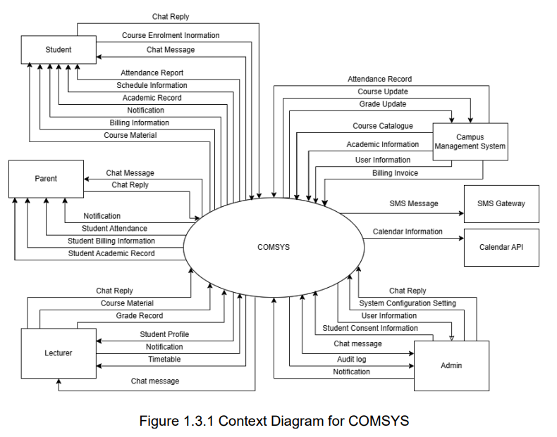

### 1.3.2 Memory Constraints

This section outlines the specific memory requirements and constraints for the university communication and service portal (COMSYS) to ensure stable and reliable operation.

| Memory Type | Constraint | Constraint Detail |
| ----------- | ----------- | ------------------ |
| **Primary Memory (RAM)** | Minimum Required RAM | 8 GB minimum required to support essential services including user authentication, academic data retrieval, and messaging. |
| | Optimal RAM | 16 GB recommended for optimal performance during peak loads, such as semester registration or mass notification events. |
| | Maximum Memory Usage | System processes should not exceed 70% of available RAM under normal operation to prevent slowdowns and ensure responsiveness. |
| **Secondary Memory (Storage)** | Minimum Disk Space | 200 GB required to store user profiles, academic performance data, and system configurations. |
| | Data archiving | Student and staff records older than five years should be archived automatically to maintain at least 40 GB of free disk space at all times. |
| | Backup and Recovery | At least 20% of total disk space must be reserved for periodic backup snapshots and recovery procedures in case of system failure or data corruption. |

By adhering to these memory constraints, COMSYS will remain robust, responsive, and capable of supporting the university’s critical communication and service functions.  
  
### 1.3.3 Product Functions

The University Portal System (COMSYS) provides the following major functions:

| Feature Category | Major Functions |
| ----------------- | --------------- |
| **Student Information Management** | Centralized dashboard for academic records, schedules, and financial information |
|  | Course enrolment |
|  | Grade and attendance tracking |
|  | Financial status monitoring |
| **Multi-Channel Communication System** | Integrated notification delivery across email, SMS, and portal |
|  | Customizable notification preferences and quiet hours |
|  | Real-time chat functionality |
|  | Announcement management with read receipt tracking |
|  | Searchable communication history |
| **Parent Engagement Platform** | Dedicated parent portal with controlled access to student information |
|  | Compliance-based information sharing |
|  | Communication channels with university administrators |
| **Academic Resource Distribution** | Centralized learning material repository |
|  | Unified link generation for academic resources |
|  | Data import/export capabilities |
| **External Calendar System Integration** | Synchronization with external calendar services |
| **Multi-language support** | Support for multiple languages across the portal interface |

<p align="center"><em>Table 1.3.3 Major Functions</em></p>  

### 1.3.4 User Characteristics

**Students** are expected to have basic computer literacy and familiarity with common web applications and mobile interfaces. No specialized technical knowledge is required beyond the ability to navigate websites and use basic mobile applications.

**Parents** may have varying levels of technical proficiency, with only basic computer literacy required. They are expected to access the system less frequently (weekly or monthly) and may prefer simplified interfaces. Some parents may have language preferences other than English.

**Lecturers** are expected to possess moderate technical proficiency and familiarity with basic educational technology tools. While they should be comfortable with routine computer operations, extensive technical expertise is not required. They will need to manage course materials and student communications regularly, accessing the system daily during academic periods. lecturers are expected to be undergo training to use the new system.

**Administrative staff** are expected to have moderate to advanced computer skills and will be trained in using administrative functions. They will be regular users requiring proficiency in managing student records, processing requests, and handling bulk operations. They should be comfortable with complex system features and multi-step processes.

### 1.3.5 Limitations

The University Portal System (COMSYS) is subject to the following limitations and constraints:

#### Regulatory Requirements and Policies

1.	Must comply with GDPR and FERPA data protection regulations, including:  
•	Ensuring all sensitive data is encrypted both in transit (using TLS/SSL protocols) and at rest (using AES-256 encryption).  
•	Implementing strict role-based access controls (RBAC) to limit access to personal and academic data only to authorized individuals.  
•	Managing explicit consent through secure digital consent forms, which clearly outline the type of data accessed, purpose of access, duration, and conditions for data revocation.  
•	Adhering to a defined data retention policy, specifying retention periods for academic records (e.g., active records retained for student enrollment duration plus five years post-graduation) and personal communication logs (e.g., retention period not exceeding two years).  
•	Regular auditing and logging of access to sensitive data to monitor compliance and quickly detect and respond to unauthorized data access or misuse incidents.

2.	Legal and privacy regulations may limit the extent of data visibility and communication features, particularly for parental access to student information.

#### Technical Limitations

1. Real-time data synchronization depends on network reliability and the availability of integrated external services (e.g., SMS gateways, calendar APIs, campus management systems).
2. System performance and user experience may be degraded during peak periods or if hardware resource constraints (RAM, storage, etc.) are not met.
3. The platform will require regular routine maintenance and timely updates to address security vulnerabilities, technological advancements, and feature enhancements.
4. Feature rollout—including new modules and multilingual support—may be phased and prioritized based on stakeholder feedback, funding, and resource availability.
5. Integration with legacy or third-party institutional systems may be limited by incompatible data formats, outdated APIs, or insufficient documentation.

#### Operational Limitations

1. User support and system administration resources may be limited, potentially leading to delays in resolving technical issues or implementing requested enhancements.
2. System scalability and performance may be constrained by the underlying infrastructure, especially if user growth exceeds projected estimates.
3. User training and onboarding resources may be limited, affecting the adoption rate and effective use of the portal.

These limitations should be considered during the planning, implementation, and operation of COMSYS to ensure realistic expectations and ongoing compliance with institutional and regulatory requirements.

### 1.4 Definitions

1. **Academic Record:** A collection of data representing a student’s academic performance, including grades, attendance, enrolment status, and completed courses.
2. **Administrator (Admin):** A university staff member with privileges to manage users, system settings, data, and oversee operations within COMSYS.
3. **Campus Management System (CMS):** The institution’s core administrative information system responsible for managing student, course, and billing data.
4. **Consent Management:** A process or feature ensuring that access to sensitive data (e.g., parent access to student records) is granted only with explicit user authorization, in compliance with privacy regulations. This consent can only be changed by having the student physically mail in a letter.
5. **Critical Notification:** A message flagged as essential or urgent (e.g., exam changes, fee deadlines) requiring prompt delivery and user attention.
6. **Dashboard:** The main user interface screen that aggregates and presents key information and actions relevant to the user's role.
7. **Data Synchronization:** The process of ensuring that information is current and consistent across all integrated systems and interfaces.
8. **End User:** Any individual who interacts with COMSYS, including students, parents, lecturers, and administrators.
9. **Notification:** Any automated or manual message sent to users through email, SMS, or portal channels to convey updates, alerts, or reminders.
10. **Parental Access:** Controlled access granted to parents or guardians for viewing their child’s academic and billing information, subject to consent and privacy policies.
11. **Portal:** The web-based entry point to COMSYS, providing access to academic, administrative, and communication services.
12. **Role-Based Access Control (RBAC):** A security mechanism restricting system access based on the user’s assigned role within the institution.
13. **Single Sign-On (SSO):** An authentication method allowing users to access COMSYS and related university systems with a single set of credentials.
14. **User:** Any individual authorized to interact with COMSYS, including students, parents, lecturers, and administrators.
15. **User Interface (UI):** The set of screens, forms, navigation, and controls through which users interact with COMSYS.
16. **Real Time:** System action occurs and is reflected to the user within 5 seconds of the triggering event, unless otherwise specified for specific features.
17. **Urgent:** Requires user attention or action within 1 hour to avoid negative consequences; see also "Critical."
18. **Consistently:** The required action or state must occur in at least 99% of cases, measured monthly, with no unexplained exceptions.
19. **Proper Termination (Logout):*** All session tokens (local and SSO), cookies, and active logins are invalidated, and the user is redirected to the login page.
20. **How is a system determined to be complex:** A system is considered complex if it contains features, workflows, or terminology that are not immediately intuitive to first-time users, require multiple steps to complete, or frequently result in user questions or errors.
21. **Communication channel:** The three communication channels are SMS, email and in-portal channels.

## 2 References

International Organization for Standardization. (2018). *ISO/IEC/IEEE 29148:2018: Systems and software engineering—Life cycle processes—Requirements engineering.* https://www.iso.org/standard/72089.html

Pohl, K. (2010). *Requirements engineering: Fundamentals, principles, and techniques (1st ed.).* Springer. http://www.requirements-book.com/

PCI DSS Guide. (n.d.). *PCI DSS Session Timeout Requirements.* Retrieved May 25, 2025, from https://pcidssguide.com/pci-dss-session-timeout-requirements/

International Organization for Standardization. (2015). *ISO 9000:2015 Quality management systems—Fundamentals and vocabulary (4th ed.).* https://www.iso.org/standard/45481.html

AltexSoft. (n.d.). *Software Requirements Specifications: Best Practices and SRS.* https://www.altexsoft.com/blog/software-requirements-specification/

Internet Engineering Task Force (IETF). (2009). *Internet calendaring and scheduling core object specification (iCalendar) (RFC 5545).* https://datatracker.ietf.org/doc/html/rfc5545

## 3 Requirements

### 3.1 Functions

The following table (Table 3.1) contains the list of features to be implemented in COMSYS, separated by its accessible role.

| Feature ID | Feature | Actor |
| ----------- | ------- | ------ |
| F001 | Login | Student, Parent, Lecturer, Admin |
| F002 | Logout | Student, Parent, Lecturer, Admin |
| F003 | Change Language Preference | Student, Parent |
| F004 | Customize Interface | Student |
| F005 | Customize Session Time-Out | Student |
| F006 | View Notification | Student, Parent |
| F007 | View Tooltip | Student, Parent |
| F008 | Access Help Documentation | Student, Parent |
| F009 | Send Notification | Lecturer, Admin |
| F010 | Access Calendar | Student, Lecturer |
| F011 | Use Live Chat | Student, Parent, Lecturer, Admin |
| F012 | View Attendance Record | Student |
| F013 | View Academic Record | Student |
| F014 | View Class Schedule | Student |
| F015 | View Exam Timetable | Student |
| F016 | View Billing Information | Student |
| F017 | Enrol in Course | Student |
| F018 | Search Past Announcement | Student |
| F019 | Customize Notification Preference | Student |
| F020 | Set 'Quiet Hours' | Student |
| F021 | View Child's Information | Parent |
| F022 | View University Contact Directory | Parent |
| F023 | Schedule Meeting with University | Parent |
| F024 | Manage Academic Resource | Lecturer |
| F025 | View Announcement Read Status | Lecturer |
| F026 | Update Student Academic Data | Lecturer |
| F027 | Manage Communication Template | Admin |
| F028 | Manage University Contact Directory | Admin |
| F029 | View System Audit Logs | Admin |
| F030 | Configure Parent Access | Admin |
| F031 | Authenticate User | University Portal |
| F032 | Send SMS Notification | SMS Gateway |
| F033 | Sync with External Calendar | Calendar API |
| F034 | Profile Management | Student |

<p align="center"><em>Table 3.1 COMSYS Features</em></p>

Figure 3.1 represents the use case diagram for COMSYS, followed by its overall requirements.

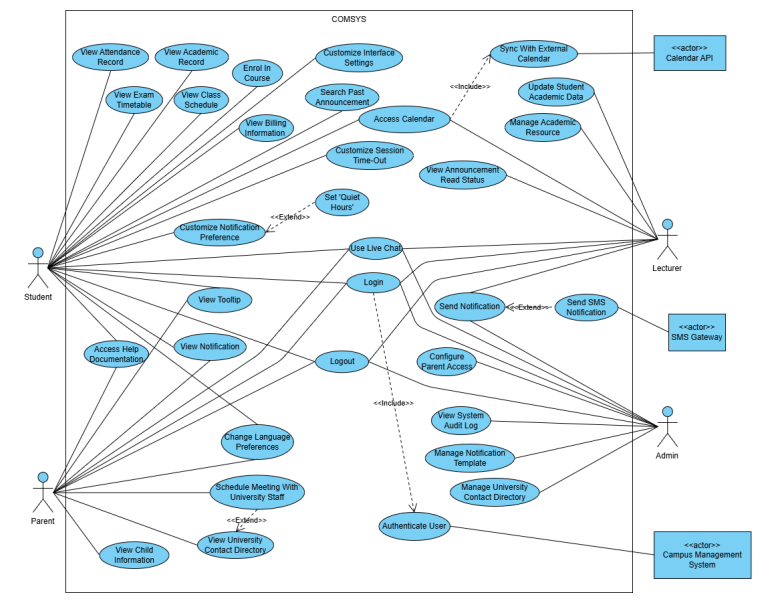 

<p align="center"><em>Figure 3.1: Use Case Diagram for COMSYS</em></p>

### Requirement Identifier Format:

Requirement IDs follow the format: **REQ_TXXYY**, where:

- **T:** Type (F = Functional, I = Interface, U = Usability, P = Performance)
- **XX:** Feature number (00 = Overall requirement)
- **YY:** Sequential requirement number within the feature

Example:  
REQ_F0602 — Functional requirement, feature 06, second requirement.

The following are the overall requirements for COMSYS:

| Requirement ID | REQ_F0001 |
| -------------- | --------- |
| **Version** | 1.0 |
| **Description** | The system shall update read status of announcements in real time. |
| **Author** | Nickleirsch |

---

| Requirement ID | REQ_F0002 |
| -------------- | --------- |
| **Version** | 1.0 |
| **Description** | The system shall implement features and controls necessary to comply with applicable data privacy and protection regulations, including but not limited to GDPR and FERPA. |
| **Author** | Nickleirsch |

---

| Requirement ID | REQ_F0003 |
| -------------- | --------- |
| **Version** | 1.0 |
| **Description** | The system shall implement encryptions for all sensitive data in transit and at rest. |
| **Author** | Nickleirsch |

---

| Requirement ID | REQ_F0004 |
| -------------- | --------- |
| **Version** | 1.0 |
| **Description** | The system shall only permit notifications to parents regarding attendance or emergencies in compliance with privacy policies. |
| **Author** | Nickleirsch |

---

| Requirement ID | REQ_F0005 |
| -------------- | --------- |
| **Version** | 1.0 |
| **Description** | The system should send automated email digests of attendance status on a bi-weekly basis. |
| **Author** | Nickleirsch |

---

| Requirement ID | REQ_F0006 |
| -------------- | --------- |
| **Version** | 1.0 |
| **Description** | The synchronization mechanism shall include academic records, financial transactions, attendance logs, and communication messages. |
| **Author** | Nickleirsch |

---

| Requirement ID | REQ_F0007 |
| -------------- | --------- |
| **Version** | 1.0 |
| **Description** | The system shall verify file type and size before accepting uploads and display a clear error if requirements are not met. |
| Author | Nickleirsch |

---

| Requirement ID | REQ_F0008 |
| -------------- | --------- |
| **Version** | 1.0 |
| **Description** | The system shall ensure that no user receives duplicate notifications for the same event across any communication channel. |
| **Author** | Nickleirsch |

---

| Requirement ID | REQ_F0009 |
| -------------- | --------- |
| **Version** | 1.0 |
| **Description** | Access to information and features shall be based on user roles (student, parent, lecturer, admin). |
| **Author** | Nickleirsch |

---

| Requirement ID | REQ_F0010 |
| -------------- | --------- |
| **Version** | 1.0 |
| **Description** | The system shall ensure that data changes are consistently reflected across all user-facing interfaces, including the web portal and mobile application. |
| **Author** | Nickleirsch |  

---

### 3.1.1 F001 Login

**The functional requirement(s) for F001 Login:**  

| **Requirement ID** | REQ_F0101 |
|---------------------|-----------|
| **Version** | 1.0 |
| **Description** | The system shall redirect users to role-specific dashboards after successful authentication |
| **Author** | Hesham |

Table 3.1.1 below illustrates the use case for the login functionality (UC001), detailing the process as defined by Requirement REQ_F0101, followed by an activity diagram which represents the process flow.

<table border="1" cellspacing="0" cellpadding="5">
  <tr>
    <td><b>Use Case ID</b></td>
    <td>UC001</td>
  </tr>
  <tr>
    <td><b>Version</b></td>
    <td>1.0</td>
  </tr>
  <tr>
    <td><b>Use Case</b></td>
    <td>F001 Login</td>
  </tr>
  <tr>
    <td><b>Purpose</b></td>
    <td>To authenticate users and provide secure access to the system based on their role.</td>
  </tr>
  <tr>
    <td><b>Actor</b></td>
    <td>Student, Parent, Lecturer, Admin</td>
  </tr>
  <tr>
    <td><b>Trigger</b></td>
    <td>User attempts to access the system.</td>
  </tr>
  <tr>
    <td><b>Precondition</b></td>
    <td>User has an active account in the system.</td>
  </tr>
  <tr>
    <td><b>Postcondition</b></td>
    <td>1. User is successfully authenticated.<br>2. User is granted access based.</td>
  </tr>
  <tr>
    <td colspan="2"><b>Main Flow</b></td>
  </tr>
  <tr>
    <td>Step 1</td>
    <td>User navigates to login page</td>
  </tr>
  <tr>
    <td>Step 2</td>
    <td>User enters credentials</td>
  </tr>
  <tr>
    <td>Step 3</td>
    <td>System validates credentials and role</td>
  </tr>
  <tr>
    <td>Step 4</td>
    <td>System authenticates the user</td>
  </tr>
  <tr>
    <td>Step 5</td>
    <td>System redirects user to their role-specific dashboard</td>
  </tr>
  <tr>
    <td colspan="2"><b>Alternate Flow – Wrong credentials are entered</b></td>
  </tr>
  <tr>
    <td>Step 3.1</td>
    <td>User enters wrong credentials</td>
  </tr>
  <tr>
    <td>Step 3.2</td>
    <td>System displays error message due to wrong credentials entered</td>
  </tr>
  <tr>
    <td>Step 3.3</td>
    <td>System prompts user for re-entry</td>
  </tr>
  <tr>
    <td colspan="2"><b>Alternate Flow – Forgot password</b></td>
</tr>
<tr>
    <td>Step 4.1</td>
    <td>User clicks “Forgot Password” link</td>
</tr>
<tr>
    <td>Step 4.2</td>
    <td>System prompts user to enter registered email or phone number</td>
</tr>
<tr>
    <td>Step 4.3</td>
    <td>System sends recovery link or OTP to the user</td>
</tr>
<tr>
    <td>Step 4.4</td>
    <td>User sets a new password and confirms</td>
</tr>
<tr>
    <td>Step 4.5</td>
    <td>System updates credentials and redirects to login screen</td>
</tr>
  <tr>
    <td colspan="2"><b>Rules</b></td>
  </tr>
  <tr>
    <td>Rule 1</td>
    <td>System must implement single sign on [REQ_F3101]</td>
  </tr>
  <tr>
    <td>Rule 2</td>
    <td>System must comply with global privacy/security regulation [REQ_F0002]</td>
  </tr>
  <tr>
    <td>Rule 3</td>
    <td>System must validate student-parent consent to provide consented functionality [REQ_F3001]</td>
  </tr>
  <tr>
    <td><b>Notes</b></td>
    <td>‘User’ in this use case refers to Student, Parent, Lecturer and Admin</td>
  </tr>
  <tr>
    <td><b>Author</b></td>
    <td>Hesham</td>
  </tr>
</table>


<p align="center"><em>Table 3.1.1: Use Case UC001 Login</em></p>

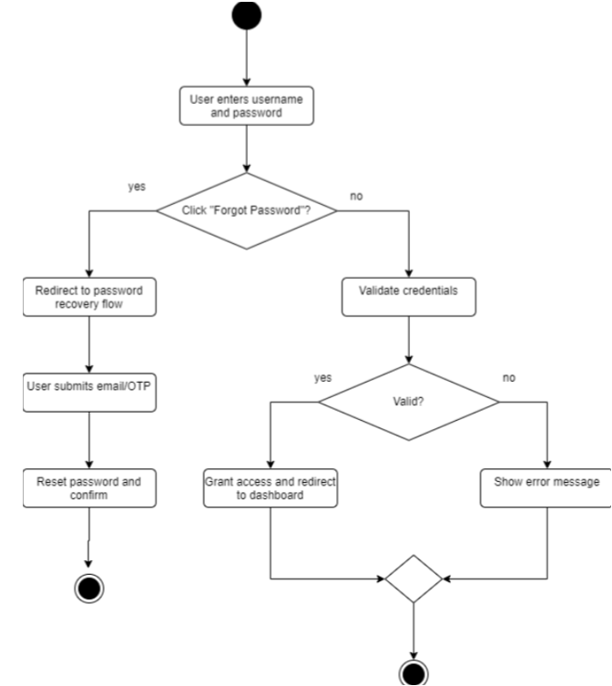

<p align="center"><em>Figure 3.1.1: Activity Diagram for Use Case UC001 Login</em></p>  

---

### 3.1.2 F002 Logout

The functional requirement(s) for F002 Logout:

| **Requirement ID** | REQ_F0201 |
|---------------------|-----------|
| **Version** | 1.0 |
| **Description** | The system shall provide proper termination of SSO sessions during logout |
| **Author** | Hesham |

Table 3.1.2 illustrates the use case for the logout functionality (UC002), detailing the process as defined by Requirement REQ_F0201, followed by an activity diagram which represents the process flow.

<table border="1" cellspacing="0" cellpadding="5">
  <tr>
    <td><b>Use Case ID</b></td>
    <td>UC002</td>
  </tr>
  <tr>
    <td><b>Version</b></td>
    <td>1.0</td>
  </tr>
  <tr>
    <td><b>Use Case</b></td>
    <td>F002 Logout</td>
  </tr>
  <tr>
    <td><b>Purpose</b></td>
    <td>To securely terminate user sessions</td>
  </tr>
  <tr>
    <td><b>Actor</b></td>
    <td>Student, Parent, Lecturer, Admin</td>
  </tr>
  <tr>
    <td><b>Trigger</b></td>
    <td>1. User initiates logout action<br>2. System detects session timeout</td>
  </tr>
  <tr>
    <td><b>Precondition</b></td>
    <td>User is logged in</td>
  </tr>
  <tr>
    <td><b>Postcondition</b></td>
    <td>1. User session is terminated<br>2. User is directed to login page<br>3. SSO session is terminated</td>
  </tr>
  <tr>
    <td colspan="2"><b>Main Flow</b></td>
  </tr>
  <tr>
    <td>Step 1</td>
    <td>User clicks the logout button</td>
  </tr>
  <tr>
    <td>Step 2</td>
    <td>System terminates active session</td>
  </tr>
  <tr>
    <td>Step 3</td>
    <td>User gets redirected to the login page</td>
  </tr>
  <tr>
    <td colspan="2"><b>Alternate Flow – If Session Timeout Occurs</b></td>
  </tr>
  <tr>
    <td>Step 1.1.1</td>
    <td>System shows a timeout warning</td>
  </tr>
  <tr>
    <td>Step 1.1.2</td>
    <td>User can extend session within 30 seconds</td>
  </tr>
  <tr>
    <td>Step 1.1.3</td>
    <td>If no response proceeds with main step 1</td>
  </tr>
  <tr>
    <td>Step 1.1.4</td>
    <td>Else system extends session</td>
  </tr>
  <tr>
    <td colspan="2"><b>Rules</b></td>
  </tr>
  <tr>
    <td>Rule 1</td>
    <td>Session timeout duration must follow user setting (for student only) [REQ_F0501]</td>
  </tr>
  <tr>
    <td><b>Notes</b></td>
    <td>‘User’ in this use case refers to Student, Parent, Lecturer and Admin</td>
  </tr>
  <tr>
    <td><b>Author</b></td>
    <td>Hesham</td>
  </tr>
</table>

<p align="center"><em>Table 3.1.2: Use Case UC002 Logout</em></p>

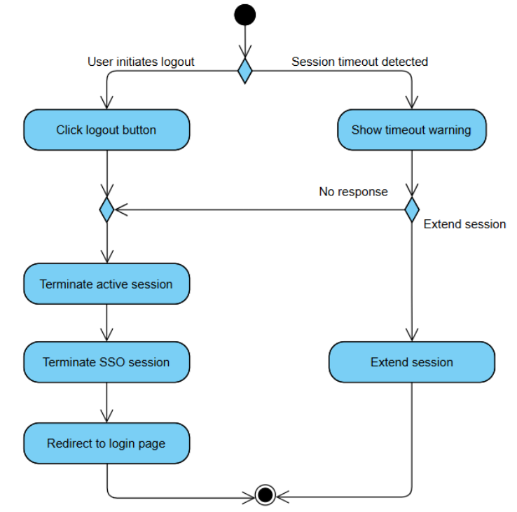

<p align="center"><em>Figure 3.1.2: Activity Diagram for Use Case UC002 Logout</em></p>

--

### 3.1.3 F003 Change Language Preference

The functional requirement(s) for F003 Change Language Preferences:

| **Requirement ID** | REQ_F0301 |
|---------------------|-----------|
| **Version** | 1.0 |
| **Description** | The system shall support a multilingual interface for all student and parent-facing pages and messages. Students and parents shall be able to select and save their preferred interface language via their user profile settings. 
Supported languages include English, Bahasa Malaysia, Mandarin (Simplified), and Tamil.
 |
| **Author** | Hesham |

Table 3.1.3 illustrates the use case for the changing language preference functionality (UC003), detailing the process as defined by Requirement REQ_F0301 and REQ_F0302, followed by an activity diagram which represents the process flow.

<table border="1" cellspacing="0" cellpadding="5">
  <tr>
    <td><b>Use Case ID</b></td>
    <td>UC003</td>
  </tr>
  <tr>
    <td><b>Version</b></td>
    <td>1.0</td>
  </tr>
  <tr>
    <td><b>Use Case</b></td>
    <td>F003 Change Language Preference</td>
  </tr>
  <tr>
    <td><b>Purpose</b></td>
    <td>To allow users to customize their interface language preference</td>
  </tr>
  <tr>
    <td><b>Actor</b></td>
    <td>Student and Parent</td>
  </tr>
  <tr>
    <td><b>Trigger</b></td>
    <td>User initiates language change from dashboard settings</td>
  </tr>
  <tr>
    <td><b>Precondition</b></td>
    <td>User is logged in</td>
  </tr>
  <tr>
    <td><b>Postcondition</b></td>
    <td>1. User’s language preference is updated<br>2. Interface language is changed</td>
  </tr>
  <tr>
    <td colspan="2"><b>Main Flow</b></td>
  </tr>
  <tr>
    <td>Step 1</td>
    <td>User navigates to language section in settings</td>
  </tr>
  <tr>
    <td>Step 2</td>
    <td>System displays available language options</td>
  </tr>
  <tr>
    <td>Step 3</td>
    <td>User selects desired language</td>
  </tr>
  <tr>
    <td>Step 4</td>
    <td>System prompts for confirmation</td>
  </tr>
  <tr>
    <td>Step 5</td>
    <td>System saves user’s language preferences and updates UI</td>
  </tr>
  <tr>
    <td colspan="2"><b>Alternate Flow – Cancel Language Selection</b></td>
  </tr>
  <tr>
    <td>Step 4.1</td>
    <td>User cancels when prompted for confirmation</td>
  </tr>
  <tr>
    <td>Step 4.2</td>
    <td>Return to Main Flow step 2</td>
  </tr>
  <tr>
    <td colspan="2"><b>Rules</b></td>
  </tr>
  <tr>
    <td>Rule 1</td>
    <td>Language preference must persist across sessions [REQ_F0302]</td>
  </tr>
  <tr>
    <td><b>Notes</b></td>
    <td>‘User’ in this use case refers to Student and Parent</td>
  </tr>
  <tr>
    <td><b>Author</b></td>
    <td>Hesham</td>
  </tr>
</table>

<p align="center"><em>Table 3.1.3: Use Case UC003 Change Language Preference</em></p>

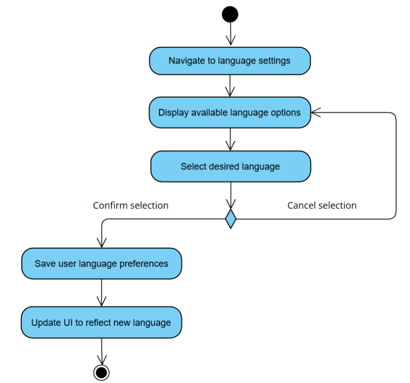

<p align="center"><em>Figure 3.1.3: Activity Diagram for Use Case UC003 Change Language Preference</em></p>

--

### 3.1.4 F004 Customize Interface

The functional requirement(s) for F004 Customize Interface:

| **Requirement ID** | REQ_F0401 |
|---------------------|-----------|
| **Version** | 1.0 |
| **Description** | The system shall provide students with the ability to switch between light and dark display modes. |
| **Author** | Hesham |

| **Requirement ID** | REQ_F0402 |
|---------------------|-----------|
| **Version** | 1.0 |
| **Description** | The system shall allow students to customize their dashboard layout by moving around widgets. |
| **Author** | Nickleirsch |

Table 3.1.4 illustrates the use case for the customizing interface functionality (UC004), detailing the process as defined by Requirement REQ_F0401 and REQ_F0402, followed by an activity diagram which represents the process flow.

<table border="1" cellspacing="0" cellpadding="5">
  <tr>
    <td><b>Use Case ID</b></td>
    <td>UC004</td>
  </tr>
  <tr>
    <td><b>Version</b></td>
    <td>1.0</td>
  </tr>
  <tr>
    <td><b>Use Case</b></td>
    <td>F004 Customize Interface</td>
  </tr>
  <tr>
    <td><b>Purpose</b></td>
    <td>To allow students and parents to personalize their portal interface through theme preferences and widget arrangement</td>
  </tr>
  <tr>
    <td><b>Actor</b></td>
    <td>Student</td>
  </tr>
  <tr>
    <td><b>Trigger</b></td>
    <td>Student accesses interface customization settings</td>
  </tr>
  <tr>
    <td><b>Precondition</b></td>
    <td>Student is logged in</td>
  </tr>
  <tr>
    <td><b>Postcondition</b></td>
    <td>
      1. Student interface preferences are changed<br>
      2. Dashboard displays customized layout and theme<br>
      3. Settings persist across sessions<br>
      4. Widgets maintain functionality in new positions
    </td>
  </tr>
  <tr>
    <td colspan="2"><b>Main Flow</b></td>
  </tr>
  <tr>
    <td>Step 1</td>
    <td>Student accesses interface settings</td>
  </tr>
  <tr>
    <td>Step 2</td>
    <td>System displays customization options:<br>a) Theme selection (light/dark)<br>b) Widget arrangement interface</td>
  </tr>
  <tr>
    <td>Step 3</td>
    <td>Student selects desired theme</td>
  </tr>
  <tr>
    <td>Step 4</td>
    <td>System previews changes in real-time</td>
  </tr>
  <tr>
    <td>Step 5</td>
    <td>Student saves customization preferences</td>
  </tr>
  <tr>
    <td>Step 6</td>
    <td>System applies and persists changes</td>
  </tr>
  <tr>
    <td colspan="2"><b>Alternate Flow – Widget Customization</b></td>
  </tr>
  <tr>
    <td>Step 2.1</td>
    <td>Student selects widget arrangement</td>
  </tr>
  <tr>
    <td>Step 2.2</td>
    <td>Student rearranges widgets to preferred position</td>
  </tr>
  <tr>
    <td>Step 2.3</td>
    <td>Return to main step 4</td>
  </tr>
  <tr>
    <td colspan="2"><b>Rules</b></td>
  </tr>
  <tr>
    <td>Rule 1</td>
    <td>Dashboard layout must maintain responsive design [REQ_I0002]</td>
  </tr>
  <tr>
    <td>Rule 2</td>
    <td>Widget positions must respect screen size constraints [REQ_I0002]</td>
  </tr>
  <tr>
    <td>Rule 3</td>
    <td>Help documentation and tooltips must be available for customization options [REQ_F0701, REQ_F0801]</td>
  </tr>
  <tr>
    <td><b>Author</b></td>
    <td>Hesham</td>
  </tr>
</table>

<p align="center"><em>Table 3.1.4: Use Case UC004 Customize Interface</em></p>

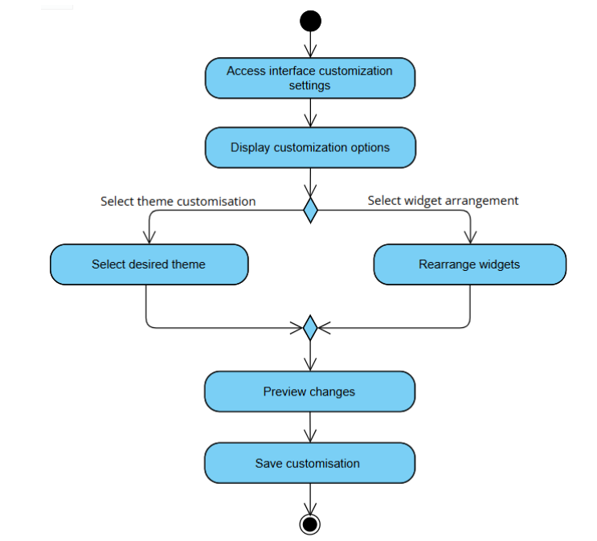

<p align="center"><em>Figure 3.1.4: Activity Diagram for Use Case UC004 Customize Interface</em></p>

--

### 3.1.5 F005 Customize Session Time-Out

The functional requirement(s) for F005 Customize Session Time-Out:

| **Requirement ID** | REQ_F0501 |
|---------------------|-----------|
| **Version** | 1.0 |
| **Description** | The system should provide customizable session timeout settings for students. |
| **Author** | Hesham |

| **Requirement ID** | REQ_F0502 |
|---------------------|-----------|
| **Version** | 1.0 |
| **Description** | The session timeout duration shall be configurable within a secure range, with a minimum of 5 minutes and a maximum of 30 minutes. |
| **Author** | Nickleirsch |

Table 3.1.5 illustrates the use case for the customizing session time-out functionality (UC005), detailing the process as defined by Requirement REQ_F0501 and REQ_F0502, followed by an activity diagram which represents the process flow.

<table border="1" cellspacing="0" cellpadding="5">
  <tr>
    <td><b>Use Case ID</b></td>
    <td>UC005</td>
  </tr>
  <tr>
    <td><b>Version</b></td>
    <td>1.0</td>
  </tr>
  <tr>
    <td><b>Use Case</b></td>
    <td>F005 Customize Session Time-Out</td>
  </tr>
  <tr>
    <td><b>Purpose</b></td>
    <td>To allow users to personalize their session timeout duration within system-defined security boundaries</td>
  </tr>
  <tr>
    <td><b>Actor</b></td>
    <td>Student</td>
  </tr>
  <tr>
    <td><b>Trigger</b></td>
    <td>User accesses session timeout settings in their profile security settings</td>
  </tr>
  <tr>
    <td><b>Precondition</b></td>
    <td>User is logged in</td>
  </tr>
  <tr>
    <td><b>Postcondition</b></td>
    <td>
      1. New session timeout duration is saved<br>
      2. Updated timeout is applied to current and future sessions
    </td>
  </tr>
  <tr>
    <td colspan="2"><b>Main Flow</b></td>
  </tr>
  <tr>
    <td>Step 1</td>
    <td>User navigates to security settings</td>
  </tr>
  <tr>
    <td>Step 2</td>
    <td>System displays current timeout settings</td>
  </tr>
  <tr>
    <td>Step 3</td>
    <td>System shows allowed timeout range</td>
  </tr>
  <tr>
    <td>Step 4</td>
    <td>User selects new timeout duration</td>
  </tr>
  <tr>
    <td>Step 5</td>
    <td>System validates selection</td>
  </tr>
  <tr>
    <td>Step 6</td>
    <td>System saves new timeout preference</td>
  </tr>
  <tr>
    <td>Step 7</td>
    <td>System applies for current and future sessions</td>
  </tr>
  <tr>
    <td colspan="2"><b>Rules</b></td>
  </tr>
  <tr>
    <td>Rule 1</td>
    <td>Minimum and maximum timeout duration must align with security policy [REQ_F0502]</td>
  </tr>
  <tr>
    <td>Rule 2</td>
    <td>Help documentation and tooltips must explain timeout implications [REQ_F0701, REQ_F0801]</td>
  </tr>
  <tr>
    <td><b>Author</b></td>
    <td>Hesham</td>
  </tr>
</table>

<p align="center"><em>Table 3.1.5: Use Case UC005 Customize Session Time-Out</em></p>

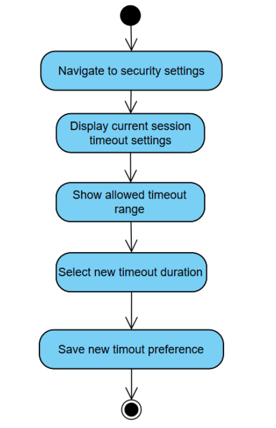

<p align="center"><em>Figure 3.1.5: Activity Diagram for Use Case UC005 Customize Session Time-Out</em></p>

--

### 3.1.6 F006 View Notification

The functional requirement(s) for F006 View Notification:

| **Requirement ID** | REQ_F0601 |
|---------------------|-----------|
| **Version** | 1.0 |
| **Description** | The system shall support in-portal notifications for students and parents. |
| **Author** | Nickleirsch |

Table 3.1.6 illustrates the use case for the view notification functionality (UC006), detailing the process as defined by Requirement REQ_F0601, followed by an activity diagram which represents the process flow.

<table border="1" cellspacing="0" cellpadding="5">
  <tr>
    <td><b>Use Case ID</b></td>
    <td>UC006</td>
  </tr>
  <tr>
    <td><b>Version</b></td>
    <td>1.0</td>
  </tr>
  <tr>
    <td><b>Use Case</b></td>
    <td>F006 View Notification</td>
  </tr>
  <tr>
    <td><b>Purpose</b></td>
    <td>To allow students and parents to access their received notifications across different channels</td>
  </tr>
  <tr>
    <td><b>Actor</b></td>
    <td>Student, Parent</td>
  </tr>
  <tr>
    <td><b>Trigger</b></td>
    <td>
      1. New notification is received<br>
      2. User clicks on a notification alert
    </td>
  </tr>
  <tr>
    <td><b>Precondition</b></td>
    <td>User is logged in</td>
  </tr>
  <tr>
    <td><b>Postcondition</b></td>
    <td>
      1. Notification(s) are displayed to user<br>
      2. Notification read status is updated<br>
      3. Notification(s) are marked as viewed
    </td>
  </tr>
  <tr>
    <td colspan="2"><b>Main Flow</b></td>
  </tr>
  <tr>
    <td>Step 1</td>
    <td>User navigates to notifications section</td>
  </tr>
  <tr>
    <td>Step 2</td>
    <td>System retrieves notifications based on user role and preferences</td>
  </tr>
  <tr>
    <td>Step 3</td>
    <td>System displays notification(s)</td>
  </tr>
  <tr>
    <td>Step 4</td>
    <td>User views notification content</td>
  </tr>
  <tr>
    <td>Step 5</td>
    <td>System updates the notification’s read status</td>
  </tr>
  <tr>
    <td colspan="2"><b>Alternative Flow – If No Notifications Exist</b></td>
  </tr>
  <tr>
    <td>Step 2.1</td>
    <td>System displays “No notifications” message</td>
  </tr>
  <tr>
    <td>Step 2.2</td>
    <td>System redirects to user’s dashboard</td>
  </tr>
  <tr>
    <td colspan="2"><b>Rules</b></td>
  </tr>
  <tr>
    <td>Rule 1</td>
    <td>Parents can only view notifications they have consent to access [REQ_F3001]</td>
  </tr>
  <tr>
    <td>Rule 2</td>
    <td>System must respect quiet hours settings if enabled [REQ_F2001]</td>
  </tr>
  <tr>
    <td>Rule 3</td>
    <td>The system must ensure that there are no duplicate notifications sent for the same event [REQ_F0008]</td>
  </tr>
  <tr>
    <td><b>Notes</b></td>
    <td>‘User’ in this use case refers to Student and Parent.<br>This use case pertains exclusively to the viewing of in-portal notifications within COMSYS. Notifications sent via SMS and email are delivered externally and are not viewable within the COMSYS system.</td>
  </tr>
  <tr>
    <td><b>Author</b></td>
    <td>Nickleirsch</td>
  </tr>
</table>

<p align="center"><em>Table 3.1.6: Use Case UC006 View Notification</em></p>

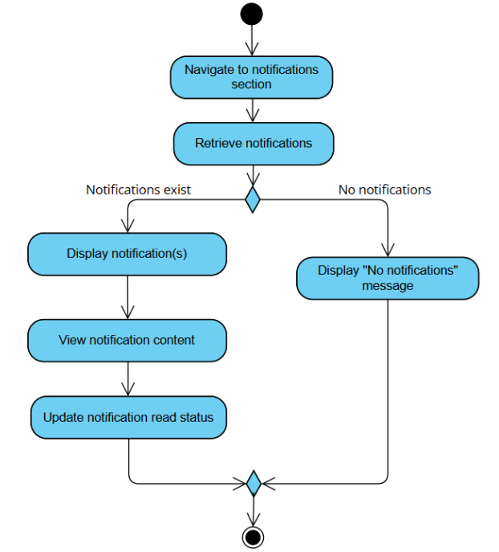

<p align="center"><em>Figure 3.1.6: Activity Diagram for Use Case UC006 View Notification</em></p>

--

## 3.1.7 F007 View Tooltip

The functional requirement(s) for F007 View Tooltip:

| **Requirement ID** | REQ_F0701 |
|--------------------|-----------|
| **Version** | 1.0 |
| **Description** | The system shall provide contextual tooltips for students and parents for interface elements on hover |
| **Author** | Hesham |

Table 3.1.7 illustrates the use case for the view tooltip functionality (UC007), detailing the process as defined by Requirement REQ_F0701, followed by an activity diagram which represents the process flow.

<table border="1" cellspacing="0" cellpadding="5">
  <tr>
    <td><b>Use Case ID</b></td>
    <td>UC007</td>
  </tr>
  <tr>
    <td><b>Version</b></td>
    <td>1.0</td>
  </tr>
  <tr>
    <td><b>Use Case</b></td>
    <td>F007 View Tooltip</td>
  </tr>
  <tr>
    <td><b>Purpose</b></td>
    <td>To provide students and parents with immediate, contextual help through tooltips for interface elements and features</td>
  </tr>
  <tr>
    <td><b>Actor</b></td>
    <td>Student, Parent</td>
  </tr>
  <tr>
    <td><b>Trigger</b></td>
    <td>User clicks on tooltip indicator</td>
  </tr>
  <tr>
    <td><b>Precondition</b></td>
    <td>
      1. User is logged in<br>
      2. User is accessing a feature with tooltip support
    </td>
  </tr>
  <tr>
    <td><b>Postcondition</b></td>
    <td>
      1. Tooltip is displayed<br>
      2. User receives immediate contextual help
    </td>
  </tr>
  <tr>
    <td colspan="2"><b>Main Flow</b></td>
  </tr>
  <tr>
    <td>Step 1</td>
    <td>User clicks on an element with tooltip</td>
  </tr>
  <tr>
    <td>Step 2</td>
    <td>System detects tooltip trigger</td>
  </tr>
  <tr>
    <td>Step 3</td>
    <td>System displays relevant contextual help</td>
  </tr>
  <tr>
    <td colspan="2"><b>Rules</b></td>
  </tr>
  <tr>
    <td>Rule 1</td>
    <td>Tooltips must be responsive across devices [REQ_I0002]</td>
  </tr>
  <tr>
    <td>Rule 2</td>
    <td>Tooltips must support multiple languages [REQ_F0301, REQ_F0302]</td>
  </tr>
  <tr>
    <td><b>Notes</b></td>
    <td>‘User’ in this use case refers to Student and Parent.</td>
  </tr>
  <tr>
    <td><b>Author</b></td>
    <td>Hesham</td>
  </tr>
</table>

<p align="center"><em>Table 3.1.7: Use Case UC007 View Tooltip</em></p>

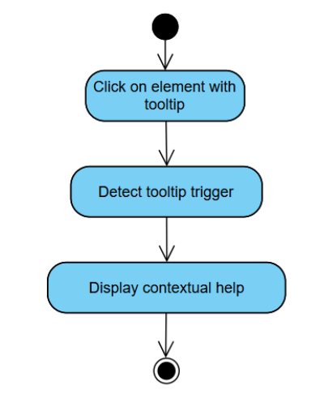

<p align="center"><em>Figure 3.1.7: Activity Diagram for Use Case UC007 View Tooltip</em></p>

--

### 3.1.8 F008 Access Help Documentation

The functional requirement(s) for F008 Access Help Documentation:

| **Requirement ID** | REQ_F0801 |
|--------------------|-----------|
| **Version** | 1.0 |
| **Description** | The system shall provide help guides accessible via a help section for students and parents, aimed at explaining system functionalities considered complex. |
| **Author** | Hesham |

Table 3.1.8 illustrates the use case for the access help documentation functionality (UC008), detailing the process as defined by Requirement REQ_F0801, followed by an activity diagram which represents the process flow.

<table border="1" cellspacing="0" cellpadding="5">
  <tr>
    <td><b>Use Case ID</b></td>
    <td>UC008</td>
  </tr>
  <tr>
    <td><b>Version</b></td>
    <td>1.0</td>
  </tr>
  <tr>
    <td><b>Use Case</b></td>
    <td>F008 Access Help Documentation</td>
  </tr>
  <tr>
    <td><b>Purpose</b></td>
    <td>To provide students and parents with comprehensive help documentation and user manuals for system features</td>
  </tr>
  <tr>
    <td><b>Actor</b></td>
    <td>Student, Parent</td>
  </tr>
  <tr>
    <td><b>Trigger</b></td>
    <td>User navigates to the documentation page</td>
  </tr>
  <tr>
    <td><b>Precondition</b></td>
    <td>User is logged in</td>
  </tr>
  <tr>
    <td><b>Postcondition</b></td>
    <td>Help documentation is displayed</td>
  </tr>
  <tr>
    <td colspan="2"><b>Main Flow</b></td>
  </tr>
  <tr>
    <td>Step 1</td>
    <td>User navigates to help documentation section</td>
  </tr>
  <tr>
    <td>Step 2</td>
    <td>System displays help categories and search</td>
  </tr>
  <tr>
    <td>Step 3</td>
    <td>User selects topic</td>
  </tr>
  <tr>
    <td>Step 4</td>
    <td>System displays relevant documentation</td>
  </tr>
  <tr>
    <td colspan="2"><b>Alternate Flow – Search for Help</b></td>
  </tr>
  <tr>
    <td>Step 2.1</td>
    <td>User searches for help category</td>
  </tr>
  <tr>
    <td>Step 2.2</td>
    <td>System displays help documentation with filtered category</td>
  </tr>
  <tr>
    <td colspan="2"><b>Rules</b></td>
  </tr>
  <tr>
    <td>Rule 1</td>
    <td>Documentation must maintain consistent formatting and be easy to navigate through [REQ_I0001]</td>
  </tr>
  <tr>
    <td>Rule 2</td>
    <td>Documentation must support multiple languages [REQ_F0301, REQ_F0302]</td>
  </tr>
  <tr>
    <td>Rule 3</td>
    <td>System must provide comprehensive guides for complex features [REQ_F0801]</td>
  </tr>
  <tr>
    <td><b>Notes</b></td>
    <td>‘User’ in this use case refers to Student and Parent.</td>
  </tr>
  <tr>
    <td><b>Author</b></td>
    <td>Hesham</td>
  </tr>
</table>


<p align="center"><em>Table 3.1.8: Use Case UC008 Access Help Documentation</em></p>

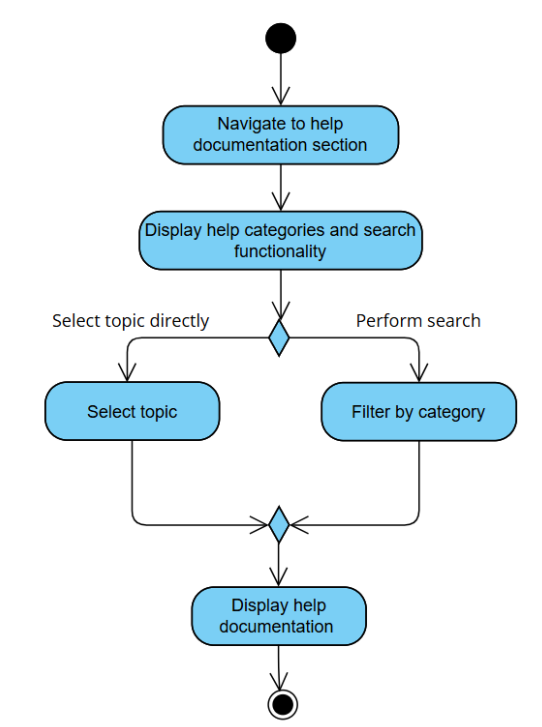

<p align="center"><em>Figure 3.1.8: Activity Diagram for Use Case UC008 Access Help Documentation</em></p>

--

### 3.1.9 F009 Send Notification

The functional requirement(s) for F009 Send Notification:

| **Requirement ID** | REQ_F0901 |
|--------------------|-----------|
| **Version** | 1.0 |
| **Description** | The system shall support sending notifications to students and parents via email based on channel preference. |
| **Author** | Nickleirsch |

| **Requirement ID** | REQ_F0902 |
|--------------------|-----------|
| **Version** | 1.0 |
| **Description** | The system shall allow administrators and lecturers to schedule sending of notifications in advance. |
| **Author** | Nickleirsch |

| **Requirement ID** | REQ_F0903 |
|--------------------|-----------|
| **Version** | 1.0 |
| **Description** | The system shall enable sending communications to filtered user groups based on predefined attributes (department, role, program). |
| **Author** | Nickleirsch |

| **Requirement ID** | REQ_F0904 |
|--------------------|-----------|
| **Version** | 1.0 |
| **Description** | The system shall allow lecturers and admins to use pre-made templates when creating notifications. |
| **Author** | Nickleirsch |

Table 3.1.9 illustrates the use case for the send notification functionality (UC009), detailing the process as defined by Requirement REQ_F0901, REQ_F0902, REQ_F0903 and REQ_F0904, followed by an activity diagram which represents the process flow.

<table border="1" cellspacing="0" cellpadding="5">
  <tr>
    <td><b>Use Case ID</b></td>
    <td>UC009</td>
  </tr>
  <tr>
    <td><b>Version</b></td>
    <td>1.0</td>
  </tr>
  <tr>
    <td><b>Use Case</b></td>
    <td>F009 Send Notification</td>
  </tr>
  <tr>
    <td><b>Purpose</b></td>
    <td>Allow lecturers and admins to send notifications to students or groups.</td>
  </tr>
  <tr>
    <td><b>Actor</b></td>
    <td>Lecturer and Admin</td>
  </tr>
  <tr>
    <td><b>Trigger</b></td>
    <td>User navigates to send notification page from dashboard</td>
  </tr>
  <tr>
    <td><b>Precondition</b></td>
    <td>User is logged in</td>
  </tr>
  <tr>
    <td><b>Postcondition</b></td>
    <td>User has sent or scheduled a notification</td>
  </tr>
  <tr>
    <td colspan="2"><b>Main Flow</b></td>
  </tr>
  <tr>
    <td>Step 1</td>
    <td>User navigates to the notification section</td>
  </tr>
  <tr>
    <td>Step 2</td>
    <td>User selects to compose a new notification</td>
  </tr>
  <tr>
    <td>Step 3</td>
    <td>User selects recipients (individuals or groups)</td>
  </tr>
  <tr>
    <td>Step 4</td>
    <td>User chooses notification channel(s) (email, SMS, portal)</td>
  </tr>
  <tr>
    <td>Step 5</td>
    <td>User enters subject and message content</td>
  </tr>
  <tr>
    <td>Step 6</td>
    <td>User confirms and chooses to send the notification immediately</td>
  </tr>
  <tr>
    <td>Step 7</td>
    <td>System sends the notification</td>
  </tr>
  <tr>
    <td>Step 8</td>
    <td>System displays a confirmation prompt</td>
  </tr>
  <tr>
    <td colspan="2"><b>Alternate Flow – Schedule Notification</b></td>
  </tr>
  <tr>
    <td>Step 6.1</td>
    <td>User chooses to schedule the notification</td>
  </tr>
  <tr>
    <td>Step 6.2</td>
    <td>User chooses a future date and time</td>
  </tr>
  <tr>
    <td>Step 6.3</td>
    <td>System queues the notification for delivery at the specified time</td>
  </tr>
  <tr>
    <td>Step 6.4</td>
    <td>Return to Main Flow step 8</td>
  </tr>
  <tr>
    <td colspan="2"><b>Alternate Flow – Use Notification Template</b></td>
  </tr>
  <tr>
    <td>Step 5.1</td>
    <td>User chooses to use a template instead</td>
  </tr>
  <tr>
    <td>Step 5.2</td>
    <td>System displays list of available templates</td>
  </tr>
  <tr>
    <td>Step 5.3</td>
    <td>System loads the notification template</td>
  </tr>
  <tr>
    <td>Step 5.4</td>
    <td>User customizes content as needed</td>
  </tr>
  <tr>
    <td>Step 5.5</td>
    <td>Return to Main Flow step 6</td>
  </tr>
  <tr>
    <td colspan="2"><b>Rules</b></td>
  </tr>
  <tr>
    <td>Rule 1</td>
    <td>Notification respects user preferences and legal consent [REQ_F1903, REQ_F3001]</td>
  </tr>
  <tr>
    <td>Rule 2</td>
    <td>System prevents duplicate notifications [REQ_F0008]</td>
  </tr>
  <tr>
    <td>Rule 3</td>
    <td>Critical alerts must be delivered within a minute of their creation [REQ_P0004]</td>
  </tr>
  <tr>
    <td><b>Notes</b></td>
    <td>
      ‘User’ for this use case refers to Lecturer and Admin.<br>
      Notifications will be delivered through three channels: in-portal, SMS, and email.<br>
      1. In-portal notifications can be viewed directly within the COMSYS system, as detailed in F006: View Notification.<br>
      2. SMS and email notifications are delivered externally to the user’s registered phone number and email address.<br>
      3. The SMS notification system is implemented via an integrated SMS gateway, as detailed in F032: Send SMS Notification.
    </td>
  </tr>
  <tr>
    <td><b>Author</b></td>
    <td>Nickleirsch</td>
  </tr>
</table>

<p align="center"><em>Table 3.1.9: Use Case UC009 Send Notification</em></p>

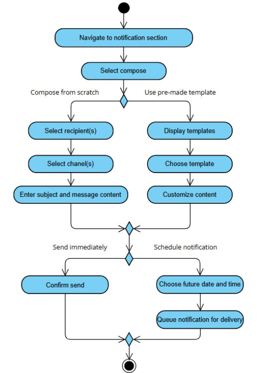

<p align="center"><em>Figure 3.1.9: Activity Diagram for Use Case UC009 Send Notification</em></p>

--

### 3.1.10 F010 Access Calendar

The functional requirement(s) for F010 Access Calendar:

| **Requirement ID** | REQ_F1001 |
|--------------------|-----------|
| **Version** | 1.0 |
| **Description** | Students and lecturers shall be able to set personal reminders and manage events or deadlines through the calendar. |
| **Author** | Nickleirsch |

Table 3.1.10 illustrates the use case for the access calendar functionality (UC010), detailing the process as defined by Requirement REQ_F1001, followed by an activity diagram which represents the process flow.

<table border="1" cellspacing="0" cellpadding="5">
  <tr>
    <td><b>Use Case ID</b></td>
    <td>UC010</td>
  </tr>
  <tr>
    <td><b>Version</b></td>
    <td>1.0</td>
  </tr>
  <tr>
    <td><b>Use Case</b></td>
    <td>F010 Access Calendar</td>
  </tr>
  <tr>
    <td><b>Purpose</b></td>
    <td>Allow students and lecturers to access their academic calendar, view schedules, upcoming events, deadlines, and other relevant information through the university portal.</td>
  </tr>
  <tr>
    <td><b>Actor</b></td>
    <td>Student and Lecturer</td>
  </tr>
  <tr>
    <td><b>Trigger</b></td>
    <td>User navigates to the calendar section.</td>
  </tr>
  <tr>
    <td><b>Precondition</b></td>
    <td>User is logged in</td>
  </tr>
  <tr>
    <td><b>Postcondition</b></td>
    <td>1. The user sees their personalized academic calendar with relevant events, schedules, and deadlines.<br>2. The user can interact with the calendar</td>
  </tr>
  <tr>
    <td colspan="2"><b>Main Flow</b></td>
  </tr>
  <tr>
    <td>Step 1</td>
    <td>User navigates to the calendar section.</td>
  </tr>
  <tr>
    <td>Step 2</td>
    <td>The system retrieves events, schedules, and deadlines relevant to the user.</td>
  </tr>
  <tr>
    <td>Step 3</td>
    <td>The system displays the calendar</td>
  </tr>
  <tr>
    <td>Step 4</td>
    <td>User views the calendar</td>
  </tr>
  <tr>
    <td colspan="2"><b>Alternate Flow – Add event</b></td>
  </tr>
  <tr>
    <td>Step 3.1</td>
    <td>User chooses to add an event to the calendar</td>
  </tr>
  <tr>
    <td>Step 3.2</td>
    <td>User chooses a date and time</td>
  </tr>
  <tr>
    <td>Step 3.3</td>
    <td>User inputs event type and description</td>
  </tr>
  <tr>
    <td>Step 3.4</td>
    <td>System saves the event</td>
  </tr>
  <tr>
    <td>Step 3.5</td>
    <td>Return to main flow step 4</td>
  </tr>
  <tr>
    <td colspan="2"><b>Rules</b></td>
  </tr>
  <tr>
    <td>Rule 1</td>
    <td>Calendar must synchronize with external calendars if enabled [REQ_F3301]</td>
  </tr>
  <tr>
    <td>Rule 2</td>
    <td>Users can set personal reminders and manage events [REQ_F1002]</td>
  </tr>
  <tr>
    <td>Rule 3</td>
    <td>Interface must be responsive to screen size [REQ_I0002]</td>
  </tr>
  <tr>
    <td>Rule 4</td>
    <td>All calendar data shown must comply with privacy and data security requirements [REQ_F0002]</td>
  </tr>
  <tr>
    <td>Rule 5</td>
    <td>Data must be updated within 2 minutes of changes (synchronization) [REQ_P0005]</td>
  </tr>
  <tr>
    <td>Rule 6</td>
    <td>Event names must be descriptive, not just codes [REQ_I0003]</td>
  </tr>
  <tr>
    <td><b>Notes</b></td>
    <td>‘User’ for this use case refers to Student and Lecturer.<br>The calendar is not the same as the class schedule of a student, for a detailed view of their courses with their instructor, class times and location, students must view their class schedule as detailed in F014 View Class Schedule.</td>
  </tr>
  <tr>
    <td><b>Author</b></td>
    <td>Nickleirsch</td>
  </tr>
</table>

<p align="center"><em>Table 3.1.10: Use Case UC010 Access Calendar</em></p>

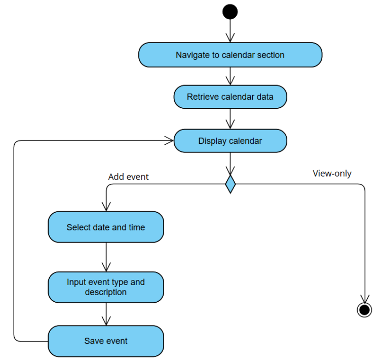

<p align="center"><em>Figure 3.1.10: Activity Diagram for Use Case UC010 Access Calendar</em></p>

--

### 3.1.11 F011 Use Live Chat

The functional requirement(s) for F011 Use Live Chat:

| **Requirement ID** | REQ_F1101 |
|--------------------|-----------|
| **Version** | 1.0 |
| **Description** | Students, parents, lecturers and admins shall be able to use the live chat functionality to exchange messages in real time. |
| **Author** | Nickleirsch |

Table 3.1.11 illustrates the use case for the use live chat functionality (UC011), detailing the process as defined by Requirement REQ_F1101, followed by an activity diagram which represents the process flow.

<table border="1" cellspacing="0" cellpadding="5">
  <tr>
    <td><b>Use Case ID</b></td>
    <td>UC011</td>
  </tr>
  <tr>
    <td><b>Version</b></td>
    <td>1.0</td>
  </tr>
  <tr>
    <td><b>Use Case</b></td>
    <td>F011 Use Live Chat</td>
  </tr>
  <tr>
    <td><b>Purpose</b></td>
    <td>To allow students, parents, lecturers, admins to communicate and exchange messages in real time through a built-in live chat feature.</td>
  </tr>
  <tr>
    <td><b>Actor</b></td>
    <td>Student, Parent, Lecturer and Admin</td>
  </tr>
  <tr>
    <td><b>Trigger</b></td>
    <td>1. User accesses the chat section<br>2. User receives a new message notification and clicks to open chat</td>
  </tr>
  <tr>
    <td><b>Precondition</b></td>
    <td>User is logged in</td>
  </tr>
  <tr>
    <td><b>Postcondition</b></td>
    <td>1. Messages are exchanged in real time<br>2. Chat is updated with the latest conversation</td>
  </tr>
  <tr>
    <td colspan="2"><b>Main Flow</b></td>
  </tr>
  <tr>
    <td>Step 1</td>
    <td>User navigates to live chat interface</td>
  </tr>
  <tr>
    <td>Step 2</td>
    <td>System displays conversation history</td>
  </tr>
  <tr>
    <td>Step 3</td>
    <td>User selects a chat box</td>
  </tr>
  <tr>
    <td>Step 4</td>
    <td>System displays past exchanged messages</td>
  </tr>
  <tr>
    <td>Step 5</td>
    <td>User types and sends a message</td>
  </tr>
  <tr>
    <td>Step 6</td>
    <td>System delivers the message to the recipient in real time</td>
  </tr>
  <tr>
    <td colspan="2"><b>Alternate Flow – Initiate New Chat</b></td>
  </tr>
  <tr>
    <td>Step 3.1</td>
    <td>User starts a new chat by searching for a user</td>
  </tr>
  <tr>
    <td>Step 3.2</td>
    <td>System displays search results</td>
  </tr>
  <tr>
    <td>Step 3.3</td>
    <td>Return to Main Flow step 5</td>
  </tr>
  <tr>
    <td colspan="2"><b>Rules</b></td>
  </tr>
  <tr>
    <td>Rule 1</td>
    <td>System must load chat boxes within 3 seconds [REQ_P0001]</td>
  </tr>
  <tr>
    <td>Rule 2</td>
    <td>System must ensure chat data is encrypted during transmission [REQ_F0003]</td>
  </tr>
  <tr>
    <td><b>Author</b></td>
    <td>Nickleirsch</td>
  </tr>
</table>

<p align="center"><em>Table 3.1.11: Use Case UC011 Use Live Chat</em></p>

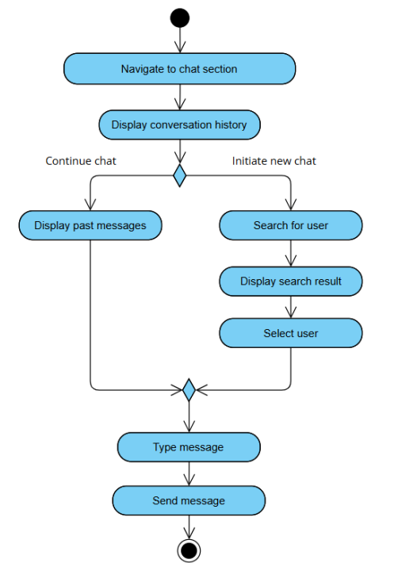

<p align="center"><em>Figure 3.1.11: Activity Diagram for Use Case UC011 Use Live Chat</em></p>

--

### 3.1.12 F012 View Attendance Record

The functional requirement(s) for F012 View Attendance Record:

| **Requirement ID** | REQ_F1201 |
|--------------------|-----------|
| **Version** | 1.0 |
| **Description** | The student dashboard shall display an overview of the student’s attendance records for each enrolled course. |
| **Author** | Hesham |

Table 3.1.12 illustrates the use case for the view attendance record functionality (UC012), detailing the process as defined by Requirement REQ_F1201, followed by an activity diagram which represents the process flow.

<table border="1" cellspacing="0" cellpadding="5">
  <tr>
    <td><b>Use Case ID</b></td>
    <td>UC012</td>
  </tr>
  <tr>
    <td><b>Version</b></td>
    <td>1.0</td>
  </tr>
  <tr>
    <td><b>Use Case</b></td>
    <td>F012 View Attendance Record</td>
  </tr>
  <tr>
    <td><b>Purpose</b></td>
    <td>To allow students to access and monitor their attendance records across all enrolled courses.</td>
  </tr>
  <tr>
    <td><b>Actor</b></td>
    <td>Student</td>
  </tr>
  <tr>
    <td><b>Trigger</b></td>
    <td>1. Student accesses attendance section<br>2. Student selects specific course for attendance view<br>3. Automated attendance digest notification clicked</td>
  </tr>
  <tr>
    <td><b>Precondition</b></td>
    <td>1. Student is logged in<br>2. Student has active course enrolments</td>
  </tr>
  <tr>
    <td><b>Postcondition</b></td>
    <td>1. Attendance records are displayed<br>2. Any attendance alerts are highlighted as read</td>
  </tr>
  <tr>
    <td colspan="2"><b>Main Flow</b></td>
  </tr>
  <tr>
    <td>Step 1</td>
    <td>Student navigates to attendance section</td>
  </tr>
  <tr>
    <td>Step 2</td>
    <td>System retrieves current attendance records</td>
  </tr>
  <tr>
    <td>Step 3</td>
    <td>System displays attendance overview for all courses</td>
  </tr>
  <tr>
    <td>Step 4</td>
    <td>Student views detailed attendance information</td>
  </tr>
  <tr>
    <td colspan="2"><b>Alternate Flow - Attendance Record Cannot Be Retrieved</b></td>
  </tr>
  <tr>
    <td>Step 2.1</td>
    <td>System cannot retrieve attendance record</td>
  </tr>
  <tr>
    <td>Step 2.2</td>
    <td>Display error message</td>
  </tr>
  <tr>
    <td colspan="2"><b>Rules</b></td>
  </tr>
  <tr>
    <td>Rule 1</td>
    <td>System must load attendance records within 3 seconds [REQ_P0001]</td>
  </tr>
  <tr>
    <td>Rule 2</td>
    <td>System must provide consistent header formatting [REQ_I0001]</td>
  </tr>
  <tr>
    <td>Rule 3</td>
    <td>System must provide tooltips for attendance calculations [REQ_F0701]</td>
  </tr>
  <tr>
    <td>Rule 4</td>
    <td>Attendance record must synchronize across interfaces within 5 seconds [REQ_P0003, REQ_F0005, REQ_F0010]</td>
  </tr>
  <tr>
    <td><b>Author</b></td>
    <td>Hesham</td>
  </tr>
</table>

<p align="center"><em>Table 3.1.12: Use Case UC012 View Attendance Record</em></p>

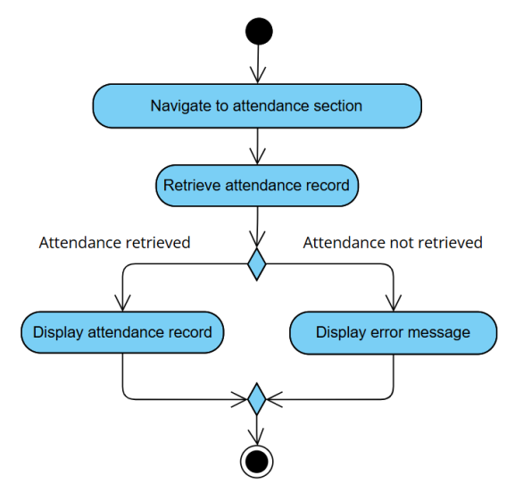

<p align="center"><em>Figure 3.1.12: Activity Diagram for Use Case UC012 View Attendance Record</em></p>

--

### 3.1.13 F013 View Academic Record

The functional requirement(s) for F013 View Academic Record:

| **Requirement ID** | REQ_F1301 |
|--------------------|-----------|
| **Version** | 1.0 |
| **Description** | The student dashboard shall display a summary of the student’s academic records, including grades and completed courses. |
| **Author** | Nickleirsch |

Table 3.1.13 illustrates the use case for the view academic record functionality (UC013), detailing the process as defined by Requirement REQ_F1301, followed by an activity diagram which represents the process flow.

<table border="1" cellspacing="0" cellpadding="5">
  <tr>
    <td><b>Use Case ID</b></td>
    <td>UC013</td>
  </tr>
  <tr>
    <td><b>Version</b></td>
    <td>1.0</td>
  </tr>
  <tr>
    <td><b>Use Case</b></td>
    <td>F013 View Academic Record</td>
  </tr>
  <tr>
    <td><b>Purpose</b></td>
    <td>To allow students to access and review their comprehensive academic records including grades, transcripts, and academic progress.</td>
  </tr>
  <tr>
    <td><b>Actor</b></td>
    <td>Student</td>
  </tr>
  <tr>
    <td><b>Trigger</b></td>
    <td>1. Student accesses academic records section<br>2. New grade notification received and clicked</td>
  </tr>
  <tr>
    <td><b>Precondition</b></td>
    <td>1. Student is logged in<br>2. Student has academic records in the system</td>
  </tr>
  <tr>
    <td><b>Postcondition</b></td>
    <td>1. Academic records are displayed<br>2. Any academic alerts are highlighted as read</td>
  </tr>
  <tr>
    <td colspan="2"><b>Main Flow</b></td>
  </tr>
  <tr>
    <td>Step 1</td>
    <td>Student navigates to academic section</td>
  </tr>
  <tr>
    <td>Step 2</td>
    <td>System retrieves academic records</td>
  </tr>
  <tr>
    <td>Step 3</td>
    <td>System displays comprehensive academic performance</td>
  </tr>
  <tr>
    <td>Step 4</td>
    <td>Student views detailed academic information</td>
  </tr>
  <tr>
    <td>Step 5</td>
    <td>Student can export their academic data if they wish to</td>
  </tr>
  <tr>
    <td colspan="2"><b>Rules</b></td>
  </tr>
  <tr>
    <td>Rule 1</td>
    <td>Academic data must sync within 5 seconds of lecturer updates [REQ_P0003, REQ_F0005, REQ_F0010]</td>
  </tr>
  <tr>
    <td>Rule 2</td>
    <td>System must maintain consistent header formatting [REQ_I0001]</td>
  </tr>
  <tr>
    <td>Rule 3</td>
    <td>System must provide tooltips for GPA calculations and academic standings [REQ_F0701]</td>
  </tr>
  <tr>
    <td>Rule 4</td>
    <td>Academic data must be exportable in Excel/CSV format [REQ_F2601]</td>
  </tr>
  <tr>
    <td><b>Author</b></td>
    <td>Nickleirsch</td>
  </tr>
</table>

<p align="center"><em>Table 3.1.13: Use Case UC013 View Academic Record</em></p>

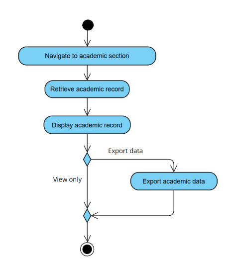

<p align="center"><em>Figure 3.1.13: Activity Diagram for Use Case UC013 View Academic Record</em></p>

--

### 3.1.14 F014 View Class Schedule

The functional requirement(s) for F014 View Class Schedule:

| **Requirement ID** | REQ_F1401 |
|--------------------|-----------|
| **Version** | 1.0 |
| **Description** | The system shall present the student’s current class schedule with course names, times, and locations. |
| **Author** | Hesham |

Table 3.1.14 illustrates the use case for the view class schedule functionality (UC014), detailing the process as defined by Requirement REQ_F1401, followed by an activity diagram which represents the process flow.

<table border="1" cellspacing="0" cellpadding="5">
  <tr>
    <td><b>Use Case ID</b></td>
    <td>UC014</td>
  </tr>
  <tr>
    <td><b>Version</b></td>
    <td>1.0</td>
  </tr>
  <tr>
    <td><b>Use Case</b></td>
    <td>F014 View Class Schedule</td>
  </tr>
  <tr>
    <td><b>Purpose</b></td>
    <td>To allow students to view their current class schedule.</td>
  </tr>
  <tr>
    <td><b>Actor</b></td>
    <td>Student</td>
  </tr>
  <tr>
    <td><b>Trigger</b></td>
    <td>1. Student navigates to class schedule section<br>2. Schedule change notification received and clicked</td>
  </tr>
  <tr>
    <td><b>Precondition</b></td>
    <td>1. Student is logged in<br>2. Student has active course enrolments</td>
  </tr>
  <tr>
    <td><b>Postcondition</b></td>
    <td>Current class schedule is displayed</td>
  </tr>
  <tr>
    <td colspan="2"><b>Main Flow</b></td>
  </tr>
  <tr>
    <td>Step 1</td>
    <td>Student navigates to class schedule section</td>
  </tr>
  <tr>
    <td>Step 2</td>
    <td>System retrieves current class schedule</td>
  </tr>
  <tr>
    <td>Step 3</td>
    <td>System displays comprehensive schedule view</td>
  </tr>
  <tr>
    <td>Step 4</td>
    <td>Student views detailed schedule information</td>
  </tr>
  <tr>
    <td colspan="2"><b>Alternate Flow - Schedule Cannot Be Retrieved</b></td>
  </tr>
  <tr>
    <td>Step 2.1</td>
    <td>System cannot retrieve schedule data</td>
  </tr>
  <tr>
    <td>Step 2.2</td>
    <td>Display error message</td>
  </tr>
  <tr>
    <td colspan="2"><b>Rules</b></td>
  </tr>
  <tr>
    <td>Rule 1</td>
    <td>System must maintain consistent header formatting [REQ_I0001]</td>
  </tr>
  <tr>
    <td>Rule 2</td>
    <td>System must provide tooltips for schedule features [REQ_F0701]</td>
  </tr>
  <tr>
    <td>Rule 3</td>
    <td>Schedule changes must sync across interfaces within 5 seconds [REQ_P0003, REQ_F0005, REQ_F0010]</td>
  </tr>
  <tr>
    <td>Rule 4</td>
    <td>Descriptive course names [REQ_I0003]</td>
  </tr>
  <tr>
    <td><b>Notes</b></td>
    <td>The class schedule is different from the calendar; the class schedule is a list of every course the student is enrolled in, detailed each class, the instructor, time and location. The calendar on the other hand is an integrated external calendar where events and reminders can be saved too, detailed in F010 Access Calendar.</td>
  </tr>
  <tr>
    <td><b>Author</b></td>
    <td>Hesham</td>
  </tr>
</table>

<p align="center"><em>Table 3.1.14: Use Case UC014 View Class Schedule</em></p>

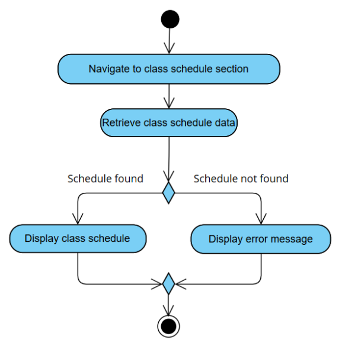

<p align="center"><em>Figure 3.1.14: Activity Diagram for Use Case UC014 View Class Schedule</em></p>

--

### 3.1.15 F015 View Exam Timetable

The functional requirement(s) for F015 View Exam Timetable:

| **Requirement ID** | REQ_F1501 |
|--------------------|-----------|
| **Version** | 1.0 |
| **Description** | The student dashboard shall display upcoming exam dates and times relevant to the student’s courses. |
| **Author** | Hesham |

Table 3.1.15 illustrates the use case for the view exam timetable functionality (UC015), detailing the process as defined by Requirement REQ_F1501, followed by an activity diagram which represents the process flow.

<table border="1" cellspacing="0" cellpadding="5">
  <tr>
    <td><b>Use Case ID</b></td>
    <td>UC015</td>
  </tr>
  <tr>
    <td><b>Version</b></td>
    <td>1.0</td>
  </tr>
  <tr>
    <td><b>Use Case</b></td>
    <td>View Exam Timetable</td>
  </tr>
  <tr>
    <td><b>Purpose</b></td>
    <td>To allow students to access and view their examination schedule, including dates, times, locations, and exam requirements.</td>
  </tr>
  <tr>
    <td><b>Actor</b></td>
    <td>Student</td>
  </tr>
  <tr>
    <td><b>Trigger</b></td>
    <td>1. Student accesses exam timetable section<br>2. Exam schedule notification received and clicked</td>
  </tr>
  <tr>
    <td><b>Precondition</b></td>
    <td>1. Student is logged in<br>2. Student has active enrolments with exams<br>3. Exam schedule is published</td>
  </tr>
  <tr>
    <td><b>Postcondition</b></td>
    <td>Exam timetable is displayed</td>
  </tr>
  <tr>
    <td colspan="2"><b>Main Flow</b></td>
  </tr>
  <tr>
    <td>Step 1</td>
    <td>Student navigates to exam timetable section</td>
  </tr>
  <tr>
    <td>Step 2</td>
    <td>System retrieves current exam schedule</td>
  </tr>
  <tr>
    <td>Step 3</td>
    <td>System displays comprehensive exam timetable</td>
  </tr>
  <tr>
    <td>Step 4</td>
    <td>Student views detailed exam information</td>
  </tr>
  <tr>
    <td colspan="2"><b>Alternative Flow – If Exam Timetable Data Cannot Be Retrieved</b></td>
  </tr>
  <tr>
    <td>Step 2.1</td>
    <td>System cannot retrieve exam data</td>
  </tr>
  <tr>
    <td>Step 2.2</td>
    <td>System displays error message</td>
  </tr>
  <tr>
    <td colspan="2"><b>Rules</b></td>
  </tr>
  <tr>
    <td>Rule 1</td>
    <td>System must maintain consistent header formatting [REQ_I0001]</td>
  </tr>
  <tr>
    <td>Rule 2</td>
    <td>Exam dates must sync across interfaces within 5 seconds [REQ_P0003, REQ_F0005, REQ_F0010]</td>
  </tr>
  <tr>
    <td><b>Author</b></td>
    <td>Hesham</td>
  </tr>
</table>

<p align="center"><em>Table 3.1.15: Use Case UC015 View Exam Timetable</em></p>

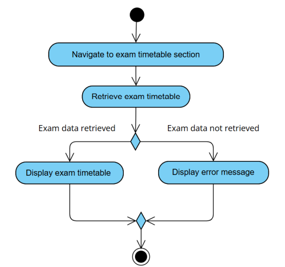

<p align="center"><em>Figure 3.1.15: Activity Diagram for Use Case UC015 View Exam Timetable</em></p>

--

### 3.1.16 F016 View Billing Information

The functional requirement(s) for F016 View Billing Information:

| **Requirement ID** | REQ_F1601 |
|--------------------|-----------|
| **Version** | 1.0 |
| **Description** | The student dashboard shall display finance section with billing information, payment status, and fee breakdowns. |
| **Author** | Hesham |

Table 3.1.16 illustrates the use case for the view billing information functionality (UC016), detailing the process as defined by Requirement REQ_F1601, followed by an activity diagram which represents the process flow.

<table border="1" cellspacing="0" cellpadding="5">
  <tr>
    <td><b>Use Case ID</b></td>
    <td>UC016</td>
  </tr>
  <tr>
    <td><b>Version</b></td>
    <td>1.0</td>
  </tr>
  <tr>
    <td><b>Use Case</b></td>
    <td>View Billing Information</td>
  </tr>
  <tr>
    <td><b>Purpose</b></td>
    <td>To allow students to access and view their invoices and fees as well as due dates to make those payments.</td>
  </tr>
  <tr>
    <td><b>Actor</b></td>
    <td>Student</td>
  </tr>
  <tr>
    <td><b>Trigger</b></td>
    <td>1. Student accesses billing section<br>2. Billing update notification received and clicked</td>
  </tr>
  <tr>
    <td><b>Precondition</b></td>
    <td>Student is logged in</td>
  </tr>
  <tr>
    <td><b>Postcondition</b></td>
    <td>Billing information is displayed</td>
  </tr>
  <tr>
    <td colspan="2"><b>Main Flow</b></td>
  </tr>
  <tr>
    <td>Step 1</td>
    <td>Student navigates to billing section</td>
  </tr>
  <tr>
    <td>Step 2</td>
    <td>System retrieves current billing data</td>
  </tr>
  <tr>
    <td>Step 3</td>
    <td>System displays comprehensive billing information</td>
  </tr>
  <tr>
    <td>Step 4</td>
    <td>Student views detailed billing information with breakdowns by course and due dates</td>
  </tr>
  <tr>
    <td colspan="2"><b>Alternative Flow – If Billing Data Cannot Be Retrieved</b></td>
  </tr>
  <tr>
    <td>Step 2.1</td>
    <td>System cannot retrieve billing information</td>
  </tr>
  <tr>
    <td>Step 2.2</td>
    <td>System displays error message</td>
  </tr>
  <tr>
    <td colspan="2"><b>Rules</b></td>
  </tr>
  <tr>
    <td>Rule i</td>
    <td>System must maintain consistent header formatting [REQ_I0001]</td>
  </tr>
  <tr>
    <td>Rule ii</td>
    <td>System must provide tooltips for how finances are calculated [REQ_F0701]</td>
  </tr>
  <tr>
    <td><b>Notes</b></td>
    <td>Billing data is view-only within COMSYS, payments are made externally and as such, not within the confines of the system.</td>
  </tr>
  <tr>
    <td><b>Author</b></td>
    <td>Hesham</td>
  </tr>
</table>

<p align="center"><em>Table 3.1.16: Use Case UC016 View Billing Information</em></p>

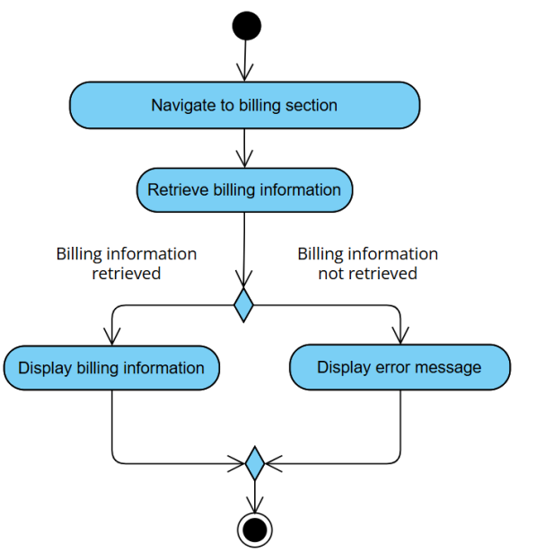

<p align="center"><em>Figure 3.1.16: Activity Diagram for Use Case UC016 View Billing Information</em></p>

--

### 3.1.17 F017 Enrol in Course

The functional requirement(s) for F017 Enrol in Course:

| **Requirement ID** | REQ_F1701 |
|--------------------|-----------|
| **Version** | 1.0 |
| **Description** | The student dashboard shall provide a section for managing course registration and enrolment. |
| **Author** | Hesham |

Table 3.1.17 illustrates the use case for the enrol in course functionality (UC017), detailing the process as defined by Requirement REQ_F1701, followed by an activity diagram which represents the process flow.

<table border="1" cellspacing="0" cellpadding="5">
  <tr>
    <td><b>Use Case ID</b></td>
    <td>UC017</td>
  </tr>
  <tr>
    <td><b>Version</b></td>
    <td>1.0</td>
  </tr>
  <tr>
    <td><b>Use Case</b></td>
    <td>F017 Enrol in Course</td>
  </tr>
  <tr>
    <td><b>Purpose</b></td>
    <td>To enable students to register for courses during their designated enrolment period.</td>
  </tr>
  <tr>
    <td><b>Actor</b></td>
    <td>Student</td>
  </tr>
  <tr>
    <td><b>Trigger</b></td>
    <td>1. Student navigates to enrolment section</td>
  </tr>
  <tr>
    <td><b>Precondition</b></td>
    <td>1. Student is logged in<br>2. Student has an active enrolment session</td>
  </tr>
  <tr>
    <td><b>Postcondition</b></td>
    <td>1. Student is enrolled in selected course(s)<br>2. Student schedule is updated<br>3. Calendar is synced with new schedule</td>
  </tr>
  <tr>
    <td colspan="2"><b>Main Flow</b></td>
  </tr>
  <tr><td>Step 1</td><td>Student navigates to course enrolment section</td></tr>
  <tr><td>Step 2</td><td>System displays available courses for enrolment</td></tr>
  <tr><td>Step 3</td><td>Student selects desired course(s)</td></tr>
  <tr><td>Step 4</td><td>System validates enrolment eligibility</td></tr>
  <tr><td>Step 5</td><td>Student confirms course selection</td></tr>
  <tr><td>Step 6</td><td>System processes enrolment request</td></tr>
  <tr><td>Step 7</td><td>System displays “enrolment successful”</td></tr>
  <tr><td>Step 8</td><td>System calls calendar sync to update calendar</td></tr>
  <tr><td>Step 9</td><td>System asks whether user wants to enrol another course</td></tr>
  <tr><td>Step 10</td><td>User chooses “No”</td></tr>

  <tr><td colspan="2"><b>Alternative Flow – If Prerequisites Not Met</b></td></tr>
  <tr><td>Step 4.1.1</td><td>Student does not meet prerequisite requirements</td></tr>
  <tr><td>Step 4.1.2</td><td>System displays “prerequisite(s) not met!” error</td></tr>
  <tr><td>Step 4.1.3</td><td>Return to main flow step 9</td></tr>

  <tr><td colspan="2"><b>Alternative Flow – If Schedule Conflict Found</b></td></tr>
  <tr><td>Step 4.2.1</td><td>System detected a schedule conflict</td></tr>
  <tr><td>Step 4.2.2</td><td>System displays “schedule conflict found!” error</td></tr>
  <tr><td>Step 4.2.3</td><td>Return to Main Flow step 9</td></tr>

  <tr><td colspan="2"><b>Alternative Flow – Enrol Another Course</b></td></tr>
  <tr><td>Step 9.1</td><td>Student chooses “Yes”</td></tr>
  <tr><td>Step 9.2</td><td>Return to Main Flow step 2</td></tr>

  <tr><td colspan="2"><b>Rules</b></td></tr>
  <tr><td>Rule 1</td><td>System must maintain consistent header formatting [REQ_I0001]</td></tr>
  <tr><td>Rule 2</td><td>The course enrolment process must be in a single window [REQ_I0007]</td></tr>

  <tr><td><b>Author</b></td><td>Hesham</td></tr>
</table>

<p align="center"><em>Table 3.1.17: Use Case UC017 Enrol in Course</em></p>

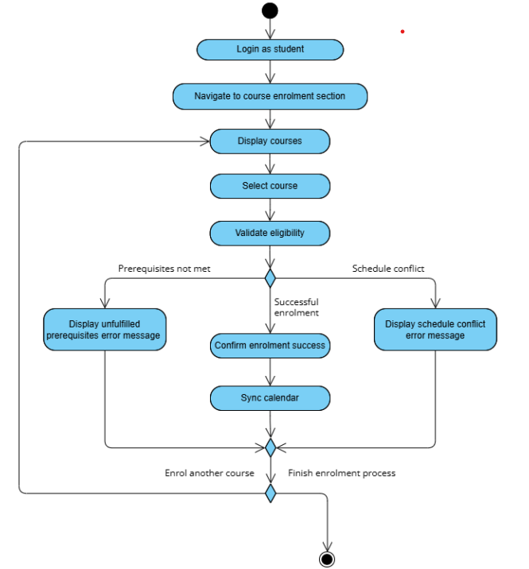

<p align="center"><em>Figure 3.1.17: Activity Diagram for Use Case UC017 Enrol in Course</em></p>

--

### 3.1.18 F018 Search Past Announcement

The functional requirement(s) for F018 Search Past Announcement:

| **Requirement ID** | REQ_F1801 |
|--------------------|-----------|
| **Version** | 1.0 |
| **Description** | The student dashboard shall display university announcements relevant to the student. |
| **Author** | Hesham |

| **Requirement ID** | REQ_F1802 |
|--------------------|-----------|
| **Version** | 1.0 |
| **Description** | The system shall provide a search functionality for past announcements and communications |
| **Author** | Hesham |

Table 3.1.18 illustrates the use case for the search past announcement functionality (UC018), detailing the process as defined by Requirement REQ_F1801 and REQ_F1802, followed by an activity diagram which represents the process flow.

<table border="1" cellspacing="0" cellpadding="5">
  <tr>
    <td><b>Use Case ID</b></td>
    <td>UC018</td>
  </tr>
  <tr>
    <td><b>Version</b></td>
    <td>1.0</td>
  </tr>
  <tr>
    <td><b>Use Case</b></td>
    <td>F018 Search Past Announcements</td>
  </tr>
  <tr>
    <td><b>Purpose</b></td>
    <td>To allow students to search and retrieve historical announcements using various search criteria.</td>
  </tr>
  <tr>
    <td><b>Actor</b></td>
    <td>Student</td>
  </tr>
  <tr>
    <td><b>Trigger</b></td>
    <td>1. Student navigates to announcement search page</td>
  </tr>
  <tr>
    <td><b>Precondition</b></td>
    <td>1. Student has an active session<br>2. Announcements exist for the requesting student</td>
  </tr>
  <tr>
    <td><b>Postcondition</b></td>
    <td>Search results are displayed</td>
  </tr>

  <tr>
    <td colspan="2"><b>Main Flow</b></td>
  </tr>
  <tr><td>Step 1</td><td>Student navigates to announcement search section</td></tr>
  <tr><td>Step 2</td><td>System displays search interface</td></tr>
  <tr><td>Step 3</td><td>Student enters search criteria</td></tr>
  <tr><td>Step 4</td><td>System retrieves matching announcements</td></tr>
  <tr><td>Step 5</td><td>System displays search results</td></tr>
  <tr><td>Step 6</td><td>Student views desired announcement</td></tr>

  <tr>
    <td colspan="2"><b>Alternative Flow – If No Results Found</b></td>
  </tr>
  <tr><td>Step 4.1</td><td>System finds no result for search criteria</td></tr>
  <tr><td>Step 4.2</td><td>System displays “No Results” message</td></tr>
  <tr><td>Step 4.3</td><td>System prompts retry</td></tr>
  <tr><td>Step 4.4</td><td>Return to Main Flow step 2</td></tr>

  <tr>
    <td colspan="2"><b>Rules</b></td>
  </tr>
  <tr><td>Rule 1</td><td>System must maintain announcement read status tracking [REQ_F0001]</td></tr>

  <tr><td><b>Author</b></td><td>Nickleirsch</td></tr>
</table>

<p align="center"><em>Table 3.1.18: Use Case UC018 Search Past Announcement</em></p>

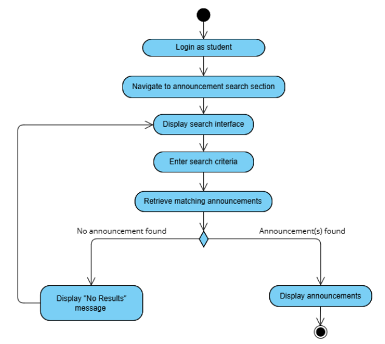

<p align="center"><em>Figure 3.1.18: Activity Diagram for Use Case UC018 Search Past Announcement</em></p>

--

### 3.1.19 F019 Customize Notification Preference

The functional requirement(s) for F019 Customize Notification Preferences:

| **Requirement ID** | REQ_F1901 |
|--------------------|-----------|
| **Version** | 1.0 |
| **Description** | The system shall allow student users to enable or disable notifications for specific communication types, such as academic alerts, billing updates, or general announcements. |
| **Author** | Hesham |

| **Requirement ID** | REQ_F1902 |
|--------------------|-----------|
| **Version** | 1.0 |
| **Description** | The system shall allow users to customize their notification preferences and channels for different types of communications. |
| **Author** | Hesham |

| **Requirement ID** | REQ_F1903 |
|--------------------|-----------|
| **Version** | 1.0 |
| **Description** | The system shall store and apply notification preferences per student in their user profile. |
| **Author** | Nickleirsch |

Table 3.1.19 illustrates the use case for the customize notification preferences functionality (UC019), detailing the process as defined by Requirement REQ_F1901, REQ_F1902 and REQ_F1903, followed by an activity diagram which represents the process flow.

<table border="1" cellspacing="0" cellpadding="5">
  <tr>
    <td><b>Use Case ID</b></td>
    <td>UC019</td>
  </tr>
  <tr>
    <td><b>Version</b></td>
    <td>1.0</td>
  </tr>
  <tr>
    <td><b>Use Case</b></td>
    <td>F019 Customize Notifications Preference</td>
  </tr>
  <tr>
    <td><b>Purpose</b></td>
    <td>To allow students to personalize their notification settings across different channels and categories.</td>
  </tr>
  <tr>
    <td><b>Actor</b></td>
    <td>Student</td>
  </tr>
  <tr>
    <td><b>Trigger</b></td>
    <td>Student accesses notification settings.</td>
  </tr>
  <tr>
    <td><b>Precondition</b></td>
    <td>Student is logged in.</td>
  </tr>
  <tr>
    <td><b>Postcondition</b></td>
    <td>1. Notification preferences are updated.<br>2. New settings are active immediately.</td>
  </tr>

  <tr>
    <td colspan="2"><b>Main Flow</b></td>
  </tr>
  <tr><td>Step 1</td><td>Student navigates to notification preferences</td></tr>
  <tr><td>Step 2</td><td>System displays current notification settings</td></tr>
  <tr><td>Step 3</td><td>Student modifies preferred channels/categories</td></tr>
  <tr><td>Step 4</td><td>Student confirms modifications</td></tr>
  <tr><td>Step 5</td><td>System saves new preferences</td></tr>

  <tr>
    <td colspan="2"><b>Rules</b></td>
  </tr>
  <tr><td>Rule 1</td><td>System must support filtering and muting by category [REQ_F1901]</td></tr>
  <tr><td>Rule 2</td><td>System must respect quiet hours setting [REQ_F2001]</td></tr>
  <tr><td>Rule 3</td><td>System will store and apply notification preferences ensuring it persists across sessions [REQ_F1903]</td></tr>

  <tr><td><b>Author</b></td><td>Hesham</td></tr>
</table>

<p align="center"><em>Table 3.1.19: Use Case UC019 Customize Notification Preference</em></p>

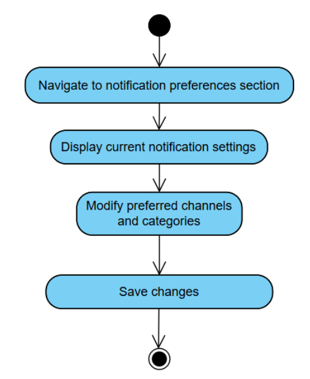

<p align="center"><em>Figure 3.1.19: Activity Diagram for Use Case UC019 Customize Notification Preference</em></p>

--

### 3.1.20 F020 Set ‘Quiet Hours’

The functional requirement(s) for F020 Set ‘Quiet Hours’:

| **Requirement ID** | REQ_F2001 |
|--------------------|-----------|
| **Version** | 1.0 |
| **Description** | The system should provide a "quiet hours" feature allowing students to temporarily suspend non-urgent notifications |
| **Author** | Hesham |

Table 3.1.20 illustrates the use case for the set ‘quiet hours’ functionality (UC020), detailing the process as defined by Requirement REQ_F2001, followed by an activity diagram which represents the process flow.

<table border="1" cellspacing="0" cellpadding="5">
  <tr>
    <td><b>Use Case ID</b></td>
    <td>UC020</td>
  </tr>
  <tr>
    <td><b>Version</b></td>
    <td>1.0</td>
  </tr>
  <tr>
    <td><b>Use Case</b></td>
    <td>F020 Set ‘Quiet Hours’</td>
  </tr>
  <tr>
    <td><b>Purpose</b></td>
    <td>To allow users to define time periods when notifications should be suppressed.</td>
  </tr>
  <tr>
    <td><b>Actor</b></td>
    <td>Student</td>
  </tr>
  <tr>
    <td><b>Trigger</b></td>
    <td>1. Student accesses quiet hours settings.<br>2. System prompts student for quiet hours setup.</td>
  </tr>
  <tr>
    <td><b>Precondition</b></td>
    <td>User is logged in.</td>
  </tr>
  <tr>
    <td><b>Postcondition</b></td>
    <td>1. Quiet hours settings are updated.<br>2. Changes are saved and active.</td>
  </tr>

  <tr>
    <td colspan="2"><b>Main Flow</b></td>
  </tr>
  <tr><td>Step 1</td><td>User navigates to quiet hours settings</td></tr>
  <tr><td>Step 2</td><td>System displays current quiet hours configuration</td></tr>
  <tr><td>Step 3</td><td>User sets quiet hours’ time ranges</td></tr>
  <tr><td>Step 4</td><td>User selects days of week for quiet hours</td></tr>
  <tr><td>Step 5</td><td>User configures critical notification exceptions</td></tr>
  <tr><td>Step 6</td><td>User confirms changes</td></tr>
  <tr><td>Step 7</td><td>System saves new quiet hours configuration</td></tr>

  <tr>
    <td colspan="2"><b>Rules</b></td>
  </tr>
  <tr><td>Rule 1</td><td>System must support filtering and muting by category [REQ_F1901]</td></tr>
  <tr><td>Rule 2</td><td>System will store and apply notification preferences ensuring it persists across sessions [REQ_F1903]</td></tr>

  <tr><td><b>Author</b></td><td>Hesham</td></tr>
</table>

<p align="center"><em>Table 3.1.20: Use Case UC020 Set ‘Quiet Hours’</em></p>

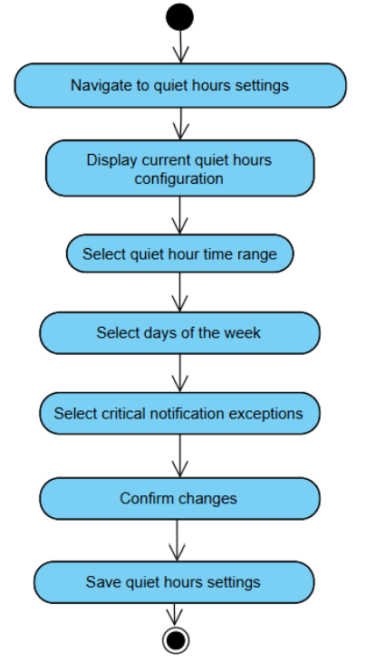

<p align="center"><em>Figure 3.1.20: Activity Diagram for Use Case UC020 Set ‘Quiet Hours’</em></p>

--

### 3.1.21 F021 View Child's Information

The functional requirement(s) for F021 View Child’s Information:

| **Requirement ID** | REQ_F2101 |
|--------------------|-----------|
| **Version** | 1.0 |
| **Description** | The system shall provide a dedicated portal for parents to access their child’s grades, attendance, and financial information. |
| **Author** | Lim Xin Yee |

Table 3.1.21 illustrates the use case for the view child’s information functionality (UC021), detailing the process as defined by Requirement REQ_F2101, followed by an activity diagram which represents the process flow.

<table border="1" cellspacing="0" cellpadding="5">
  <tr>
    <td><b>Use Case ID</b></td>
    <td>UC021</td>
  </tr>
  <tr>
    <td><b>Version</b></td>
    <td>1.0</td>
  </tr>
  <tr>
    <td><b>Use Case</b></td>
    <td>F021 View Child’s Information</td>
  </tr>
  <tr>
    <td><b>Purpose</b></td>
    <td>To allow parents to securely access and view their child's academic, attendance, and financial records through the university's portal.</td>
  </tr>
  <tr>
    <td><b>Actor</b></td>
    <td>Parent</td>
  </tr>
  <tr>
    <td><b>Trigger</b></td>
    <td>Parent logs in to the university portal and selects the option to view their child’s information.</td>
  </tr>
  <tr>
    <td><b>Precondition</b></td>
    <td>1. Parent has a registered and verified user account.<br>2. The student (child) has granted the necessary consent for data access, in accordance with university privacy policies.</td>
  </tr>
  <tr>
    <td><b>Postcondition</b></td>
    <td>The parent can view up-to-date information regarding their child’s grades, attendance, financial status, and academic details, as presented in a readable format (e.g., tables, summaries, charts).</td>
  </tr>

  <tr>
    <td colspan="2"><b>Main Flow</b></td>
  </tr>
  <tr><td>Step 1</td><td>Parent navigates to child information section.</td></tr>
  <tr><td>Step 2</td><td>System checks that consent has been provided by the student.</td></tr>
  <tr><td>Step 3</td><td>System retrieves child’s academic, attendance, and financial data.</td></tr>
  <tr><td>Step 4</td><td>System displays the information with visual aids.</td></tr>
  <tr><td>Step 5</td><td>Parent may choose to export academic data for record-keeping.</td></tr>

  <tr>
    <td colspan="2"><b>Alternate Flow – Student Consent Not Granted</b></td>
  </tr>
  <tr><td>Step 2.1</td><td>Student did not grant consent to the parent.</td></tr>
  <tr><td>Step 2.2</td><td>System displays a prompt stating that access to the requested information is restricted.</td></tr>

  <tr>
    <td colspan="2"><b>Rules</b></td>
  </tr>
  <tr><td>Rule 1</td><td>Only parents with valid authentication and authorization (student’s explicit consent) can access child-related data. [REQ_F0009, REQ_F3001]</td></tr>
  <tr><td>Rule 2</td><td>Information displayed must comply with privacy regulation. [REQ_F0002]</td></tr>
  <tr><td>Rule 3</td><td>Parental access is restricted to only the child’s academic, financial, and attendance information. [REQ_F2101]</td></tr>
  <tr><td>Rule 4</td><td>Data presented must be in a readable, structured format for comprehension. [REQ_I0004]</td></tr>

  <tr><td><b>Notes</b></td><td>
  Visual aids refer to tables, charts and summaries as parents are users who need quick understanding.<br>
  For a parent to view a student’s personal data, the student must first provide explicit consent to the university. This consent must be given by physically submitting a signed consent form to the university administration.<br>
  Once the form is received, an admin user will configure the parent’s access to the student’s data in the system, as defined in F00X: Configure Parent Access.<br>
  This process is required to ensure compliance with applicable privacy laws and protect student data.
  </td></tr>

  <tr><td><b>Author</b></td><td>Lim Xin Yee and Nickleirsch</td></tr>
</table>

<p align="center"><em>Table 3.1.21: Use Case UC021 View Child’s Information</em></p>

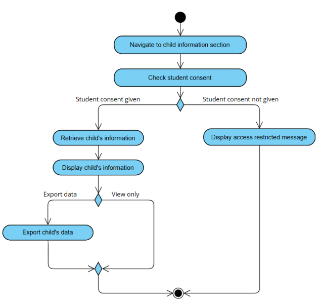

<p align="center"><em>Figure 3.1.21: Activity Diagram for Use Case UC021 View Child’s Information</em></p>

 --
 
 ### 3.1.22 F022 View University Contact Directory

The functional requirement(s) for F022 View University Contact Directory:

| **Requirement ID** | REQ_F2201 |
|--------------------|-----------|
| **Version** | 1.0 |
| **Description** | The system shall include a contact directory interface, maintained by admins, for parents to access with filters for faculty and department. |
| **Author** | Nickleirsch |

Table 3.1.22 illustrates the use case for the view university contact directory functionality (UC022), detailing the process as defined by Requirement REQ_F2201, followed by an activity diagram which represents the process flow.

<table border="1" cellspacing="0" cellpadding="5">
  <tr>
    <td><b>Use Case ID</b></td>
    <td>UC022</td>
  </tr>
  <tr>
    <td><b>Version</b></td>
    <td>1.0</td>
  </tr>
  <tr>
    <td><b>Use Case</b></td>
    <td>F022 View University Contact Directory</td>
  </tr>
  <tr>
    <td><b>Purpose</b></td>
    <td>To allow parents to access and view university contact details, including departments and relevant staff.</td>
  </tr>
  <tr>
    <td><b>Actor</b></td>
    <td>Parent</td>
  </tr>
  <tr>
    <td><b>Trigger</b></td>
    <td>The parent selects the "Contact Directory" option from the university portal after logging in.</td>
  </tr>
  <tr>
    <td><b>Precondition</b></td>
    <td>Parent is logged in.</td>
  </tr>
  <tr>
    <td><b>Postcondition</b></td>
    <td>1. The system displays a filtered contact directory containing permitted university contact details.<br>2. Parent may optionally initiate communication through live chat or contact form.</td>
  </tr>

  <tr>
    <td colspan="2"><b>Main Flow</b></td>
  </tr>
  <tr><td>Step 1</td><td>Parent navigates to the contact directory section.</td></tr>
  <tr><td>Step 2</td><td>Parent chooses faculty or department to contact.</td></tr>
  <tr><td>Step 3</td><td>The system loads the contact directory interface with filters (if any are applied).</td></tr>
  <tr><td>Step 4</td><td>Parent selects a contact entry to view full details.</td></tr>
  <tr><td>Step 5</td><td>Parent can choose to initiate communication via live chat or contact form.</td></tr>

  <tr>
    <td colspan="2"><b>Alternate Flow – Parent Initiates Live Chat</b></td>
  </tr>
  <tr><td>Step 5.1.1</td><td>Parent clicks on “Live Chat” from a contact entry.</td></tr>
  <tr><td>Step 5.1.2</td><td>Proceed to F011 Chat.</td></tr>

  <tr>
    <td colspan="2"><b>Alternate Flow – Parent Initiates Contact Form</b></td>
  </tr>
  <tr><td>Step 5.2.1</td><td>Parent clicks on “Contact Form” from a contact entry.</td></tr>
  <tr><td>Step 5.2.2</td><td>Proceed to F023 Schedule Meeting with University Staff.</td></tr>

  <tr>
    <td colspan="2"><b>Rules</b></td>
  </tr>
  <tr><td>Rule 1</td><td>The contact directory interface shall include filters for faculty and department. [REQ_F2201]</td></tr>
  <tr><td>Rule 2</td><td>The system shall enable communication between parents and authorized university staff through chat, or a secure contact form embedded within the directory interface. [REQ_F2201, REQ_F2301]</td></tr>

  <tr><td><b>Notes</b></td><td>
  1. Faculty refers to educational divisions within the university (e.g. Faculty of Multimedia, Faculty of Engineering).<br>
  2. Department refers to the administrative divisions of the university (e.g. Finance, Student Affairs).
  </td></tr>

  <tr><td><b>Author</b></td><td>Lim Xin Yee</td></tr>
</table>

<p align="center"><em>Table 3.1.22: Use Case UC022 View University Contact Directory</em></p>

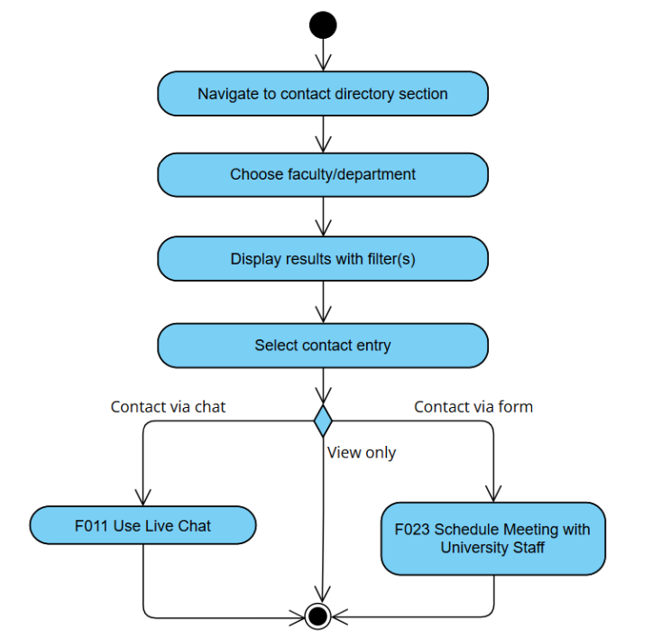

<p align="center"><em>Figure 3.1.22: Activity Diagram for Use Case UC022 View University Contact Directory</em></p>

--

### 3.1.23 F023 Schedule Meeting with University Staff

The functional requirement(s) for F023 Schedule Meeting with University Staff:

| **Requirement ID** | REQ_F2301 |
|--------------------|-----------|
| **Version** | 1.0 |
| **Description** | The system shall enable communication between university administrators and parents via chat or contact form. |
| **Author** | Lim Xin Yee |

Table 3.1.23 illustrates the use case for the schedule meeting with university staff functionality (UC023), detailing the process as defined by Requirement REQ_F2301, followed by an activity diagram which represents the process flow.

<table border="1" cellspacing="0" cellpadding="5">
  <tr>
    <td><b>Use Case ID</b></td>
    <td>UC023</td>
  </tr>
  <tr>
    <td><b>Version</b></td>
    <td>1.0</td>
  </tr>
  <tr>
    <td><b>Use Case</b></td>
    <td>F023 Schedule Meeting with University Staff</td>
  </tr>
  <tr>
    <td><b>Purpose</b></td>
    <td>To allow parents to request and schedule meetings with relevant university staff using a secure contact form integrated within the parent portal.</td>
  </tr>
  <tr>
    <td><b>Actor</b></td>
    <td>Parent</td>
  </tr>
  <tr>
    <td><b>Trigger</b></td>
    <td>Parent submits a meeting request through the contact form available on the university portal.</td>
  </tr>
  <tr>
    <td><b>Precondition</b></td>
    <td>1. Parent is logged in.<br>2. The contact form is properly configured and operational.</td>
  </tr>
  <tr>
    <td><b>Postcondition</b></td>
    <td>1. A meeting request is logged and sent to the selected staff member.<br>2. The requested meeting is scheduled or followed up via further communication.</td>
  </tr>

  <tr>
    <td colspan="2"><b>Main Flow</b></td>
  </tr>
  <tr><td>Step 1</td><td>Parent navigates to contact directory section.</td></tr>
  <tr><td>Step 2</td><td>Parent selects a university staff member from the contact list.</td></tr>
  <tr><td>Step 3</td><td>Parent fills out the contact form, including preferred meeting date, time, and purpose.</td></tr>
  <tr><td>Step 4</td><td>Parent submits the form.</td></tr>
  <tr><td>Step 5</td><td>System sends the meeting request to the selected staff member.</td></tr>
  <tr><td>Step 6</td><td>The meeting request is sent to the staff member.</td></tr>

  <tr>
    <td colspan="2"><b>Alternate Flow – Invalid Form Submission</b></td>
  </tr>
  <tr><td>Step 4.1</td><td>System detects missing/invalid required fields.</td></tr>
  <tr><td>Step 4.2</td><td>System prompts the parent to complete all necessary fields.</td></tr>

  <tr>
    <td colspan="2"><b>Rules</b></td>
  </tr>
  <tr><td>Rule 1</td><td>The contact directory interface shall include filters for faculty and department. [REQ_F2201]</td></tr>
  <tr><td>Rule 2</td><td>The system shall enable communication between parents and authorized university staff through chat, or a secure contact form embedded within the directory interface. [REQ_F2201, REQ_F2301]</td></tr>
  <tr><td>Rule 3</td><td>System will notify the parent of the meeting status (confirmed, rescheduled, or declined). [REQ_0601]</td></tr>

  <tr><td><b>Author</b></td><td>Lim Xin Yee</td></tr>
</table>

<p align="center"><em>Table 3.1.23: Use Case UC023 Schedule Meeting with University Staff</em></p>

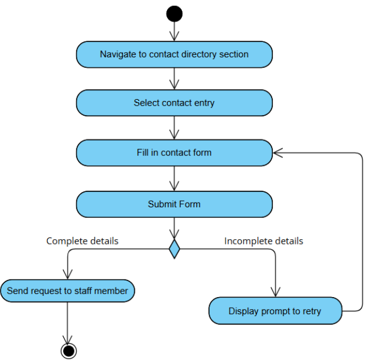

<p align="center"><em>Figure 3.1.23: Activity Diagram for Use Case UC023 Schedule Meeting with University Staff</em></p>

--

### 3.1.24 F024 Manage Academic Resource

The functional requirement(s) for F024 Manage Academic Resource:

| **Requirement ID** | REQ_F2401 |
|--------------------|-----------|
| **Version** | 1.0 |
| **Description** | Lecturers shall be able to upload and update materials in a centralized location. |
| **Author** | Nickleirsch |

| **Requirement ID** | REQ_F2402 |
|--------------------|-----------|
| **Version** | 1.0 |
| **Description** | Lecturers shall be able to generate a single unique link to academic resources usable across platforms. |
| **Author** | Nickleirsch |

Table 3.1.24 illustrates the use case for the manage academic resource functionality (UC024), detailing the process as defined by Requirement REQ_F2401, and REQ_F2402 followed by an activity diagram which represents the process flow.

<table border="1" cellspacing="0" cellpadding="5">
  <tr>
    <td><b>Use Case ID</b></td>
    <td>UC024</td>
  </tr>
  <tr>
    <td><b>Version</b></td>
    <td>1.0</td>
  </tr>
  <tr>
    <td><b>Use Case</b></td>
    <td>F024 Manage Academic Resource</td>
  </tr>
  <tr>
    <td><b>Purpose</b></td>
    <td>Enable lecturers to update academic materials in a centralized folder and share a unique link to it.</td>
  </tr>
  <tr>
    <td><b>Actor</b></td>
    <td>Lecturer</td>
  </tr>
  <tr>
    <td><b>Trigger</b></td>
    <td>Lecturer selects the option to update course material.</td>
  </tr>
  <tr>
    <td><b>Precondition</b></td>
    <td>Lecturer is logged in.</td>
  </tr>
  <tr>
    <td><b>Postcondition</b></td>
    <td>Academic resource is successfully uploaded.</td>
  </tr>

  <tr>
    <td colspan="2"><b>Main Flow</b></td>
  </tr>
  <tr><td>Step 1</td><td>Lecturer navigates to the course management section.</td></tr>
  <tr><td>Step 2</td><td>Lecturer selects the relevant course.</td></tr>
  <tr><td>Step 3</td><td>Lecturer selects “Update Academic Resource.”</td></tr>
  <tr><td>Step 4</td><td>Lecturer chooses one or more files to upload.</td></tr>
  <tr><td>Step 5</td><td>System checks file type and size.</td></tr>
  <tr><td>Step 6</td><td>System stores the material in a centralized location.</td></tr>
  <tr><td>Step 7</td><td>System displays a confirmation of successful upload along with unique link to the resource.</td></tr>

  <tr>
    <td colspan="2"><b>Alternate Flow – Uploading Unsupported File Type or Size</b></td>
  </tr>
  <tr><td>Step 5.1.1</td><td>The lecturer tries to upload an unsupported file format or size.</td></tr>
  <tr><td>Step 5.1.2</td><td>The system displays a clear error, prompting a retry.</td></tr>

  <tr>
    <td colspan="2"><b>Rules</b></td>
  </tr>
  <tr><td>Rule 1</td><td>Only authenticated lecturers can upload materials. [REQ_F0009]</td></tr>
  <tr><td>Rule 2</td><td>Upload location must be centralized and accessible via a unique link. [REQ_F2401, REQ_F2402]</td></tr>

  <tr><td><b>Author</b></td><td>Nickleirsch</td></tr>
</table>

<p align="center"><em>Table 3.1.24: Use Case UC024 Manage Academic Resource</em></p>

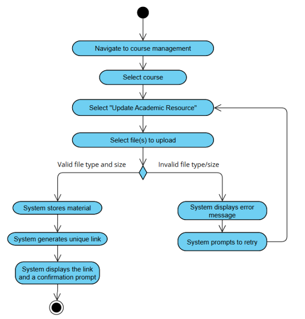

<p align="center"><em>Figure 3.1.24: Activity Diagram for Use Case UC024 Manage Academic Resource</em></p>

--

### 3.1.25 F025 View Announcement Read Status

The functional requirement(s) for F025 View Announcement Read Status:

| **Requirement ID** | REQ_F2501 |
|--------------------|-----------|
| **Version** | 1.0 |
| **Description** | The system shall allow lecturers and admin to view the read status of announcements they have made. |
| **Author** | Nickleirsch |

Table 3.1.25 illustrates the use case for the view announcement read status functionality (UC025), detailing the process as defined by Requirement REQ_F2501 followed by an activity diagram which represents the process flow.

<table border="1" cellspacing="0" cellpadding="5">
  <tr>
    <td><b>Use Case ID</b></td>
    <td>UC025</td>
  </tr>
  <tr>
    <td><b>Version</b></td>
    <td>1.0</td>
  </tr>
  <tr>
    <td><b>Use Case</b></td>
    <td>F025 View Announcement Read Status</td>
  </tr>
  <tr>
    <td><b>Purpose</b></td>
    <td>To allow lecturers to view which students have read a particular announcement.</td>
  </tr>
  <tr>
    <td><b>Actor</b></td>
    <td>Lecturer</td>
  </tr>
  <tr>
    <td><b>Trigger</b></td>
    <td>Lecturer wants to check which recipients have read a specific announcement.</td>
  </tr>
  <tr>
    <td><b>Precondition</b></td>
    <td>Lecturer is logged in.</td>
  </tr>
  <tr>
    <td><b>Postcondition</b></td>
    <td>Lecturer can see which recipients have read or have not read the announcement.</td>
  </tr>

  <tr>
    <td colspan="2"><b>Main Flow</b></td>
  </tr>
  <tr><td>Step 1</td><td>Lecturer navigates to the announcement history.</td></tr>
  <tr><td>Step 2</td><td>Lecturer selects an announcement they have sent.</td></tr>
  <tr><td>Step 3</td><td>System displays a list of recipients with their read status, with real-time updates.</td></tr>

  <tr>
    <td colspan="2"><b>Alternate Flow – No Announcements Exist</b></td>
  </tr>
  <tr><td>Step 1.1</td><td>If no announcements have been made yet, the system prompts the user to make an announcement.</td></tr>

  <tr>
    <td colspan="2"><b>Rules</b></td>
  </tr>
  <tr><td>Rule 1</td><td>Only announcement authors can view read statuses. [REQ_F2501]</td></tr>
  <tr><td>Rule 2</td><td>Read status is updated in real time. [REQ_F0001]</td></tr>

  <tr><td><b>Notes</b></td><td>Read receipts are only supported for portal announcements.</td></tr>
  <tr><td><b>Author</b></td><td>Nickleirsch</td></tr>
</table>

<p align="center"><em>Table 3.1.25: Use Case UC025 View Announcement Read Status</em></p>

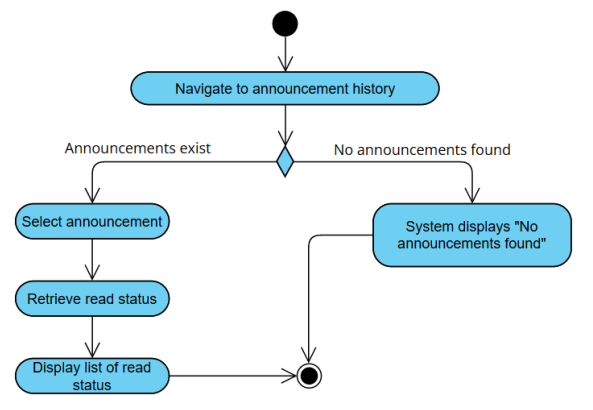

<p align="center"><em>Figure 3.1.25: Activity Diagram for Use Case UC025 View Announcement Read Status</em></p>

--

### 3.1.26 F026 Update Student Academic Data

The functional requirement(s) for F026 Update Student Academic Data:

| **Requirement ID** | REQ_F2601 |
|--------------------|-----------|
| **Version** | 1.0 |
| **Description** | The system shall allow exporting and importing student academic data in Excel or CSV format. |
| **Author** | Nickleirsch |

Table 3.1.26 illustrates the use case for the update student academic data functionality (UC026), detailing the process as defined by Requirement REQ_F2601 followed by an activity diagram which represents the process flow.

<table border="1" cellspacing="0" cellpadding="5">
<tr><td><b>Use Case ID</b></td><td>UC026</td></tr>
<tr><td><b>Version</b></td><td>1.0</td></tr>
<tr><td><b>Use Case</b></td><td>F026 Update Student Academic Data</td></tr>
<tr><td><b>Purpose</b></td><td>Allow lecturers to import or export student academic data for analysis or backup.</td></tr>
<tr><td><b>Actor</b></td><td>Lecturer</td></tr>
<tr><td><b>Trigger</b></td><td>Lecturer selects import or export option.</td></tr>
<tr><td><b>Precondition</b></td><td>Lecturer is logged in.</td></tr>
<tr><td><b>Postcondition</b></td><td>Lecturer can see which recipients have read or have not read the announcement.</td></tr>

<tr><td colspan="2"><b>Main Flow</b></td></tr>
<tr><td><b>Step</b></td><td><b>Action</b></td></tr>
<tr><td>1</td><td>Lecturer accesses “Academic Data” section.</td></tr>
<tr><td>2</td><td>Lecturer chooses to import.</td></tr>
<tr><td>3</td><td>Lecturer selects file for upload.</td></tr>
<tr><td>4</td><td>System validates file format and content.</td></tr>
<tr><td>5</td><td>System applies changes and displays confirmation prompt.</td></tr>

<tr><td colspan="2"><b>Alternate Flow – Export Data</b></td></tr>
<tr><td>2.1.1</td><td>Lecturer chooses to export.</td></tr>
<tr><td>2.1.2</td><td>The system retrieves the file in selected format and provides download link.</td></tr>

<tr><td colspan="2"><b>Alternate Flow – Invalid File Format</b></td></tr>
<tr><td>4.1</td><td>The lecturer has uploaded an invalid file.</td></tr>
<tr><td>4.2</td><td>The lecturer is prompted to retry.</td></tr>

<tr><td colspan="2"><b>Rules</b></td></tr>
<tr><td colspan="2">The system shall verify the file type before accepting uploads [REQ_F0007]</td></tr>

<tr><td><b>Author</b></td><td>Nickleirsch</td></tr>
</table>

<p align="center"><em>Table 3.1.26: Use Case UC026 Update Student Academic Data</em></p>

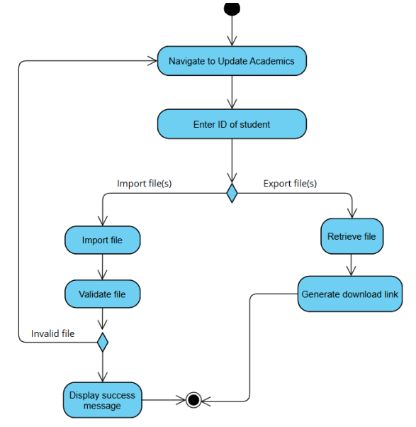

<p align="center"><em>Figure 3.1.26: Activity Diagram for Use Case UC026 Update Student Academic Data</em></p>

--

### 3.1.27 F027 Manage Communication Template

The functional requirement(s) for F027 Manage Communication Template:

| **Requirement ID** | REQ_F2701 |
|--------------------|-----------|
| **Version** | 1.0 |
| **Description** | The system shall allow creation, customization, and management of communication templates by admins. |
| **Author** | Danesh Veran |

Table 3.1.27 illustrates the use case for the manage communication templates functionality (UC027), detailing the process as defined by Requirement REQ_F2701 followed by an activity diagram which represents the process flow.

<table border="1" cellspacing="0" cellpadding="5">
<tr><td><b>Use Case ID</b></td><td>UC027</td></tr>
<tr><td><b>Version</b></td><td>1.0</td></tr>
<tr><td><b>Use Case</b></td><td>F027 Manage Communication Template</td></tr>
<tr><td><b>Purpose</b></td><td>Allow administrators to create, modify, view, and delete reusable communication templates for SMS, email, and portal notifications.</td></tr>
<tr><td><b>Actor</b></td><td>Admin</td></tr>
<tr><td><b>Trigger</b></td><td>Admin navigates to communication template management section.</td></tr>
<tr><td><b>Precondition</b></td><td>Admin is logged in.</td></tr>
<tr><td><b>Postcondition</b></td><td>Communication template is created, updated, or deleted. Changes are logged.</td></tr>

<tr><td colspan="2"><b>Main Flow</b></td></tr>
<tr><td><b>Step</b></td><td><b>Action</b></td></tr>
<tr><td>1</td><td>Admin navigates to communication template management section.</td></tr>
<tr><td>2</td><td>System displays existing templates and options (Create, Edit, Delete).</td></tr>
<tr><td>3</td><td>Admin selects create new template.</td></tr>
<tr><td>4</td><td>System presents a form for template details (Name, Type [SMS/Email/Portal], Subject [if applicable], Body content with placeholders).</td></tr>
<tr><td>5</td><td>Admin enters template details and content.</td></tr>
<tr><td>6</td><td>Admin saves the template.</td></tr>
<tr><td>7</td><td>System validates and stores the new template, making it available for use.</td></tr>

<tr><td colspan="2"><b>Alternate Flow – Modify Template</b></td></tr>
<tr><td>2.1</td><td>Admin selects an existing template and chooses to edit.</td></tr>
<tr><td>2.2</td><td>System loads the template details for modification.</td></tr>
<tr><td>2.3</td><td>Admin modifies the template content or details and saves.</td></tr>

<tr><td colspan="2"><b>Alternate Flow – Delete Template</b></td></tr>
<tr><td>2.1</td><td>Admin selects an existing template and chooses to delete.</td></tr>
<tr><td>2.2</td><td>System prompts for confirmation.</td></tr>
<tr><td>2.3</td><td>Admin confirms. System removes the template.</td></tr>

<tr><td colspan="2"><b>Rules</b></td></tr>
<tr><td colspan="2">1. The system shall allow creation, customization, and management of communication templates for admins. [REQ_F2701]<br>2. Templates can be categorized or tagged by administrators for better organization and retrieval. [REQ_F2701]</td></tr>

<tr><td><b>Author</b></td><td>Danesh Veran</td></tr>
</table>

<p align="center"><em>Table 3.1.27: Use Case UC027 Manage Communication Template</em></p>

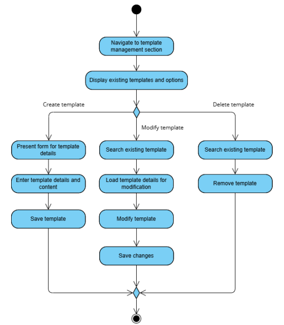

<p align="center"><em>Figure 3.1.27: Activity Diagram for Use Case UC027 Manage Communication Template</em></p>

--

### 3.1.28 F028 Manage University Contact Directory

The functional requirement(s) for F028 Manage University Contact Directory:

| **Requirement ID** | REQ_F2201 |
|--------------------|-----------|
| **Version** | 1.0 |
| **Description** | The system shall include a contact directory interface, maintained by admins, for parents to access with filters for faculty and department. |
| **Author** | Danesh Veran |

Table 3.1.28 illustrates the use case for the manage university contact directory functionality (UC028), detailing the process as defined by Requirement REQ_F2201 followed by an activity diagram which represents the process flow.

<table border="1" cellspacing="0" cellpadding="5">
<tr><td><b>Use Case ID</b></td><td>UC028</td></tr>
<tr><td><b>Version</b></td><td>1.0</td></tr>
<tr><td><b>Use Case</b></td><td>F028 Manage University Contact Directory</td></tr>
<tr><td><b>Purpose</b></td><td>Allow administrators to create, update, and manage entries in the university-wide contact directory accessible to relevant stakeholders.</td></tr>
<tr><td><b>Actor</b></td><td>Admin</td></tr>
<tr><td><b>Trigger</b></td><td>Admin navigates to contact directory section.</td></tr>
<tr><td><b>Precondition</b></td><td>Admin is logged in.</td></tr>
<tr><td><b>Postcondition</b></td><td>Contact directory is updated with new information.</td></tr>

<tr><td colspan="2"><b>Main Flow</b></td></tr>
<tr><td><b>Step</b></td><td><b>Action</b></td></tr>
<tr><td>1</td><td>Admin navigates to “Contact Directory Management”.</td></tr>
<tr><td>2</td><td>System displays existing directory structure and entries with options (Add, Edit, Delete).</td></tr>
<tr><td>3</td><td>Admin selects add a new entry.</td></tr>
<tr><td>4</td><td>System presents a form for contact details (Name, Department, Role, Email, Phone, Office Hours, communication channels available).</td></tr>
<tr><td>5</td><td>Admin enters the required information.</td></tr>
<tr><td>6</td><td>Admin saves the new entry.</td></tr>
<tr><td>7</td><td>System validates and adds the entry to the directory.</td></tr>

<tr><td colspan="2"><b>Alternate Flow – Modify Entry</b></td></tr>
<tr><td>3.1</td><td>Admin selects an existing entry and chooses to edit.</td></tr>
<tr><td>3.2</td><td>System loads the entry details for modification.</td></tr>
<tr><td>3.3</td><td>Admin modifies the details and saves.</td></tr>

<tr><td colspan="2"><b>Alternate Flow – Delete Entry</b></td></tr>
<tr><td>4.1</td><td>Admin selects an entry and chooses to delete.</td></tr>
<tr><td>4.2</td><td>System prompts for confirmation.</td></tr>
<tr><td>4.3</td><td>Admin confirms. System removes the entry.</td></tr>

<tr><td colspan="2"><b>Rules</b></td></tr>
<tr><td colspan="2">
1. Filters (department, role) must be configurable for the directory display [REQ_F2201].<br>
2. Contact information must use descriptive names [REQ_I0003].<br>
3. The system shall enable communication between parents and authorized university staff through chat, or a secure contact form embedded within the directory interface, where applicable. [REQ_F2201]
</td></tr>

<tr><td><b>Author</b></td><td>Danesh Veran</td></tr>
</table>

<p align="center"><em>Table 3.1.28: Use Case UC028 Manage University Contact Directory</em></p>

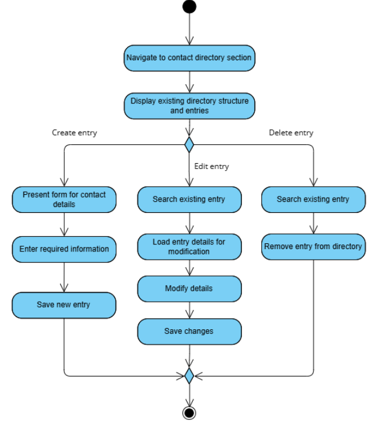

<p align="center"><em>Figure 3.1.28: Activity Diagram for Use Case UC028 Manage University Contact Directory</em></p>

--

### 3.1.29 F029 View System Audit Log

The functional requirement(s) for F029 View System Audit Log:

| **Requirement ID** | REQ_F2901 |
|--------------------|-----------|
| **Version** | 1.0 |
| **Description** | The system shall maintain an audit log that records all user and system activities, including but not limited to logins, data modifications, access to sensitive records, and administrative actions. |
| **Author** | Nickleirsch |

| **Requirement ID** | REQ_F2902 |
|--------------------|-----------|
| **Version** | 1.0 |
| **Description** | Each audit log entry shall include the timestamp, user ID, action performed, and affected resources. |
| **Author** | Nickleirsch |

Table 3.1.29 illustrates the use case for the view system audit log functionality (UC029), detailing the process as defined by Requirement REQ_F2901 followed by an activity diagram which represents the process flow.

<table border="1" cellspacing="0" cellpadding="5">
<tr><td><b>Use Case ID</b></td><td>UC029</td></tr>
<tr><td><b>Version</b></td><td>1.0</td></tr>
<tr><td><b>Use Case</b></td><td>F029 View System Audit Log</td></tr>
<tr><td><b>Purpose</b></td><td>Allow administrators to review system activity logs for security, troubleshooting, and compliance purposes.</td></tr>
<tr><td><b>Actor</b></td><td>Admin</td></tr>
<tr><td><b>Trigger</b></td><td>Admin navigates to audit logs section.</td></tr>
<tr><td><b>Precondition</b></td><td>Admin is logged in.</td></tr>
<tr><td><b>Postcondition</b></td><td>Admin has viewed relevant audit log entries.</td></tr>

<tr><td colspan="2"><b>Main Flow</b></td></tr>
<tr><td><b>Step</b></td><td><b>Action</b></td></tr>
<tr><td>1</td><td>Admin navigates to audit log section.</td></tr>
<tr><td>2</td><td>System displays options to filter logs.</td></tr>
<tr><td>3</td><td>Admin enters query.</td></tr>
<tr><td>4</td><td>System retrieves and displays matching audit log entries (e.g., timestamp, user, action, details).</td></tr>
<tr><td>5</td><td>Admin reviews the log entries.</td></tr>
<tr><td>6 (Optional)</td><td>Admin exports selected log entries.</td></tr>

<tr><td colspan="2"><b>Alternate Flow – No Matching Logs</b></td></tr>
<tr><td>4.1</td><td>If no logs match the filter criteria, system displays "No matching entries found."</td></tr>

<tr><td colspan="2"><b>Rules</b></td></tr>
<tr><td colspan="2">
1. Access to audit logs must be restricted to authorized administrative personnel [REQ_F0009].<br>
2. Sensitive information within logs must be appropriately masked or access controlled [REQ_F0003].
</td></tr>

<tr><td><b>Author</b></td><td>Danesh Veran</td></tr>
</table>

<p align="center"><em>Table 3.1.29: Use Case UC029 View System Audit Log</em></p>

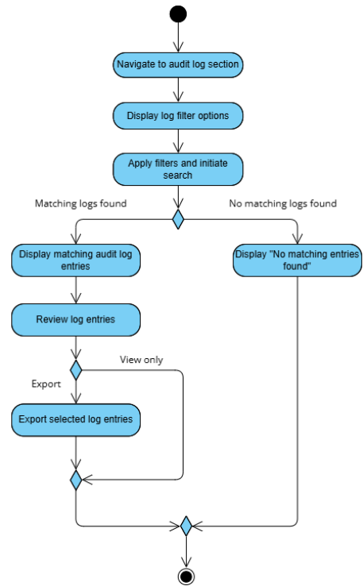

<p align="center"><em>Figure 3.1.29: Activity Diagram for Use Case UC029 View System Audit Log</em></p>

--

### 3.1.30 F030 Configure Parent Access

The functional requirement(s) for F030 Configure Parent Access:

| **Requirement ID** | REQ_F3001 |
|--------------------|-----------|
| **Version** | 1.0 |
| **Description** | Parental access and notifications shall comply with university privacy policies and require explicit student consent. |
| **Author** | Danesh Veran |

Table 3.1.30 illustrates the use case for the configure parent access functionality (UC030), detailing the process as defined by Requirement REQ_F3001 followed by an activity diagram which represents the process flow.

<table border="1" cellspacing="0" cellpadding="5">
<tr><td><b>Use Case ID</b></td><td>UC030</td></tr>
<tr><td><b>Version</b></td><td>1.0</td></tr>
<tr><td><b>Use Case</b></td><td>F030 Configure Parent Access</td></tr>
<tr><td><b>Purpose</b></td><td>Allow administrators to manage university-level settings for parental access to student information, including default consent mechanisms and information visibility rules.</td></tr>
<tr><td><b>Actor</b></td><td>Admin</td></tr>
<tr><td><b>Trigger</b></td><td>Admin navigates to parental access section.</td></tr>
<tr><td><b>Precondition</b></td><td>Admin is logged in.</td></tr>
<tr><td><b>Postcondition</b></td><td>1. System-wide settings for parent access and student consent are updated.<br>2. Changes are logged.</td></tr>

<tr><td colspan="2"><b>Main Flow</b></td></tr>
<tr><td><b>Step</b></td><td><b>Action</b></td></tr>
<tr><td>1</td><td>Admin navigates to parental access section.</td></tr>
<tr><td>2</td><td>System displays current configurations for parental access.</td></tr>
<tr><td>3</td><td>Admin modifies parental access to view child’s information.</td></tr>
<tr><td>4</td><td>Admin saves the configuration changes.</td></tr>

<tr><td colspan="2"><b>Rules</b></td></tr>
<tr><td colspan="2">
1. All configurations must comply with university privacy policies and explicit student consent requirements [REQ_F0002].<br>
2. The system shall provide a dedicated portal for parents to access their child’s grades, attendance, and financial information, subject to consent [REQ_F3001, REQ_F2101].
</td></tr>

<tr><td><b>Notes</b></td><td>The student’s consent must be a physical letter that is sent in by the student personally.</td></tr>
<tr><td><b>Author</b></td><td>Danesh Veran</td></tr>
</table>

<p align="center"><em>Table 3.1.30: Use Case UC030 Configure Parent Access</em></p>

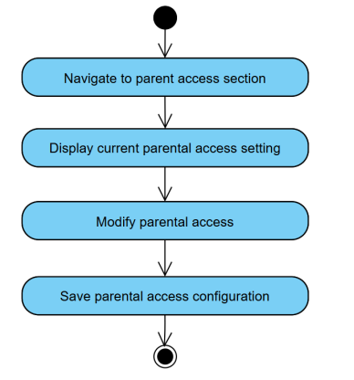

<p align="center"><em>Figure 3.1.30: Activity Diagram for Use Case UC030 Configure Parent Access</em></p>

--

### 3.1.31 F031 Authenticate User

The functional requirement(s) for F031 Authenticate User:

| **Requirement ID** | REQ_F3101 |
|--------------------|-----------|
| **Version** | 1.0 |
| **Description** | The system shall support single sign-on authentication for accessing all university services. |
| **Author** | Lim Xin Yee |

Table 3.1.31 illustrates the use case for the authenticate user functionality (UC031), detailing the process as defined by Requirement REQ_F3101 followed by an activity diagram which represents the process flow.

<table border="1" cellspacing="0" cellpadding="5">
<tr><td><b>Use Case ID</b></td><td>UC031</td></tr>
<tr><td><b>Version</b></td><td>1.0</td></tr>
<tr><td><b>Use Case</b></td><td>F031 Authenticate User</td></tr>
<tr><td><b>Purpose</b></td><td>To ensure that only authorized users can securely access the university portal and its associated services by verifying their credentials through a centralized authentication mechanism.</td></tr>
<tr><td><b>Actor</b></td><td>Campus Management System</td></tr>
<tr><td><b>Trigger</b></td><td>User credentials are received by the authentication service.</td></tr>
<tr><td><b>Precondition</b></td><td>The Campus Management System is up and running.</td></tr>
<tr><td><b>Postcondition</b></td><td>1. The user is granted access to the portal with permissions appropriate to their role.<br>2. A secure session is initiated with session timeout policies applied.</td></tr>

<tr><td colspan="2"><b>Main Flow</b></td></tr>
<tr><td><b>Step</b></td><td><b>Action</b></td></tr>
<tr><td>1</td><td>System receives authentication credentials from the interface.</td></tr>
<tr><td>2</td><td>System transmits encrypted credentials for validation.</td></tr>
<tr><td>3</td><td>System receives valid credential response.</td></tr>
<tr><td>4</td><td>System creates encrypted session token.</td></tr>
<tr><td>5</td><td>System returns session token with access permissions.</td></tr>

<tr><td colspan="2"><b>Alternate Flow – Invalid Credentials</b></td></tr>
<tr><td>3.1</td><td>System receives invalid credential response.</td></tr>
<tr><td>3.2</td><td>The user is prompted to try again.</td></tr>
<tr><td>3.3</td><td>Redirect to login.</td></tr>

<tr><td colspan="2"><b>Rules</b></td></tr>
<tr><td colspan="2">
1. Role-based access control must be enforced upon authentication. [REQ_F0009]<br>
2. Authentication must use university SSO system. [REQ_F3101]<br>
3. Authentication process must comply with FERPA, GDPR, and university privacy policies. [REQ_F0002]<br>
4. All credentials and session data must be encrypted in transit and at rest. [REQ_F0003]<br>
5. Logging of authentication events [REQ_F2901].
</td></tr>

<tr><td><b>Author</b></td><td>Lim Xin Yee</td></tr>
</table>

<p align="center"><em>Table 3.1.31: Use Case UC031 Authenticate User</em></p>

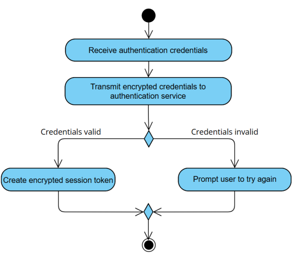

<p align="center"><em>Figure 3.1.31: Activity Diagram for Use Case UC031 Authenticate User</em></p>

--

### 3.1.32 F032 Send SMS Notification

The functional requirement(s) for F032 Send SMS Notification:

| **Requirement ID** | REQ_F3201 |
|--------------------|-----------|
| **Version** | 1.0 |
| **Description** | The system shall support sending notifications via SMS to students and parents where mobile numbers are available, based on channel preference. |
| **Author** | Nickleirsch |

| **Requirement ID** | REQ_F3202 |
|--------------------|-----------|
| **Version** | 1.0 |
| **Description** | The system shall provide urgent/critical alerts (low attendance, overdue fees) via SMS. |
| **Author** | Nickleirsch |

Table 3.1.32 illustrates the use case for the send SMS notification functionality (UC032), detailing the process as defined by Requirement REQ_F3201 and REQ_F3202 followed by an activity diagram which represents the process flow.

<table border="1" cellspacing="0" cellpadding="5">
<tr><td><b>Use Case ID</b></td><td>UC032</td></tr>
<tr><td><b>Version</b></td><td>1.0</td></tr>
<tr><td><b>Use Case</b></td><td>F032 Send SMS Notification</td></tr>
<tr><td><b>Purpose</b></td><td>Deliver urgent or scheduled SMS notifications to users as directed by the university system.</td></tr>
<tr><td><b>Actor</b></td><td>SMS Gateway</td></tr>
<tr><td><b>Trigger</b></td><td>SMS Gateway receives a request from the university portal to send an SMS notification.</td></tr>
<tr><td><b>Precondition</b></td><td>1. University portal has validated the message, recipient(s), and preferences.<br>2. SMS Gateway is operational and authenticated.</td></tr>
<tr><td><b>Postcondition</b></td><td>1. SMS is delivered to intended recipients, with delivery status communicated back to the university portal.</td></tr>

<tr><td colspan="2"><b>Main Flow</b></td></tr>
<tr><td><b>Step</b></td><td><b>Action</b></td></tr>
<tr><td>1</td><td>SMS Gateway receives a notification payload (recipient, message, metadata).</td></tr>
<tr><td>2</td><td>SMS Gateway validates payload integrity.</td></tr>
<tr><td>3</td><td>SMS Gateway attempts delivery to the recipient(s).</td></tr>
<tr><td>4</td><td>SMS Gateway receives delivery status from carrier.</td></tr>
<tr><td>5</td><td>SMS Gateway logs the status and notifies the university portal.</td></tr>

<tr><td colspan="2"><b>Alternate Flow – Delivery Fails</b></td></tr>
<tr><td>3.1</td><td>SMS Gateway logs the failure and notifies the portal.</td></tr>

<tr><td colspan="2"><b>Rules</b></td></tr>
<tr><td colspan="2">
1. Urgent/critical alerts must be delivered within 1 minute [REQ_P0004]<br>
2. SMS Gateway must respect recipient opt-in/out [REQ_F1903]<br>
3. All SMS content must comply with privacy and consent regulations [REQ_F0002, REQ_F3001]<br>
4. Templates and scheduling must be supported [REQ_F0902, REQ_F0904, REQ_F2701]
</td></tr>

<tr><td><b>Author</b></td><td>Nickleirsch</td></tr>
</table>

<p align="center"><em>Table 3.1.32: Use Case UC032 Send SMS Notification</em></p>

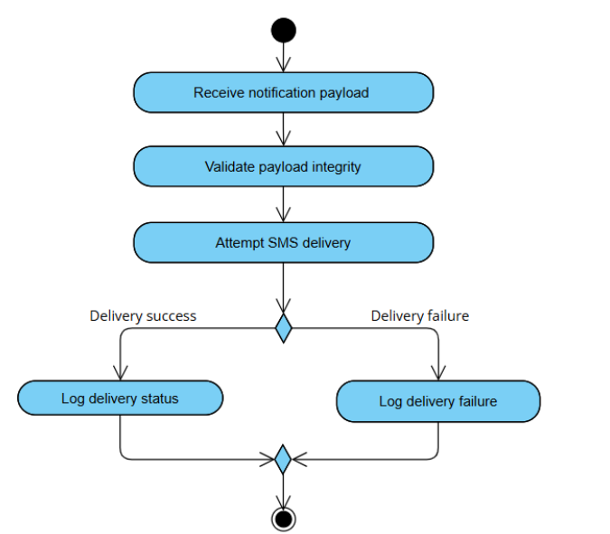

<p align="center"><em>Figure 3.1.32: Activity Diagram for Use Case UC032 Send SMS Notification</em></p>

--

### 3.1.33 F033 Sync with External Calendar

The functional requirement(s) for F033 Sync with External Calendar:

| **Requirement ID** | REQ_F3301 |
|--------------------|-----------|
| **Version** | 1.0 |
| **Description** | The system shall support integration with common calendar applications (Google Calendar, Apple Calendar) for academic schedules. |
| **Author** | Nickleirsch |

Table 3.1.33 illustrates the use case for the sync with external calendar functionality (UC033), detailing the process as defined by Requirement REQ_F3301 followed by an activity diagram which represents the process flow.

<table border="1" cellspacing="0" cellpadding="5">
<tr><td><b>Use Case ID</b></td><td>UC033</td></tr>
<tr><td><b>Version</b></td><td>1.0</td></tr>
<tr><td><b>Use Case</b></td><td>F033 Sync with External Calendar</td></tr>
<tr><td><b>Purpose</b></td><td>Enable synchronization of academic schedules and events between the university system and external calendar applications (e.g., Google Calendar, Apple Calendar).</td></tr>
<tr><td><b>Actor</b></td><td>Calendar API</td></tr>
<tr><td><b>Trigger</b></td><td>The user selects "Sync Calendar" in their calendar settings.</td></tr>
<tr><td><b>Precondition</b></td><td>1. Calendar API is authenticated with external calendar provider.<br>2. The user has a valid account with an external calendar provider.</td></tr>
<tr><td><b>Postcondition</b></td><td>1. Academic schedules and events are synchronized with the selected external calendar application.<br>2. Any subsequent changes in the university calendar are updated in the user's external calendar.</td></tr>

<tr><td colspan="2"><b>Main Flow</b></td></tr>
<tr><td><b>Step</b></td><td><b>Action</b></td></tr>
<tr><td>1</td><td>Calendar API receives a sync trigger.</td></tr>
<tr><td>2</td><td>Calendar API requests updated academic events (.ics file).</td></tr>
<tr><td>3</td><td>The system transmits the user's academic schedule and events to the calendar API.</td></tr>
<tr><td>4</td><td>Calendar API updates events in the external calendar.</td></tr>
<tr><td>5</td><td>The system confirms the successful sync.</td></tr>

<tr><td colspan="2"><b>Alternate Flow – Synchronization Fails</b></td></tr>
<tr><td>4.1.1</td><td>The synchronization fails due to network or API errors.</td></tr>
<tr><td>4.1.2</td><td>The system logs the error for later retrial.</td></tr>

<tr><td colspan="2"><b>Rules</b></td></tr>
<tr><td colspan="2">
1. Sync must occur within 2 minutes of any calendar change. [REQ_P0005]<br>
2. The system must support integration with at least Google Calendar and Apple Calendar. [REQ_F3301]<br>
3. Sync failures and actions are logged [REQ_F2901, REQ_F2902]
</td></tr>

<tr><td><b>Author</b></td><td>Nickleirsch</td></tr>
</table>

<p align="center"><em>Table 3.1.33: Use Case UC033 Sync with External Calendar</em></p>

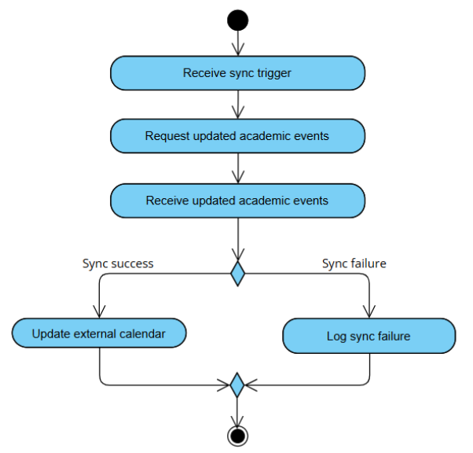

<p align="center"><em>Figure 3.1.33: Activity Diagram for Use Case UC033 Sync with External Calendar</em></p>

--

## 3.2 Performance Requirements

The following are the performance requirements for COMSYS:

| **Requirement ID** | REQ_P0001 |
|--------------------|-----------|
| **Version** | 1.0 |
| **Description** | The system shall load any page within 3 seconds under normal conditions. |
| **Author** | Nickleirsch |

---

| **Requirement ID** | REQ_P0002 |
|--------------------|-----------|
| **Version** | 1.0 |
| **Description** | The system shall process course enrolment requests within 5 seconds. |
| **Author** | Nickleirsch |

---

| **Requirement ID** | REQ_P0003 |
|--------------------|-----------|
| **Version** | 1.0 |
| **Description** | The system shall synchronize updated data across interfaces within 5 seconds. |
| **Author** | Nickleirsch |

---

| **Requirement ID** | REQ_P0004 |
|--------------------|-----------|
| **Version** | 1.0 |
| **Description** | Critical notifications shall be delivered within 1 minute of their creation. |
| **Author** | Nickleirsch |

---

| **Requirement ID** | REQ_P0005 |
|--------------------|-----------|
| **Version** | 1.0 |
| **Description** | Calendar synchronization shall occur within 2 minutes of changes being made. |
| **Author** | Nickleirsch |

---

| **Requirement ID** | REQ_P0006 |
|--------------------|-----------|
| **Version** | 1.0 |
| **Description** | Notifications shall be guaranteed to reach all selected channels without loss, with 99% reliability for scheduled/automated notifications. |
| **Author** | Nickleirsch |

---

| **Requirement ID** | REQ_P0007 |
|--------------------|-----------|
| **Version** | 1.0 |
| **Description** | The system shall maintain 99.9% uptime during academic terms and 99% during breaks and holidays. |
| **Author** | Nickleirsch |

--

## 3.3 Usability Requirements

| **Requirement ID** | REQ_U0001 |
|--------------------|-----------|
| **Version** | 1.0 |
| **Description** | The system shall limit navigation depth to maximum five levels for any feature. |
| **Author** | Nickleirsch |

---

| **Requirement ID** | REQ_U0002 |
|--------------------|-----------|
| **Version** | 1.0 |
| **Description** | The system must meet WCAG 2.1 guidelines for accessibility, ensuring usability for all users, including those with disabilities. |
| **Author** | Nickleirsch |

---

| **Requirement ID** | REQ_U0003 |
|--------------------|-----------|
| **Version** | 1.0 |
| **Description** | The system shall provide context-sensitive help or tooltips for at least 90% of user interface elements. |
| **Author** | Nickleirsch |

--

## 3.4 Interface Requirements

| **Requirement ID** | REQ_I0001 |
|--------------------|-----------|
| **Version** | 1.0 |
| **Description** | The system shall provide consistent header formatting across all tables and views. |
| **Author** | Nickleirsch |

---

| **Requirement ID** | REQ_I0002 |
|--------------------|-----------|
| **Version** | 1.0 |
| **Description** | The interface shall be responsive and adapt to different screen sizes. |
| **Author** | Nickleirsch |

---

| **Requirement ID** | REQ_I0003 |
|--------------------|-----------|
| **Version** | 1.0 |
| **Description** | The system shall use descriptive course/event names, not codes, throughout the interface. |
| **Author** | Nickleirsch |

---

| **Requirement ID** | REQ_I0004 |
|--------------------|-----------|
| **Version** | 1.0 |
| **Description** | Academic, financial, and attendance data shall be presented with charts, tables, and summaries for quick understanding. |
| **Author** | Nickleirsch |

---

| **Requirement ID** | REQ_I0005 |
|--------------------|-----------|
| **Version** | 1.0 |
| **Description** | The system shall provide visual indicators for navigation paths. |
| **Author** | Nickleirsch |

---

| **Requirement ID** | REQ_I0006 |
|--------------------|-----------|
| **Version** | 1.0 |
| **Description** | Academic, financial, and attendance data shall be presented with charts, tables, and summaries for quick understanding. |
| **Author** | Nickleirsch |

---

| **Requirement ID** | REQ_I0007 |
|--------------------|-----------|
| **Version** | 1.0 |
| **Description** | The system shall provide a single-window course enrolment process. |
| **Author** | Nickleirsch |

--

## 3.4.1 System Interfaces

The following system interfaces represent the key integration points through which COMSYS interacts with systems and services to deliver its capabilities:

#### 1. Campus Management System

**Purpose:**  
Synchronizes and retrieves information such as academic, billing, schedule data and authentication system. [F012-F016, F021]

**Interface:**  
Communication with the CMS occurs via secured RESTful API endpoints, using JSON as the standard data exchange format. The portal both queries the CMS for information (e.g., student grades, attendance, billing) and sends updates (e.g., course registrations, academic records) as needed.

**Functionality:**  
Enables up-to-date student data, supports dashboard content, manages course registration, grades and attendance. This is achieved by probing the system for information and sending information to be updated.

#### 2. Calendar Applications (Google Calendar, Apple Calendar)

**Purpose:**  
Synchronizes academic schedules and user reminders. [F010]

**Interface:**  
REST API

**Functionality:**  
The system will regularly sync and request updates to reflect with the external calendars. Allows users to sync academic events and deadlines with personal calendars.

#### 3. Single Sign-On Authentication System

**Purpose:**  
Provides unified authentication and secure access to the portal. [F031]

**Interface:**  
REST API

**Functionality:**  
Enables secure user authentication, automatic redirection to role-specific dashboards, session timeout handling, and proper termination of sessions. This interface ensures that only authorized users can access sensitive academic and administrative data.

## 3.4.2 User Interfaces

The COMSYS platform will provide a unified web portal with a responsive, accessible design, delivering tailored experiences for each user role via dedicated dashboards and intuitive interaction elements.

### General Web Portal Features

1. **Responsive Design:**  
The interface will automatically adapt to various screen sizes and devices (desktop, tablet, mobile) to ensure usability for all users.

2. **WCAG 2.1 Compliance:**  
All interface components, including navigation, forms, and content, will follow WCAG 2.1 guidelines to ensure accessibility for users with disabilities.

3. **Fixed Top Navigation Bar:**  
Provides quick access to primary features (e.g., dashboard, messages, resources, settings) and persists across all pages.

4. **Consistent Layout:**  
All pages will use a consistent structure with clear headings, logical grouping of related functions, and standardized buttons and icons.

5. **Role-Based Dashboards:**  
Upon login, users are directed to dashboards tailored to their roles (Student, Parent, Lecturer, Admin), displaying relevant information and actions.

### Student Portal

1. **Customizable Dashboard:**  
Students can personalize their dashboard to display key academic information (grades, timetable, notifications, financial status).

2. **Quick Access Widgets:**  
Tiles/buttons for common actions such as course enrollment, grade review, and messaging.

3. **Navigation Panel:**  
Collapsible side or top menu for accessing modules like academic records, resource library, and support.

4. **Data Entry Fields:**  
Clear forms for updating personal information, submitting requests, and uploading documents.

### Parent Portal

1. **Controlled Access:**  
Parents view authorized student data (academic progress, attendance, notifications) based on role permissions and privacy settings.

2. **Communication Tools:**  
Buttons to initiate messages with lecturers or administrators.

3. **Information Panels:**  
Read-only panels summarizing student status, announcements, and alerts.

### Lecturer Portal

1. **Course Management Dashboard:**  
Overview of teaching schedules, course rosters, and grading tasks.

2. **Interactive Gradebook:**  
Data entry fields for grades and attendance, with validation to prevent errors.

3. **Messaging and Announcements:**  
Quick links to send messages or notifications to students and parents.

4. **Resource Uploads:**  
Drag-and-drop and file picker for uploading materials and assignments.

### Admin Portal

1. **Comprehensive Control Panel:**  
Access to user management, system settings, analytics, and audit logs.

2. **Bulk Operations:**  
Buttons and selection tools for managing multiple records (e.g., user accounts, notifications) efficiently.

3. **Search and Filter:**  
Search bars and filter options for all data tables.

4. **Real-time Monitoring:**  
Dashboard widgets showing system status, recent activity, and alerts.

## 3.4.3 Software Interfaces

The following software interfaces represent the software interfaces which COMSYS interacts with:

### 3.4.3.1 Operating Systems

#### Microsoft Windows

| **Name** | Microsoft Windows |
|----------|--------------------|
| **Mnemonic** | Win |
| **Version** | Current supported versions |
| **Source** | Microsoft |
| **Purpose** | Supported environment for portal administrative tools and desktop user clients; ensures compatibility with institutional PCs |

#### macOS

| **Name** | macOS |
|----------|-------|
| **Mnemonic** | macOS |
| **Version** | Current supported versions |
| **Source** | Apple |
| **Purpose** | Supported platform for the portal’s macOS desktop interface; ensures compatibility with Mac environments used by staff and faculty. |

#### GNU/Linux

| **Name** | GNU/Linux |
|----------|------------|
| **Mnemonic** | Linux |
| **Version** | Current supported versions |
| **Source** | GNU/Linux foundation |
| **Purpose** | Platform for server-side components or Linux-based desktop use. |

#### SMS Gateway

| **Name** | SMS Gateway |
|----------|-------------|
| **Mnemonic** | SMS_Gateway |
| **Version** | Current supported versions |
| **Source** | GNU/Linux foundation |
| **Purpose** | Send critical and regular notifications to users’ mobile devices |
| **Message Format** | SMPP Submit_SM PDUs with fields: source_addr (sender ID), dest_addr (phone number), short_message (up to 160-char text). Delivery receipts via Submit_SM_RESP. |

---

### 3.4.3.2 Client Web Browsers

**Message content general guidelines:**  
HTTP/HTTPS with HTML/CSS/JavaScript content (UTF-8 text); complies with W3C standards.

#### Google Chrome

| **Name** | Google Chrome |
|----------|----------------|
| **Mnemonic** | Chrome |
| **Version** | Chromium-based browser |
| **Source** | Google |
| **Purpose** | Primary client browser for accessing the web portals |

#### Mozilla Firefox

| **Name** | Mozilla Firefox |
|----------|------------------|
| **Mnemonic** | Firefox |
| **Version** | Gecko-based browser |
| **Source** | Mozilla Foundation |
| **Purpose** | Primary client browser for accessing the web portals |

#### Safari

| **Name** | Safari |
|----------|--------|
| **Mnemonic** | Safari |
| **Source** | Apple |
| **Purpose** | Primary client browser for accessing the web portals |

---

### 3.4.3.3 RESTful APIs

i. Used for data exchange with the Campus Management System (retrieving/updating academic, billing, schedule data).  
ii. Used for integration with the SMS Gateway to send notifications.  
iii. Used for syncing with external calendar applications (Google Calendar, Apple Calendar).

### 3.4.4 Communication Interfaces

The following system interfaces represent the key communication interfaces through which COMSYS interacts with systems and services to deliver its capabilities:

| **No.** | **Interface** | **Purpose** |
|---------|----------------|-------------|
| 1 | HTTPS | Used for all browser-based access to ensure secure communication between users (students, parents, lecturers, admins) and the portal. All web and API traffic is encrypted for confidentiality and integrity. |
| 2 | SMTP | Used for sending email notifications and alerts to users. Ensures secure delivery of emails via the university’s or a third-party email server. |
| 3 | WebSocket | Used for real-time communication features such as live chat and push notifications within the portal. Provides bidirectional, low-latency data exchange between server and clients. |
| 4 | OAuth2 | Used for secure Single Sign-On (SSO) authentication and authorization. Ensures centralized identity management and secure token/session handling. |
| 5 | TLS/SSL encryption | All communications are encrypted using TLS/SSL to protect data privacy and prevent unauthorized access. |

--

### 3.5 Logical Database Requirements

Specification of the flow of data and database requirements:

COMSYS operates primarily as an intermediary system, minimizing direct data storage and instead focusing on efficient data retrieval and caching from the existing Campus Management System. While COMSYS maintains its own database for user preferences, notification settings, and communication templates, it fetches core academic data (grades, attendance, billing) in real-time from the Campus Management System through secure APIs. The system should employ a caching mechanism that temporarily stores frequently accessed data to reduce system load and improve response times, with cache invalidation triggered by updates in the source system. User authentication is synchronized with the main campus system, while COMSYS independently manages communication logs, notification preferences, and delivery status tracking. This approach ensures data consistency while adding new communication capabilities without duplicating sensitive academic records.

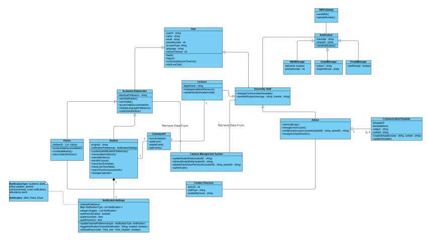

<p align="center"><em>Figure 3.5 Class Diagram; available also at classdiag.png</em></p>

#### **In-depth Explanation of Class Diagram**

---

#### 1. **User (Abstract Class)**  
*An abstract base class that defines common attributes and methods for all system users. It handles basic user management, session management, and language preferences.*

| Attribute/Method | Data Type | Description |
|-------------------|-----------|-------------|
| `userID` | String | Unique identifier for user |
| `name` | String | User’s full name |
| `email` | String | User's email address |
| `phoneNumber` | Int | Contact number |
| `accountType` | String | Type of user account |
| `language` | String | Preferred language |
| `sessionTimeout` | Int | Session timeout in minutes |

---

#### 2. **NotificationSettings**  
*Manages how users receive notifications by controlling quiet hours, delivery channels (SMS, email, portal), and notification categories. It stores user preferences and determines when and how notifications should be delivered.*

| Attribute | Data Type | Description |
|-----------|-----------|-------------|
| `quietHoursStart` | Time | Start of quiet period |
| `quietHoursEnd` | Time | End of quiet period |
| `quietHoursEnabled` | Boolean | Quiet hours toggle |
| `categoryToggles` | List<NotificationType> | Enabled notification types |
| `channelPreferences` | Map<NotificationType, Channel> | Preferred channels per type |

---

#### 3. **CommunicationTemplate**  
*Stores and manages message templates used for different types of communications. It supports multiple channels (SMS, email, portal) and allows for standardized message creation with customizable content.*

| Attribute | Data Type | Description |
|-----------|-----------|-------------|
| `templateID` | String | Unique template identifier |
| `templateName` | String | Name of template |
| `subject` | String | Email subject line |
| `content` | String | Template content |
| `templateType` | String | Type of template |

---

#### 4. **Notification (Abstract Class)**  
*Represents a single notification in the system; an abstract class that is inherited by all notification channel types.*

| Attribute | Data Type | Description |
|-----------|-----------|-------------|
| `message` | String | Notification content |
| `recipient` | String | Recipient identifier |
| `delivered` | Boolean | Delivery status |
| `readReceipt` | Boolean | Read status |

---

#### 5. **ContactDirectory**  
*Stores and manages staff contact information and their availability hours.*

| Attribute | Data Type | Description |
|-----------|-----------|-------------|
| `entryID` | Int | Unique contact identifier |
| `staffType` | String | Type of staff member |
| `availabilityHours` | String | Available hours |

---

#### 6. **CalendarAPI**  
*Handles all calendar-related operations including adding, removing, and retrieving events. It manages schedule synchronization and helps coordinate activities across the system.*

| Method | Description |
|--------|-------------|
| `addEvent()` | Adds new calendar event |
| `deleteEvent()` | Removes calendar event |
| `getEvents()` | Retrieves calendar events |

---

#### 7. **SMSGateway**  
*Manages SMS message sending and phone number validation. It tracks message delivery status and ensures proper handling of mobile communications.*

| Method | Description |
|--------|-------------|
| `sendSMS()` | Sends SMS message |
| `validateNumber()` | Validates phone number |

---

#### 8. **CampusManagementSystem**  
*Manages student data operations and access control. It handles data updates, retrieval, and validates parent permissions for accessing student information.*

| Method | Description |
|--------|-------------|
| `updateStudentData()` | Updates the student’s data |
| `retrieveStudentData()` | Retrieves the student’s data |
| `validateParentViewPermission()` | Checks if parent has consent to access student information |

--

### 3.6 Design Constraints

The design of COMSYS is subject to several constraints arising from external standards, regulations, and technical limitations:

1. **Branding and UI Compliance**  
   The user interface must comply with the university’s official branding guidelines, including colour schemes, logo usage, and typography standards.

2. **Regulatory Compliance**  
   All features and data flows must comply with relevant privacy and data protection regulations, including FERPA and GDPR, especially around parental access, data sharing, and consent management.

3. **Integration Requirements**  
   The system must integrate with existing university infrastructure, including Single Sign-On (SSO), Academic Database, Financial Database, and external calendar services (Google Calendar, Apple Calendar).

4. **Technology Stack**  
   The software should be developed using technologies compatible with both Linux and Windows server environments.

5. **Accessibility Standards**  
   The system must meet WCAG 2.1 guidelines for accessibility, ensuring usability for all users, including those with disabilities.

6. **Notification Delivery**  
   SMS, email, and push notifications must be routed through approved university and third-party gateways, respecting service limits and anti-spam policies.

7. **Authentication**  
   All access must be authenticated via the university’s SSO system; no local username/password logins are permitted.

### 3.7 Software System Attributes

| **Attribute Category** | **Requirement** | **Factors Needed** | **Priority** |
|------------------------|-----------------|---------------------|--------------|
| **Reliability** | REQ_F3301: Notifications shall be guaranteed to reach all selected channels without duplication or loss, with 99% reliability for scheduled/automated notifications. | 1. Implement message queuing system with retry mechanisms <br> 2. Monitor notification delivery rates <br> 3. Regular testing of all notification channels | High |
| | REQ_P0003: The system shall synchronize updated data across interfaces within 5 seconds of the change being committed. | 1. Implement real-time data synchronization protocols <br> 2. Create efficient database indexing strategy <br> 3. Use optimized query caching <br> 4. Implement event-driven architecture for updates <br> 5. Regular performance benchmarking | Medium |
| | REQ_F0007: The system shall verify file type and size before accepting uploads and display a clear error if requirements are not met. | 1. Client and server-side validation of file properties <br> 2. Standardized error handling mechanisms <br> 3. Comprehensive file type whitelist <br> 4. Automated file scanning process <br> 5. User feedback on upload progress | High |
| **Availability** | REQ_P0007: The system shall maintain 99.9% uptime during academic terms and 99% during breaks and holidays. | 1. Implement redundant server infrastructure <br> 2. Setup automatic failover mechanisms <br> 3. Regular preventative maintenance scheduling <br> 4. Implement real-time health monitoring <br> 5. Geographic distribution of deployment of system components | High |
| **Security** | REQ_F0009: Access to information and features shall be based on user roles (student, parent, lecturer, admin). | 1. Role-based access control implementation <br> 2. Segregation of duties for critical functions | High |
| | REQ_F3001: Parental access and notifications shall comply with university privacy policies and require explicit student consent. | Consent management system: The student will be required to mail a signed consent to allow/revoke access of the system to their parent. | Medium |
| | REQ_F2901: The system shall maintain an audit log that records all user and system activities, including but not limited to logins, data modifications, access to sensitive records, and administrative actions. | 1. Tamper-evident logging mechanism <br> 2. Separate storage for security logs | Medium |
| **Maintainability** | REQ_F2701: The system shall allow creation, customization, and management of communication templates by admin. | 1. Template management system <br> 2. Template versioning capability | Low |
| **Portability** | REQ_I0002: The interface shall be responsive and adapt to different screen sizes. | 1. Responsive design framework implementation <br> 2. Device-specific testing procedures | Medium |
| | REQ_F3301: The system shall support integration with common calendar applications (Google Calendar, Apple Calendar) for academic schedules. | 1. Standard calendar API implementations <br> 2. iCalendar format support <br> 3. Synchronization conflict resolution | Medium |

---
 
# 3.8 Supporting Information

This section provides supplementary details to help readers and implementers of the SRS.

## a) Sample Input/Output Formats

### 1. Academic Data Import

- **Accepted formats:** CSV, Excel (.xlsx)
- **Sample CSV Header:**
```
StudentID, CourseCode, Grade, Attendance, Semester
```

### 2. Notification Export

- **Exported as CSV:**
```
Recipient, Channel, NotificationType, DeliveryStatus, Timestamp
```

### 3. Parent Portal Access

**Sample JSON output:**

```json
{
  "studentName": "Jane Doe",
  "attendance": "95%",
  "billingStatus": "Paid",
  "latestGrades": [
    {"course": "Math101", "grade": "A"},
    {"course": "CompSci201", "grade": "B+"}
  ]
}
```

### 4. Sample Calendar API Input/Output: iCalendar (.ics) Format

The COMSYS system supports calendar data exchange using the iCalendar (.ics) file format, a widely used standard for representing and sharing scheduling information across platforms (e.g., Google Calendar, Microsoft Outlook).

**Example: Exported Calendar Event (.ics)**

```
BEGIN:VCALENDAR
VERSION:2.0
PRODID:-//COMSYS University Portal//EN
CALSCALE:GREGORIAN
METHOD:PUBLISH
BEGIN:VEVENT
UID:20250524T133411Z-001@comsys.university.edu
DTSTAMP:20250524T133411Z
DTSTART:20250601T090000Z
DTEND:20250601T100000Z
SUMMARY:Sample Event - Course Registration Deadline
DESCRIPTION:Last day to register for summer courses. Please ensure your enrollment is complete.
LOCATION:Online Portal
STATUS:CONFIRMED
END:VEVENT
END:VCALENDAR
```

**Explanation:**

The .ics file format enables COMSYS to import and export calendar events, supporting interoperability with external calendar applications.

This allows users to:
- a. Import university calendar events into their personal calendars.
- b. Export academic deadlines, schedules, or notifications as downloadable .ics files.

> **Note:** This sample is illustrative. Actual exported fields and their mapping will be defined by the COMSYS Calendar API implementation and requirements.

## b) Supporting or Background Information

### 1. Requirements Elicitation

Requirements were gathered through:
- Interviews
- Questionnaires
- Observation sessions with stakeholder groups: students, parents, lecturers, administrators, and IT staff.

### 2. Pain Points Addressed

- I. Fragmented communication channels
- II. Lack of centralized academic and administrative access
- III. Missed or delayed notifications
- IV. Inefficient workflows

### 3. Standards & Best Practices

- I. Follows ISO/IEC/IEEE 29148:2018 for requirements engineering.
- II. WCAG 2.1 for accessibility.

## c) Problem Description

The portal is intended to solve the problem of fragmented academic and administrative systems, inconsistent and unreliable communications, and lack of timely access to important academic, billing, and scheduling information for all stakeholders.

## d) Special Packaging Instructions

1. All deployable code and configuration files must be securely packaged and digitally signed.
2. Media exported for deployment must be encrypted and stored according to university IT security protocols.
3. No sensitive data should be included in deployment or export packages.
4. All third-party component licenses must be included in the deployment package.

> **Note:** All supporting information provided here is intended for implementation guidance and stakeholder understanding. Sample data formats are illustrative and are not to be considered mandatory requirements unless otherwise specified in Section 3 (Requirements).

# 4. Verification

## 4.1 Verification Approach

COMSYS will be verified through a structured combination of manual and automated testing processes to ensure that all functional, performance, usability, and security requirements are met.

### How:

1. **Unit Testing:**  
   Individual software modules will be tested for correctness and robustness using automated unit tests.

2. **Integration Testing:**  
   Interactions between modules (e.g., notification system and academic database) will be verified through integration tests.

3. **System Testing:**  
   The complete system will undergo end-to-end testing for all specified use cases and workflows, including regression testing.

4. **User Acceptance Testing (UAT):**  
   Representative end users (students, parents, lecturers, admins) will perform acceptance testing to confirm that the system satisfies real-world requirements.

5. **Performance Testing:**  
   The system will be subjected to load and stress tests to verify response time, reliability, and synchronization speeds.

6. **Security Testing:**  
   Security audits and penetration testing will be conducted to confirm compliance with privacy policies and data protection regulations (e.g., FERPA, GDPR).

7. **API Testing:**  
   Verify all integrations with external systems (Campus Management System, SMS Gateway) through automated API tests.

8. **Accessibility Testing:**  
   Ensure compliance with WCAG guidelines for users with disabilities.

### Who:

1. The product development team will conduct unit and integration testing.
2. The QA (Quality Assurance) department will oversee system, regression, and performance testing.
3. Security testing will be performed by IT security specialists or external auditors.
4. User Acceptance Testing will involve selected representatives from each user group (students, parents, lecturers, admins).

### When:

1. Verification will occur at key milestones:
    - a. After completion of individual features and modules (unit testing).
    - b. At the end of each development sprint (integration and system testing).
    - c. Prior to each major system release (performance, security, and acceptance testing).
    - d. After significant updates or bug fixes (regression testing).

### Where:

1. All testing will take place in a dedicated QA/testing environment that accurately reflects the production environment.
2. Staging environment will be used for integration testing.
3. Sandbox environment will be used for security testing.
4. Cloud-based testing platforms will be used for cross-browser and device testing.

## 4.2 Verification Criteria

The software will be verified against the following criteria:

### Performance

1. The system shall load any page within 3 seconds under normal load conditions.
2. Calendar synchronization shall occur within 2 minutes of changes.
3. Critical notifications shall be delivered within 1 minute of their creation.
4. Course enrolment requests shall be processed within 5 seconds.
5. Academic data synchronization across user interfaces shall occur within 5 seconds.
6. The system shall maintain 99.9% uptime during academic terms and 99% during breaks and holidays.

### Functionality

1. All notifications must be delivered to the selected channels (email, SMS, portal, push) as configured by users, with no duplication or data loss (99% reliability for scheduled/automated notifications).
2. Only authorized users can access, upload, or modify academic data and materials as specified by role-based access controls.
3. The system must allow users to customize notification preferences and filter/mute categories.
4. Read status of announcements must be accurately tracked and displayed in real time to authorized users.

### Usability & Accessibility

1. Navigation depth shall not exceed five levels for any feature.
2. Tooltips, help guides, and visual indicators shall be present for complex features.
3. The interface shall be responsive and accessible across supported device types.
4. The system shall support multilingual interface options as specified.

### Security & Compliance

1. All access and data transfers must be authenticated via SSO and encrypted in transit and at rest.
2. Parental access and notifications must comply with privacy and consent requirements.
3. The system shall log and audit all critical actions for traceability.

**Successful verification will be achieved when the system consistently meets or exceeds these criteria during QA and user acceptance testing.**

---

# 5. Appendices

## 5.1 Assumptions and Dependencies

### 1. Browser Compatibility
i. Latest versions of Chrome, Firefox, and Safari will maintain support for WebSocket and current web standards.  
ii. Browsers will continue to support TLS/SSL encryption protocols.

### 2. Network Infrastructure
i. Reliable internet connectivity with sufficient bandwidth to handle concurrent user sessions.

### 3. External Systems Integration
i. Continuous availability of the Campus Management System's RESTful API.  
ii. SMS Gateway service reliability for critical notifications.  
iii. Calendar Applications (Google Calendar, Apple Calendar) API stability.

### 4. Data Assumptions
i. Academic calendar structure remains consistent.  
ii. Student ID and course formats remain consistent.

### 5. Authentication and Authorization
i. The university’s Single Sign-On (SSO) service will remain available and maintain current authentication protocols.  
ii. User roles and permissions will be centrally managed and updated by the institution.

### 6. Data Privacy and Security
i. University data privacy policies and regulations (e.g., FERPA, GDPR) will remain unchanged during implementation and operation.  
ii. Secure storage and transmission of sensitive data is ensured by university infrastructure.

### 7. User Base
i. The number of concurrent users will not exceed projected peak loads defined in performance requirements.  
ii. All users will have access to university-issued email accounts for notifications and password recovery.

### 8. Maintenance and Support
i. Regular maintenance windows will be scheduled and communicated in advance.  
ii. IT support staff will be available for troubleshooting and incident response.

### 9. Third-Party Components
i. All third-party libraries and frameworks used will remain actively maintained and compatible with the system’s technical stack.  
ii. Licensing for any third-party services or components will remain valid and up to date.

## 5.2 Acronyms and Abbreviations

1. **API (Application Programming Interface):** Set of protocols and tools for building and integrating application software.  
2. **CMS (Campus Management System):** The university’s core administrative data system.  
3. **COMSYS (Communication and Services Portal):** The centralized web platform described in this SRS.  
4. **FERPA (Family Educational Rights and Privacy Act):** U.S. law governing the privacy of student education records.  
5. **GDPR (General Data Protection Regulation):** European Union regulation on data protection and privacy.  
6. **HTML (Hypertext Markup Language):** Standard language for documents designed to be displayed in a web browser.  
7. **HTTP/HTTPS (Hypertext Transfer Protocol [Secure]):** Protocols for transferring data over the web (secure variant uses encryption).  
8. **iCalendar (.ics) (Internet Calendaring and Scheduling Core):** File format standard for exchanging calendar information.  
9. **JSON (JavaScript Object Notation):** Lightweight data-interchange format.  
10. **OS (Operating System):** System software that manages hardware and software resources.  
11. **RBAC (Role-Based Access Control):** Security paradigm based on user roles.  
12. **REST (Representational State Transfer):** Architectural style for designing networked applications.  
13. **SRS (Software Requirements Specification):** This document, detailing system requirements and constraints.  
14. **SSO (Single Sign-On):** A unified authentication process for multiple applications.  
15. **SMS (Short Message Service):** Text messaging service component of most telephone, internet, and mobile device systems.  
16. **SMTP (Simple Mail Transfer Protocol):** Protocol for sending email messages.  
17. **UI (User Interface):** The point of interaction between the user and the system.  
18. **WCAG (Web Content Accessibility Guidelines):** International standard for web accessibility.  
19. **XML (Extensible Markup Language):** Markup language for encoding documents in a format that is both human-readable and machine-readable.

## 5.3 Glossary

This glossary provides in-depth explanations of domain-specific terms and their significance within the context of COMSYS.

1. **Academic Calendar:**  
A schedule maintained by the university that includes term dates, exam periods, holidays, and other significant academic events. COMSYS uses this for syncing and managing deadlines and reminders across user roles.

2. **Audit Log:**  
A tamper-evident record of all actions and events within the system, including logins, data changes, and administrative operations. Used for security, compliance, and troubleshooting.

3. **Calendar API:**  
A set of RESTful endpoints in COMSYS that allows integration and synchronization with external calendar applications (e.g., Google Calendar, Apple Calendar). Supports importing/exporting events in standardized formats like iCalendar (.ics).

4. **Chat Service:**  
A real-time messaging functionality within COMSYS that enables direct communication between students, lecturers, parents, and administrators.

5. **Data Caching:**  
Temporary storage of frequently accessed or recently fetched data to improve system speed and reduce repeated queries to external systems.

6. **Encryption (TLS/SSL):**  
Security protocols that ensure data transmitted between users and the portal is protected from interception and unauthorized access.

7. **External System:**  
Any system outside of COMSYS to which it connects for data or service integration (e.g., CMS, SMS Gateway, external calendar service).

8. **Multilingual Support:**  
The capability of COMSYS to present its user interface and notifications in multiple languages, facilitating accessibility and user preference.

9. **Notification Channel:**  
The medium through which notifications are delivered to users, such as email, SMS, or portal-based in-app alerts.

10. **Parent Portal:**  
A dedicated interface within COMSYS that allows authorized parents or guardians to view student-related information and receive notifications, subject to consent and privacy policies.

11. **Performance Requirement:**  
A quantifiable target for system responsiveness, throughput, reliability, or other operational metrics (e.g., page load time, notification delivery speed).

12. **Portal Integration:**  
The process and capability of COMSYS to connect with and exchange data with other university platforms, ensuring a seamless user experience.

13. **Role:**  
A specific category assigned to a COMSYS user (student, parent, lecturer, admin) determining their permissions, accessible features, and data visibility.

14. **Session Timeout:**  
The period of inactivity after which a user is automatically logged out to maintain security.

15. **WebSocket:**  
A communication protocol used in COMSYS for real-time features like live chat and instant notifications, enabling bidirectional, low-latency data exchange.

---
---

## 3.8 Supporting Information

### 3.8.1 Validation Session

| **Session ID** | **Date and Time** | **Technique** | **Section Reviewed** | **Participant & Role** | **No. of Defects** |
|----------------|-------------------|---------------|----------------------|------------------------|--------------------|
| VS-01 | 21/06/2025; 10am-1pm | Inspection | Sections 3.1, 3.3, 3.4 | Yang Jia En (Inspector), Teoh Xuan Xuan (Inspector), Tey Jun Cheng (Inspector) | 12 |
| VS-02 | 22/06/2025; 2pm-5pm | Inspection | Sections 3.2, 3.5, 3.7 | Tey Jun Cheng (Inspector), Teoh Xuan Xuan (Inspector), Yang Jia En (Inspector, Organizer) | 12 |

### 3.8.2 Defect Summary

#### Severity Levels

| **Severity** | **Description** |
|--------------|------------------|
| 1 | Minor issue; affects readability or minor clarity problems |
| 2 | Low impact; vague functionality, incomplete data presentation, or unclear scope for developers/translators |
| 3 | Medium impact; functional inconsistency or conflicting system logic |
| 4 | High impact; affects legal clarity, traceability, or RTM integrity |
| 5 | Critical defect; key functionality gap or breaks digital UX and feasibility |

--

#### A. Content Defect

| **Req ID** | **Validation and Defect Description** | **Detected By** | **Comment/Suggested Fix** | **Session ID** | **Severity (1–5)** |
|------------|----------------------------------------|------------------|----------------------------|----------------|--------------------|
| REQ_F0002 | GDPR and FERPA compliance too vague | Inspector | Add specific controls like encryption, access control, data retention, consent logic | VS-01 | 4 |
| REQ_F0301 | Multilingual support doesn’t specify which languages | Inspector | Explicitly list supported languages (e.g., EN, BM, Mandarin, Tamil) | VS-01 | 3 |
| REQ_F0701 | Tooltip requirement doesn’t specify which elements or what they should display | Inspector | Add examples of elements (e.g., dashboard, timeout) and sample content | VS-01 | 3 |
| REQ_F1201 | Attendance “overview” is underspecified | Inspector | Include fields like percentage, missed/attended counts, last attendance date | VS-01 | 3 |
| - | Requirements are not linked to any defined system goals | Inspector | Add “System Goals” with IDs (G1–G5) under Section 1.2 and revise RTM accordingly | VS-01 | 4 |
| - | Missing requirement and use case for profile editing (e.g., phone, avatar) | Inspector | Add a new requirement REQ_F3401 and UC034 to support profile management | VS-01 | 5 |
| Section 2.2.1 | Grammar mistake: “lecturers are expected to be undergo training” | Inspector | Correct to “lecturers are expected to undergo training” | VS-01 | 2 |
| REQ_P0003, REQ_P0005 | “Real-time” is defined as 5s in Section 1.4 but used inconsistently (2min in P0005) | Inspector | Standardize all performance-related timing to a unified threshold or redefine terms | VS-01 | 4 |
| REQ_F2001 | Quiet Hours feature lacks exception handling for critical notifications (e.g., urgent alerts) | Inspector | Specify that critical alerts override quiet hours and are always delivered immediately | VS-01 | 4 |
| REQ_F3001 | Requiring students to mail physical letters for parental consent is impractical in a digital system | Inspector | Replace with secure digital consent method: digital signature, OTP, or verified email | VS-01 | 5 |
| REQ_I0004 / REQ_I0006 | Duplicate functional requirements with identical description and different IDs detected | Inspector | Consolidate into one unique ID and remove redundancy | VS-02 | 4 |
| REQ_F0801 | Requirement refers to “complex features” without defining which features are considered complex | Inspector | List specific complex features in REQ_F0801 and UC008 Rules section | VS-02 | 3 |
| UC001 | Login use case lacks flow for password recovery/account reset | Inspector | Add alternate flow: “Forgot Password” handling | VS-02 | 3 |
| UC004, UC008, UC011, UC015, UC016, UC017, UC018 | Inconsistent naming of “Alternative Flow” vs. “Alternate Flow” on Pg 23–24, 28, etc. | Inspector | Standardize to a single term across all use cases | VS-02 | 1 |
| UC021 | Reference to “F00X: Configure Parent Access” is invalid (placeholder not replaced) | Inspector | Replace with correct label “F030: Configure Parent Access” | VS-02 | 2 |
| UC023 | Text refers to incorrect table caption “3.1.22” instead of “3.1.23" | Inspector | Update text to reflect correct table number (3.1.23) | VS-02 | 2 |
| REQ_F0902 | REQ_F0902 does not specify if users can cancel/edit scheduled notifications before sending | Inspector | Add an alternate flow in UC009 to allow editing or cancelling scheduled notifications | VS-02 | 2 |
| UC004 & UC034 | Notes sections are missing entirely in some use cases | Inspector | Reinstate “Notes” row even if N/A | VS-02 | 1 |

--

#### B. Documentation Defect

| **Page No.** | **Validation and Defect Description** | **Detected By** | **Comment/Suggested Fix** | **Session ID** | **Severity (1–5)** |
|--------------|----------------------------------------|------------------|---------------------------|----------------|--------------------|
| Pg 25–30 | Tooltip description lacks examples and use context | Inspector | Add concrete UI element references (e.g., settings, billing) | VS-01 | 2 |
| Pg 22 | Language selection requirement doesn’t list supported languages | Inspector | List supported languages inline with REQ_F0301 | VS-01 | 2 |
| Section 1 | Missing list of clearly defined system goals (Goal ID: G1–G5) | Inspector | Add “System Goals” section and use Goal IDs in RTM | VS-01 | 3 |
| - | Feature missing from functional requirements list and use case index | Inspector | Add F034 and UC034 with activity diagram and alternate flows | VS-01 | 4 |
| Pg 17 | Typographical error in user expectations paragraph | Inspector | Remove “be” from phrase “expected to be undergo training” | VS-01 | 2 |
| Pg 7 | Definition defines “real-time” as 5 seconds but used inconsistently in later requirements | Inspector | Add consistent glossary definition and revise all related REQs | VS-01 | 3 |
| Pg 31 | No documentation of exception behavior for critical messages during quiet hours | Inspector | Add a rule or note in UC020 to clarify override conditions | VS-01 | 3 |
| Pg 36 | Glossary defines consent revocation as physical-only with no mention of digital flow | Inspector | Revise glossary and REQ_F3001 to include secure digital revocation options | VS-01 | 3 |
| Pg 90 | REQ_I0004 and REQ_I0006 are identical in wording, causing redundancy | Inspector | Remove one instance or reword if truly distinct | VS-02 | 4 |
| Pg 32 | “Complex features” term in REQ_F0801 is undefined | Inspector | Add glossary term and explicitly list complex features in requirement | VS-02 | 3 |
| Pg 18 | No alternate flow for password recovery is documented in UC001 | Inspector | Add alternate flow for “Forgot Password” scenario | VS-02 | 3 |
| Pg 23–24, 28, 39, 47, 49, 51–53 | Mixed use of "Alternative Flow" and "Alternate Flow" | Inspector | Unify terminology: Use either “Alternate Flow” or “Alternative Flow” consistently | VS-02 | 1 |
| Pg 59 | Incorrect cross-reference to “F00X” instead of actual use case “F030” | Inspector | Correct to “F030” for accurate mapping | VS-02 | 2 |
| Pg 64 | Text incorrectly references Table 3.1.23 as 3.1.22 | Inspector | Update to correct number in caption and cross-references | VS-02 | 2 |

--

#### C. Agreement Defect

| **Req ID** | **Validation Description/Stakeholder Concern Mismatch** | **Detected By** | **Session ID** | **Severity (1–5)** |
|------------|----------------------------------------------------------|------------------|----------------|--------------------|
| REQ_F0701 | Tooltip support is required by UC005, but REQ_F0701 doesn’t clarify which tooltips will be used | Inspector | VS-01 | 3 |
| - | Stakeholders cannot trace goals to requirements or use cases | Inspector | VS-01 | 3 |
| - | Students are unable to edit basic personal details despite viewing them in billing | Inspector | VS-01 | 4 |
| REQ_P0005 | Misaligned stakeholder expectations: "real-time" varies by requirement (5s vs 2min) | Inspector | VS-01 | 4 |
| REQ_F2001 | Stakeholders expect critical alerts (e.g., emergencies, system downtime) to bypass quiet hours | Inspector | VS-01 | 4 |
| REQ_F3001 | Parents and students expect digital systems to allow secure consent handling and revocation | Inspector | VS-01 | 4 |
| REQ_I0004/I0006 | Stakeholders may assume two separate behaviors when it’s actually a duplicate requirement | Inspector | VS-02 | 4 |
| REQ_F0801 | Stakeholders unsure which features need to be supported by help documentation | Inspector | VS-02 | 3 |
| UC001 | Stakeholders expect a basic system to support password reset functionality | Inspector | VS-02 | 3 |
| UC004, UC008, UC011, UC015, UC016, UC017, UC018 | Terminology inconsistency may confuse readers and reviewers of use cases | Inspector | VS-02 | 1 |
| UC021 | Incorrect use case reference may confuse reviewers or downstream developers | Inspector | VS-02 | 2 |
| UC023 | Table references mismatch may cause reviewer confusion in documentation | Inspector | VS-02 | 2 |

--

### 3.8.3 Conflict Analysis

| Conflict ID | Conflict Description | Conflict Analysis | Stakeholders Involved | Session ID |
|-------------|-----------------------|--------------------|------------------------|-------------|
| CF-01 | Compliance measures for GDPR and FERPA are too vague. | No specific encryption, data retention, access control, or consent mechanisms are described, creating risk for regulatory failure and ambiguity during implementation. | Legal Team, Development Team | VS-01 |
| CF-02 | Multilingual interface support (REQ_F0301) is too generic. | The SRS doesn’t list supported languages, leading to ambiguity in UI design, translation scope, and testing. | International Students, UX Designers | VS-01 |
| CF-03 | Tooltip functionality (REQ_F0701) is vague. | It doesn’t specify which elements have tooltips or their content. This affects UI clarity and requirement traceability, especially as Use Case UC005 references tooltips. | Documentation Team, QA, UI/UX Team | VS-01 |
| CF-04 | REQ_F1201 (Attendance Record) lacks detail. | Missing fields like attendance %, late entries, and absent counts make implementation incomplete and confusing for users. | Students, Admins | VS-01 |
| CF-05 | No explicit list of system goals in the SRS. | Goal IDs are referenced in the RTM, but without definitions, traceability is broken and validation logic fails. | QA Team, Project Lead | VS-01 |
| CF-06 | No feature allowing students to edit their own profile details. | Basic profile management (phone, avatar) is missing, which is a basic user expectation. | Students, Developers | VS-01 |
| CF-07 | Typographical error in stakeholder description. | Affects document professionalism and clarity. | Documentation Team | VS-01 |
| CF-08 | Conflicting definition of "real-time". | Defined as 5 seconds in glossary but used inconsistently (e.g., 2 minutes in REQ_P0005), causing confusion and validation issues. | QA Team, Performance Engineer | VS-01 |
| CF-09 | Quiet Hours feature doesn’t clarify handling of urgent notifications. | Ambiguity on whether critical alerts can bypass quiet hours creates inconsistent system behavior. | Users, QA Team, Developers | VS-01 |
| CF-10 | Requiring physical letters for parental access revocation is unrealistic. | Incompatible with digital workflows; no secure digital fallback is provided. | Students, Parents, QA Team | VS-01 |
| CF-11 | Requirement REQ_I0004 and REQ_I0006 describe the exact same functionality using different IDs | Duplicate requirement IDs may create confusion in development, testing, and maintenance processes. May also cause redundancy in traceability matrices and validation reports. | QA Team, Developers | VS-02 |
| CF-12 | “Complex features” is vague; may lead to incomplete or inconsistent documentation coverage | Without defining which features are considered complex, help documentation may not address user needs completely. Leads to inconsistent support coverage across modules. | Developers, QA, Helpdesk | VS-02 |
| CF-13 | Login use case lacks handling of forgotten passwords, a standard user expectation | Absence of password recovery flow can affect usability, user experience, and system adoption. May cause user frustration and increase helpdesk tickets. | QA Team, Developers, End Users | VS-02 |
| CF-14 | Use cases inconsistently use “Alternative Flow” vs “Alternate Flow” | The inconsistency reduces document professionalism, may cause confusion during reviews, and affects standardization | QA, Documentation Team | VS-02 |
| CF-15 | Use case references placeholder “F00X” instead of resolved use case ID “F030” | Placeholder label not updated creates traceability errors and complicates downstream implementation mapping | QA team, Technical Writers | VS-02 |
| CF-16 | Text mislabelled Table 3.1.23 as 3.1.22 | Incorrect table references lead to navigation ambiguity for reviewers and breaks internal document cross-referencing | QA, Editors | VS-02 |
| CF-17 | No mention of cancel/edit options for scheduled notifications | Missing alternate flow for scheduled notification management may lead to confusion or inability to modify queued messages | Lecturers, Admin | VS-02 |
| CF-18 | Some use cases (e.g., UC004, UC034) are missing the “Notes” row entirely. This breaks consistency in formatting and may confuse reviewers into thinking documentation is incomplete. Even if no notes are applicable, the row should be present and state "N/A". | Missing “Notes” rows make the use case templates appear incomplete, reducing consistency and professionalism across the document. A consistent format improves review clarity and sets expectations for all use cases. | Documentation Team, QA Reviewers | VS-02 |

--

### 3.8.4 Conflict Resolution

| Conflict ID | Conflict Resolution Strategy | Resolved (Y/N) | Outcome | Justification |
|-------------|-------------------------------|----------------|---------|----------------|
| CF-01 | Expanded REQ_F0002 to include encryption standards (TLS, AES), role-based access control, data retention rules, and digital consent requirements. | Y | GDPR and FERPA compliance is now concrete and testable. | Ensures legal and technical clarity for secure system behavior. |
| CF-02 | REQ_F0301 was updated to list supported languages (e.g., English, BM, Mandarin, Tamil); added as validation criteria. | Y | Language support is now explicit for implementation and translation. | Clarifies design expectations and scope for multilingual support. |
| CF-03 | Expanded REQ_F0701 to list tooltip-covered elements (dashboard, billing, timeout, etc.) and sample content; updated UC007 and UC005 references. | Y | Tooltip functionality is now fully defined and traceable. | Supports clear help features and ensures consistent UI design. |
| CF-04 | Updated REQ_F1201 and UC012 to include fields like attendance %, absences, late entries, and last attendance date. | Y | Attendance view now provides detailed, useful insights for students. | Ensures complete data display and matches user expectations. |
| CF-05 | Added a new table System Goals under Section 1.2 listing G1–G5 and linked them to RTM and functional requirements. | Y | Traceability structure is now complete and valid. | Supports full goal-to-requirement traceability flow. |
| CF-06 | Added REQ_F3401 and UC034 to support profile editing and validation; included activity diagram and alt flows. | Y | Profile editing is now defined and traceable. | Closes major usability and expectation gap. |
| CF-07 | Corrected grammatical structure in stakeholder training paragraph. | Y | Sentence is now grammatically correct. | Improves document readability and polish. |
| CF-08 | Standardized “real-time” as 5 seconds across all related REQs. REQ_P0005 reworded to say “timely” if needed. | Y | Glossary and requirements now aligned. | Prevents performance ambiguity and test confusion. |
| CF-09 | Updated REQ_F2001 and UC020 to explicitly state that critical notifications (e.g., emergency alerts) override quiet hours. | Y | Quiet Hours feature now supports exceptions properly. | Ensures reliable delivery of urgent communications. |
| CF-10 | Updated REQ_F3001 and glossary to include secure digital consent process (OTP, email token, or digital signature confirmation). | Y | System now supports modern, verifiable consent flows. | Aligns with expectations for digital systems. |
| CF-11 | Retain REQ_I0004 as the primary ID, delete REQ_I0006, and update all references accordingly | Y | Duplicates removed, ID reference integrity restored | Avoids traceability error and stakeholder confusion |
| CF-12 | Expanded REQ_F0801 and UC008 Rule 3 with a list of complex features; added glossary term for clarity | Y | All stakeholders aligned on features requiring detailed guides | Ensures help documentation covers all critical areas |
| CF-13 | Added alternate flow under UC001 to describe password recovery (Forgot Password) functionality | Y | Password reset scenario is now captured in the login process | Aligns with usability expectations and completeness |
| CF-14 | Replaced all instances of “Alternative Flow” with “Alternate Flow” for consistency | Y | Unified terminology across use cases | Increases clarity and editorial consistency |
| CF-15 | Update “F00X: Configure Parent Access” to “F030: Configure Parent Access” in UC021 | Y | Reference is now accurate and traceable | Ensures referential integrity in documentation |
| CF-16 | Corrected text from “Table 3.1.22” to “Table 3.1.23” | Y | Numbering aligns with actual section reference | Fixes cross-reference clarity in SRS document |
| CF-17 | Introduced an alternate flow titled "Cancel or Modify Scheduled Notification" in UC009. Include access, selection, update/cancel options, and confirmation. | Y | Scheduled notifications can now be modified or cancelled | Ensures clarity |
| CF-18 | Reinstated the “Notes” row in UC004 and UC034 with the value “N/A” where applicable. | Y | All use cases now include a Notes section for format consistency. | Ensures uniform structure and prevents reader confusion. |

--

### 3.8.5 Change Log

| **Change ID** | **Req ID**                   | **Summary of Change**                                                                                     | **Proposed By**     | **Date**       | **Session ID** |
|---------------|------------------------------|-----------------------------------------------------------------------------------------------------------|---------------------|----------------|----------------|
| CH-01         | —                            | Created initial `project-part-2` branch and set up file structure for Software Requirements Engineering Part 2. | Yang Jia En         | 2025-06-17     | —              |
| CH-02         | —                            | Added diagram screenshot to previous SRS file.                                                            | Teoh Xuan Xuan      | 2025-06-18     | —              |
| CH-03         | —                            | Created the markdown format for SRS.                                                                      | Teoh Xuan Xuan      | 2025-06-19     | —              |
| CH-04         | —                            | Created the validation and defect report.                                                                 | Yang Jia En         | 2025-06-20     | VS-01          |
| CH-05         | REQ_F0002                    | Expanded GDPR and FERPA compliance requirements with explicit encryption, access control, and retention details. | Yang Jia En         | 2025-06-21     | VS-01          |
| CH-06         | REQ_F0301, REQ_F0302         | Merged duplicate multilingual requirements into a single statement.                                       | Tey Jun Cheng       | 2025-06-21              | VS-01              |
| CH-07         | REQ_F0701                    | Expanded tooltip requirement to specify which interface elements display tooltips and their expected content. | Teoh Xuan Xuan      | 2025-06-21              | VS-01              |
| CH-08         | REQ_F1201, UC012             | Expanded attendance requirement and use case to include percentage, total sessions, missed days, and late entries. | Yang Jia En         | 2025-06-22              | VS-01              |
| CH-09         | —                            | Added “System Goals” under Section 1.2 defining G1–G5 for use in traceability matrix and requirement links. | Tey Jun Cheng       | 2025-06-22              | —              |
| CH-10         | REQ_F3401, UC034             | Added new requirement and use case for Profile Management allowing students to edit phone, avatar, and contact info. | Teoh Xuan Xuan      | 2025-06-22              | VS-01              |
| CH-11         | Section 2.2.1                | Fixed grammar in stakeholder description (“lecturers are expected to undergo training”).                  | Yang Jia En         | 2025-06-22              | —              |
| CH-12         | REQ_P0003, REQ_P0005         | Standardized “real-time” threshold and revised conflicting performance wording.                           | Tey Jun Cheng       | 2025-06-22              | VS-02              |
| CH-13         | REQ_F2001, UC020             | Added exception logic to Quiet Hours feature to allow override by critical notifications.                 | Yang Jia En         | 2025-06-22              | VS-01              |
| CH-14         | REQ_F3001, Glossary          | Replaced physical consent requirement with secure digital consent methods (e.g., OTP, verified email link). | Teoh Xuan Xuan      | 2025-06-22              | VS-01              |
| CH-15 | REQ_I0004 / REQ_I0006 | Removed duplicate requirement (REQ_I0006); retained REQ_I0004 only | Teoh Xuan Xuan | 22-06-2025 | VS-02 |
| CH-16 | REQ_F0801, UC008 | Listed complex features (quiet time, timeout, etc.); updated rule; added glossary definition for "complex feature" | Tey Jun Cheng | 22-06-2025 | VS-02 |
| CH-17 | UC001 | Added alternate flow for password recovery ("Forgot Password") | Yang Jia En | 22-06-2025 | VS-02 |
| CH-18 | UC004, UC008, UC011, UC015, UC016, UC017, UC018 | Replaced “Alternative Flow” with “Alternate Flow” on 8 pages | Yang Jia En | 22-06-2025 | VS-02 |
| CH-19 | UC021 | Fixed broken reference “F00X” to “F030” in View Child’s Info use case | Teoh Xuan Xuan | 22-06-2025 | VS-02 |
| CH-20 | UC023 | Corrected table number reference to 3.1.23 | Tey Jun Cheng | 22-06-2025 | VS-02 |
| CH-21 | REQ_F0902 | Added alternate flow to UC009 for cancelling or modifying scheduled notifications. Clarified REQ_F0902. | Yang Jia En | 22-06-2025 | VS-02 |
| CH-22 | UC004, UC034 | Reinstated missing “Notes” rows in UC004 and UC034 with “N/A” values to preserve formatting consistency across use cases. | Tey Jun Cheng | 22-06-2025 | VS-02 |

--

### 3.8.6 Requirements Traceability Matrix

#### Traceability Score Description

| **Traceability Score** | **Description** |
|------------------------|------------------|
| 1 | Linked to only 1 artifact (e.g., just a goal, or just a use case) |
| 2 | Linked to 2 artifacts (e.g., goal + feature) |
| 3 | Linked to 3 artifacts, but links may be basic or unverified |
| 4 | Linked to 3 artifacts with high confidence, correctness, and completeness (e.g., validated relationships, clear traceability) |

--

| Req ID     | Requirement Description                                              | Linked Goal(s) | Feature(s) | Use Case(s)  | Traceability Score (1–4) |
|------------|-----------------------------------------------------------------------|----------------|------------|--------------|--------------------------|
| REQ_F0002  | The system shall comply with GDPR and FERPA with specific controls   | G1             | F0002      | UC0002       | 4                        |
| REQ_F1201  | Attendance record view with % and session breakdown                  | G4             | F1201      | UC012        | 4                        |
| REQ_F0301  | Multilingual interface and user language selection                   | G5             | F0301      | UC003        | 4                        |
| REQ_F0701  | Contextual tooltips for key UI elements                              | G5             | F0701      | UC005, UC007 | 4                        |
| REQ_F3401  | Allow students to update personal profile info                       | G3             | F034       | UC034        | 4                        |
| REQ_P0005  | The system shall sync data in a “timely” manner (standardized term)  | G4             | P005       | UC005, UC012 | 4                        |
| REQ_F2001  | The system shall allow quiet hours but always deliver critical notifications | G2        | F020       | UC020        | 4                        |
| REQ_F3001  | The system shall handle parental consent using secure digital methods | G1           | F030       | UC030        | 4                        |
| REQ_F0801 | The system shall provide help documentation for complex features such as GPA, timeout, and parental settings | G5 | F008 | UC008 | 4 | Complex features explicitly listed; linked to help access flow and glossary |
| UC001 | Login use case now includes alternate flow for password reset | G1 | F001 | UC001 | 4 | Flow supports both login and account recovery scenarios |

--

### 3.8.7 Role in Requirements Validation, Negotiation & Management

| Role   | Name          | Primary Responsibility           | No. of Session Participated |
|--------|---------------|-----------------------------------|-----------------------------|
| Student | Yang Jia En   | Inspector, Organizer | 2                           |
| Student | Tey Jun Cheng | Inspector | 2                           |
| Student | Teoh Xuan Xuan | Inspector | 2                           |

--

### 3.8.8 Version Control & Configuration Summary

| Activity                  | Yang Jia En | Tey Jun Cheng | Teoh Xuan Xuan |
|---------------------------|-------------|---------------|----------------|
| Commits Made              | 5           | 3             | 5             |
| Pull Requests Merged      | 3           | 1             | 1              |
| Change Log Entries Made   | 2           | 1             | 2              |
